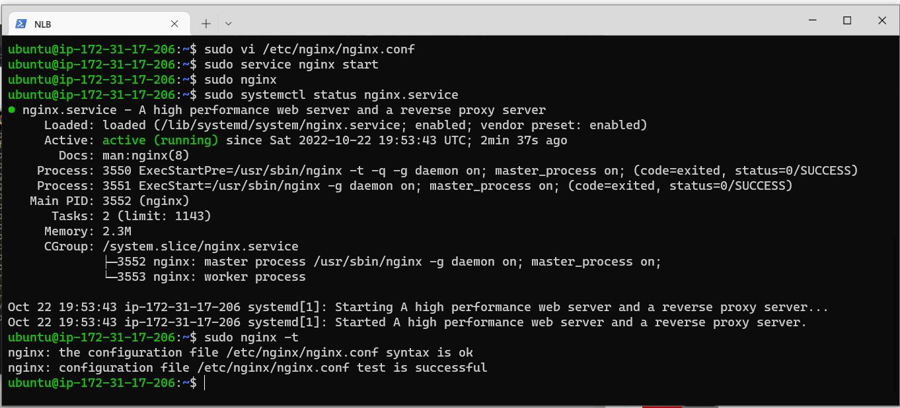

# LOAD BALANCER SOLUTION WITH NGINX AND SSL/TLS

## BACKGROUND
Task
This project consists of two parts:

* Configure Nginx as a Load Balancer as a spin off of Project 8
* Register a new domain name and configure secured connection using SSL/TLS certificates

## STEP 0: Launching A New Instance

I terminated the apache load balancer server and launched a new EC2 Instance(Ubuntu 20.04) which will be used as Nginx load balancer and named it "Nginx LB". I also started all the EC2 instances that was setup in project 7. Then I connected to the Ubuntu server on my terminal via ssh connection.


* Opening TCP port 80 for HTTP and 443 for HTTPS on the security group


## STEP 1: Configuring Nginx As A Load Balancer

* Updating the server:  `sudo apt update`


* Upgrading the server: `sudo apt upgrade`


* Installing Nginx: `sudo apt install nginx`


* 2 - Update /etc/hosts file for local DNS with Web Servers’ names (e.g. Web1 and Web2) and their local IP addresses: `sudo vi /etc/hosts`


* Configuring the Nginx LB to make use of the Webserver’s names defined in the /etc/hosts: `sudo vi /etc/nginx/nginx.conf`


* Adding the following configuration in the http section:

```
upstream myproject {
    server Web1 weight=5;
    server Web2 weight=5;
  }

server {
    listen 80;
    server_name www.domain.com;
    location / {
      proxy_pass http://myproject;
    }
  }

```


* Restart Nginx service: `sudo systemctl restart nginx`

* And make sure the service is up and running: `sudo systemctl status nginx`




## STEP 2: REGISTER A NEW DOMAIN NAME AND CONFIGURE SECURED CONNECTION USING SSL/TLS CERTIFICATES.

* 1 - In order to get a valid SSL certificate – I registered a new domain name. 

      `http://imayorstudios.com.ng/`

* 2 - I assigned an Elastic IP to my Nginx LB server and associated my domain name with this Elastic IP (Since I am using a free-tier EC2 services, I used the Public domain)


* 3 - Update a **record** in my registrar to point to Nginx LB using Elastic IP address. (I did not use Elastic IP Address since I am using the free-tier)

After the connection was successful, create RECORD on the under Route 53
and make sure it is pointing to the Ngnix Load Balancer public IP


* Check that my Web Servers can be reached from my browser using new domain name using HTTP protocol – http://<your-domain-name.com>

e.g. `www.imayorstudios.com.ng`


**Mitigation: I had to register a new domain and hosted it to be able to carry out this project. I could not access a free domain from Freenom.com**


* 4 - Configure Nginx to recognize my new domain name: `sudo vi /etc/nginx/nginx.conf`

Update your `nginx.conf` with `server_name www.<your-domain-name.com>` instead of `server_name www.domain.com`

e.g. server_name www.imayorstudios.com.ng


* ## 5 - Install certbot and request for an SSL/TLS certificate

* Make sure snapd service is active and running, inorder to install certbot: `sudo systemctl status snapd`


* Installing certbot that will be used to request for SSL/TLS certificate: `sudo snap install - -classic certbot`


* Creating a symlink for the certbot from /snap/bin to /usr/bin: `sudo ln -s /snap/bin/certbot /usr/bin/certbot`


* Requesting for my certificate and selecting my domain name: `sudo certbot --nginx`


* I tested secured access to my Web Solution by trying to reach `https://imayorstudios.com.ng`


* I clicked on the padlock icon and I could see the details of the certificate issued for my website.


* 5 - Set up periodical renewal of your SSL/TLS certificate

* Testing the renewal command in a dry-run mode: `sudo certbot renew - -dry-run`


* Configuring a cronjob to run renew command for my SSL/TSL certificate twice a day: `crontab -e`

* Adding the following line:
`* */12 * * * root /usr/bin/certbot renew > /dev/null 2>&1`


Hola! Done with it. 

Mitigation: I had to register a new domain and hosted it to be able to carry out this project. I could not access a free domain from Freenom.com