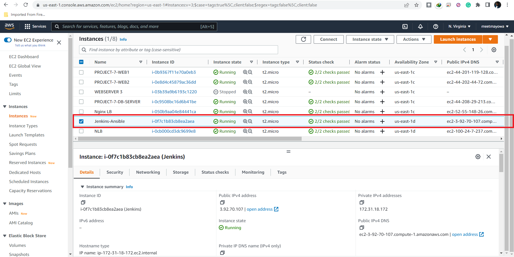

# ANSIBLE CONFIGURATION MANAGEMENT TO AUTOMATE SEVERAL PROJECTS

## INTRODUCTION
In this project, the Jenkins server from [Project 9](https://github.com/meetmayowa/DevOps-PBL/blob/main/Project9_Working_with_Jenkins_CICD_project/project9.md) Web Architecture is setup and configured to function as a Jump Server or Bastion Host by using Ansible Configuration Management which helps to automate most of repetitive tasks done in previous projects.

This Project will make you appreciate DevOps tools even more by making most of the routine tasks automated with Ansible Configuration Management, at the same time you will become confident at writing code using declarative language such as YAML.

## Task
* Install and configure Ansible client to act as a Jump Server/Bastion Host
* Create a simple Ansible playbook to automate servers configuration

The following outlines the steps I took in configuring an Ansible server and also configuring a build task in Jenkins job that is linked to my Github repository to trigger whenever there is a change in the main branch by the use of webhooks, of which the artifacts from the build are used to automate tasks with Ansible playbook.

## STEP 1: Connecting To The Jenkins Server

* 1 - I updated the tag name of the `Jenkins server` to `Jenkins-Ansible` and connecting to it from my terminal via ssh connection and also starting the whole servers setup in project 7-8 for ansible playbook to perform task on them.

* 2 - In your GitHub account create a new repository and name it `ansible-config-mgt`

* 3 - Configuring Ansible In The Jenkins-Ansible Server

* Update the server `sudo apt update`

* Install Ansible on the server `sudo apt install ansible`

* Check my Ansible version by running:  `ansible --version`

* 4 - Configure Jenkins build job to save my repository content every time I change it.

## Creating a Freestyle Job

* i-  I created a new Freestyle project `ansible` in Jenkins and point it to your `ansible-config-mgt` repository.

* Opening the Jenkins web console from my web browser with the Jenkins server IP address and creating a freestyle job called ansible

* Grab the url from the Github repo and paste it into the Jenkins configuration page 

* Firstly, I clicked on the general configuration and clicked on "Git" button under the source code management

* To connect my GitHub repository, I provided its URL, I copied it from the repository itself.

* Configure Webhook in GitHub and set webhook to trigger ansible build.

 Enable webhooks in your GitHub repository settings

* Inputting the ansible-config-mgt repository url and adding my credentials

* To make sure that the build runs automatically whenever a change is made on the Git repository via the webhooks, I proceeded to click on "configure"

* In configuration of my Jenkins freestyle project, I choose Git repository, provided there the link to my Tooling GitHub repository and credentials (user/password) so Jenkins could access files in the repository.

* On the Build Triggers section, selecting GitHub hook trigger for GITScm polling

* And on the Post-build Actions, clicking on Add post-build action and selecting Archive the artifacts to archive all the files resulted from the build

* Clicking on “Add post-build action” and selecting “Archive the artifacts” to archive all the files(artifacts) resulted from the build and hit save

* Change the Branches to build from */master to */main

* Making a change in the README.md file in my repository and pushing it the main branch to test the configuration. Going back to the Jenkins web console to confirm that ansible build is triggered.

* A new build has been launched automatically (by webhook) and I could see its results – artifacts, saved on Jenkins server.

* Verifying the location of the stored artifacts: `ls /var/lib/jenkins/jobs/ansible/builds/<build_number>/archive/`

## Step 2: Prepare my development environment using Visual Studio Code

Working With Visual Studio Code Application
A VS code application is setup that will help in better coding experience and debugging and for pushing and pulling codes easily from Github.

* I connected to the ansible-config-mgt repository from VSCode application
* Creating a new branch from the ansible-config-mgt repository called feature on the VS Code terminal that will be used for development of a new feature.

