# ANSIBLE REFACTORING AND STATIC ASSIGNMENT (IMPORTS AND ROLES)

## INTRODUCTION
In continuation of [Project 11](https://github.com/meetmayowa/DevOps-PBL/blob/main/Project11_Ansible_Configuration_Management_To_Automate_Several_Projects/project11.md), the ansible code in my ansible-config-mgt repository is refactored into making use of the import functionality– which allows us to effectively re-use previously created playbooks in a new playbook, and assigning task in the playbook with role functionality.


The following outlines the steps taken:

## STEP 1: Enhancing The Jenkins Job

* Since artifacts stored in Jenkins server changes directory at each build. Inorder to keep tabs on recent artifacts, copy-artifacts plugin is implemented to copy recent artifacts from a build and paste it automatically to a specified directory where ansible playbook can be run with ease.

* 1-  Creating a new directory on the Jenkins-ansible server where the artifacts will be copied to: `sudo mkdir /home/ubuntu/ansible-config-artifact`
* 2- Changing the permissions: `chmod -R 0777 /home/ubuntu/ansible-config-artifact`


* 3-  From the Jenkins web console, onto the manage plugin, then on the available tab, searching for copy-artifact plugin and installing the plugin. 

Go to Jenkins web console -> Manage Jenkins -> Manage Plugins -> on Available tab search for Copy Artifact and install this plugin without restarting Jenkins


* 4- Creating a new freestyle job ‘save-artifact’ and configuring it to be triggered on the completion of the existing ‘ansible’ job:


* 5- On the general tab


* On the build trigger tab


* On the build tab


* Checking the repo to be sure that it was updated after the git push

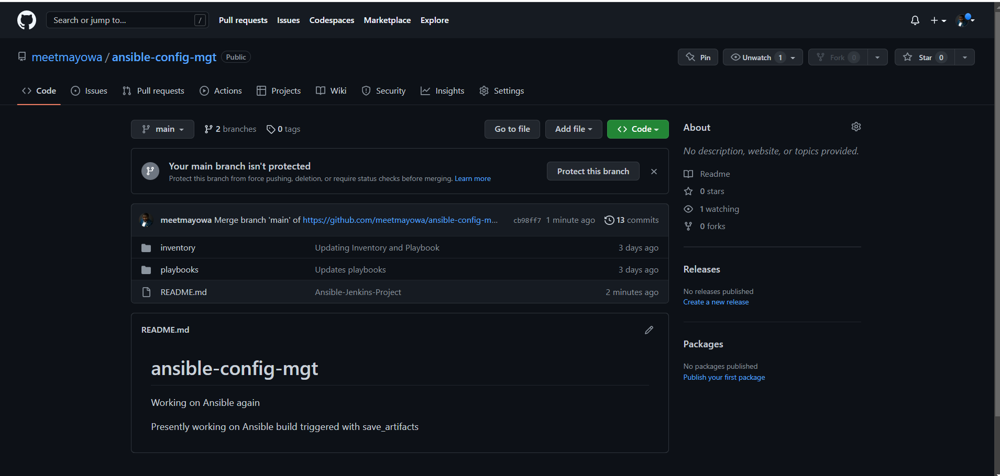

* Testing the configuration by making a change in the README.md file: Ansible build triggered with save_artifacts


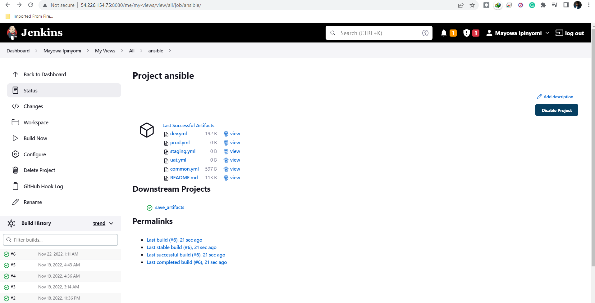

* Artifacts successfully saved on the /home/ubuntu/ansible-config-artifact


## STEP 2: Refactoring Ansible Code


Before starting to refactor the codes, I ensured that I have pulled down the latest code from master (main) branch, and created a new branch, name it refactor.

* Pulling the latest changes from the main branch: `git pull` 

* Checkout to new branch ‘refactor’: `git checkout -b refactor`

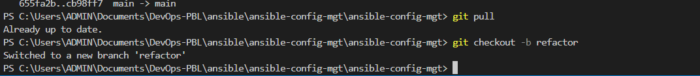


* Creating site.yml file in the playbooks folder. The file will be considered as an entry point into the entire infrastructure, ie, site.yml will be the parent to all other playbook

* Creating ‘static-assignments’ folder in the root of the repository. This is where all the children playbooks are stored

* Moving the common.yml file that we created in the previous Project to the 'static-assignments' folder

* Configuring the site.yml file to import common.yml file

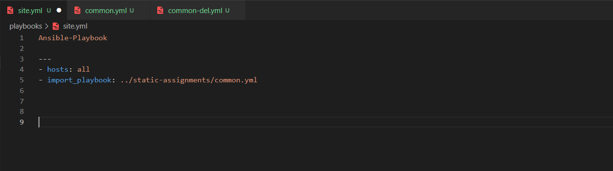


The ansible-config-mgt folder structure

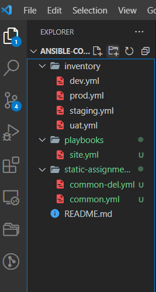


* Since the wireshark has been installed on the webservers, so common-del.yml is used instead of common.yml to uninstall wireshark
common-del.yml playbook file

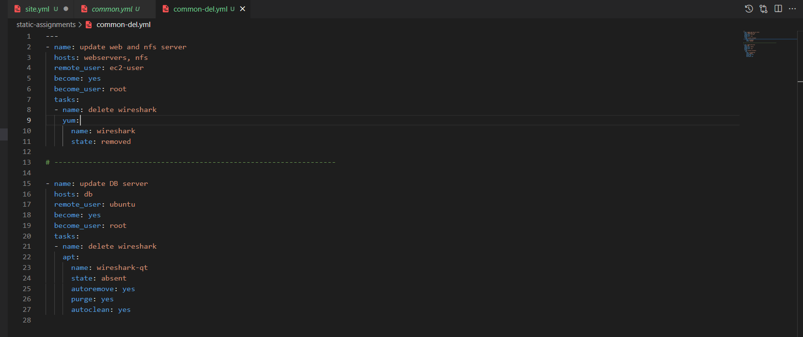

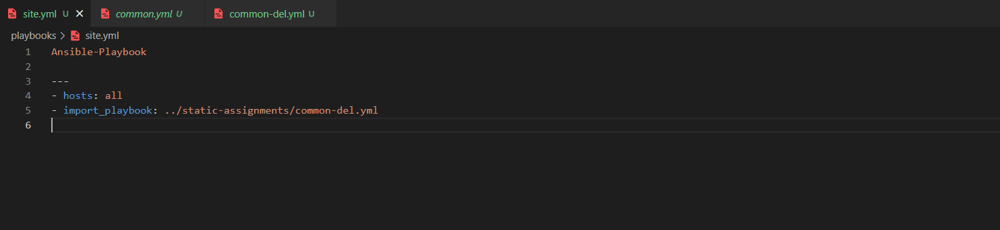


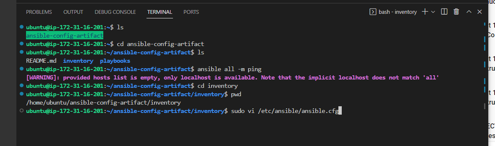

* Updating site.yml playbook file


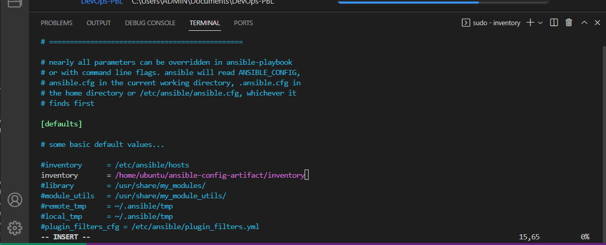

`git push --set-upstream origin refactor`


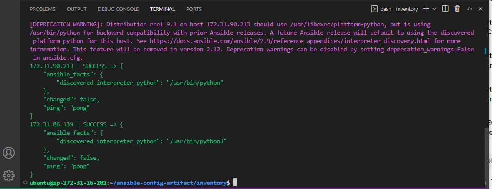


* Change Directory (cd) into the report Repo `ansible-config-artifact` and run this command: `ansible-playbook -i inventory/<your inventory file> playbooks/<playbook file>`

i.e `ansible-playbook -i inventory/dev.yml playbooks/site.yml`

Running the ansible-playbook command against dev.yml inventory file:

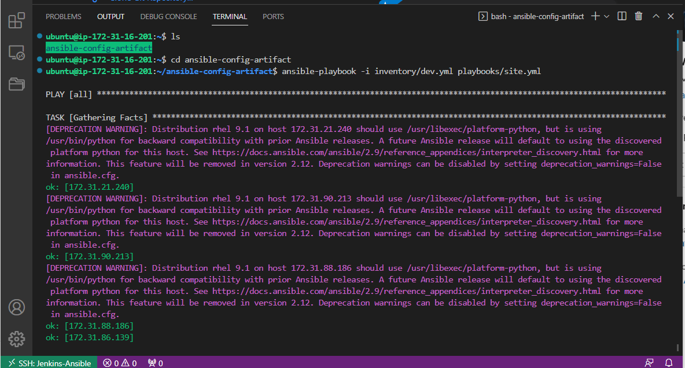


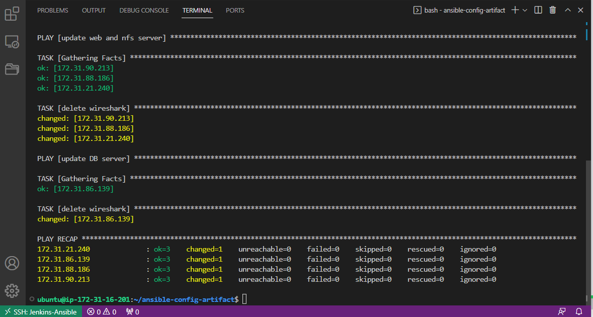


## STEP 3: Making Use Of Role Functionalities

* To demonstrate the role functions, 2 new Red Hat servers are launched and are used as UAT(User Acceptance Testing).

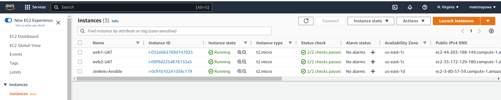

* Configuring the uat.yml in the inventory folder with the ip address of the 2 new servers launched

```
[uat-webservers]
<Web1-UAT-Server-Private-IP-Address> ansible_ssh_user='ec2-user' ansible_ssh_private_key_file=<path-to-.pem-private-key>
<Web2-UAT-Server-Private-IP-Address> ansible_ssh_user='ec2-user' ansible_ssh_private_key_file=<path-to-.pem-private-key>

```

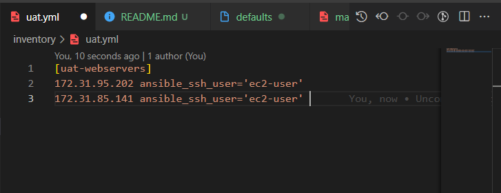


* To create a role for the UAT webservers, the folder ‘role’ is created in the playbooks directory
* Creating a dummy role structure ‘webserver’ with ansible-galaxy command: `sudo ansible-galaxy init webserver`

* Webserver role folder structure

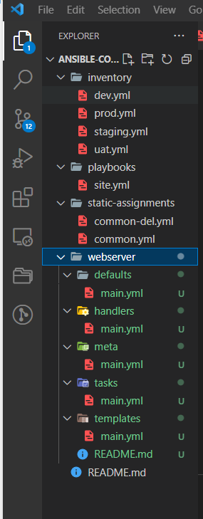


* In order to make ansible locate the role directory, editing the role section and specifying the role path in the ansible.cfg file: `sudo vi /etc/ansible/ansible.cfg`


* Configuring the task file of the webserver role and adding the following task in the main.yml: `sudo vi ansible-config-artifact/playbooks/role/webserver/task/main.yml`

```
---
- name: install apache
  become: true
  ansible.builtin.yum:
    name: "httpd"
    state: present

- name: install git
  become: true
  ansible.builtin.yum:
    name: "git"
    state: present

- name: clone a repo
  become: true
  ansible.builtin.git:
    repo: https://github.com/meetmayowa/tooling.git
    dest: /var/www/html
    force: yes

- name: copy html content to one level up
  become: true
  command: cp -r /var/www/html/html/ /var/www/

- name: Start service httpd, if not started
  become: true
  ansible.builtin.service:
    name: httpd
    state: started

- name: recursively remove /var/www/html/html/ directory
  become: true
  ansible.builtin.file:
    path: /var/www/html/html
    state: absent

```

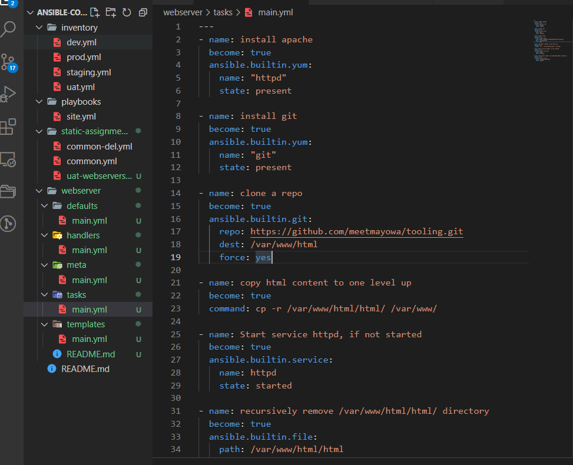

The task file does the following:

1- Install and configure Apache (httpd service)

2- Clone Tooling website from GitHub https://github.com/meetmayowa/tooling.git.

3-Ensuring the tooling website code is deployed to /var/www/html on each of UAT Web servers.


4- Ensuring httpd service is started


* Creating a new assignment in the static-assignments folder ‘uat-webservers’: `sudo vi ansible-config-artifact/static-assignments/uat-webservers.yml`

* Entering the following codes in the uat-webservers.yml file:

```
---
- hosts: uat-webservers
  roles:
     - webserver

```
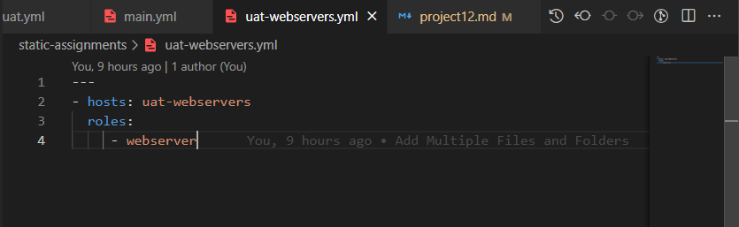

* Updating the site.yml file to be able to import uat-webservers role

```
- hosts: uat_webservers
- import_playbook: ../static-assignments/uat-webservers.yml

```
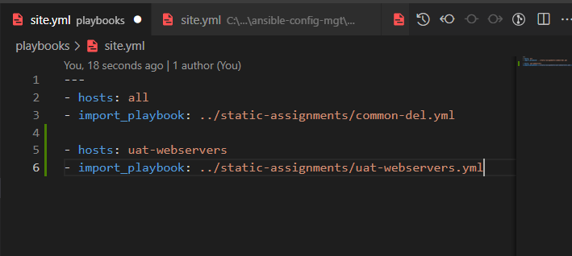


## STEP 4: Commit And Running the playbook


* Commiting the changes and pushing the code to the main branch to create a merge request


* Merging the request

**Pull request created**


**Merged created**

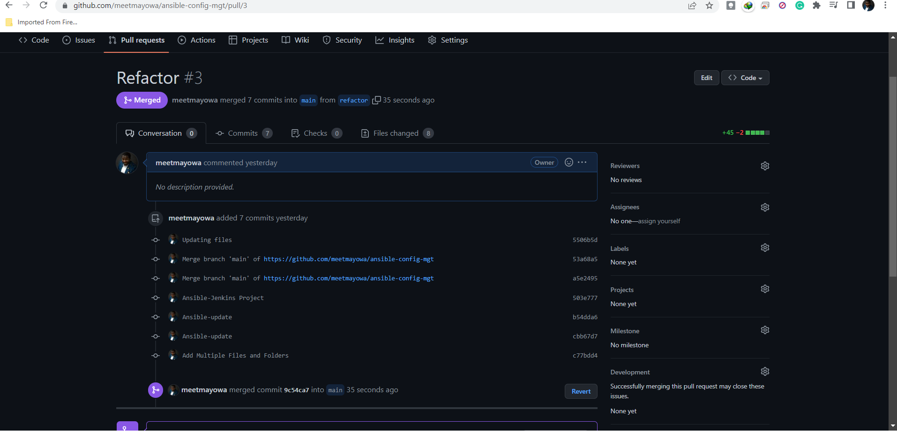

**Ensuring that Jenkins build is triggered**

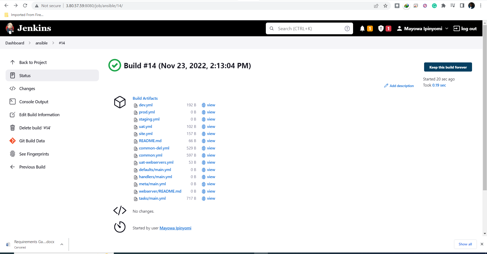


* Running the ansible playbook: `sudo ansible-playbook -i /home/ubuntu/ansible-config-artifact/inventory/uat.yml /home/ubuntu/ansible-config-artifact/playbooks/site.yml`  or

* Cd Directory into the repo and then run this command   `ansible-playbook -i inventory/uat.yml playbooks/site.yml`


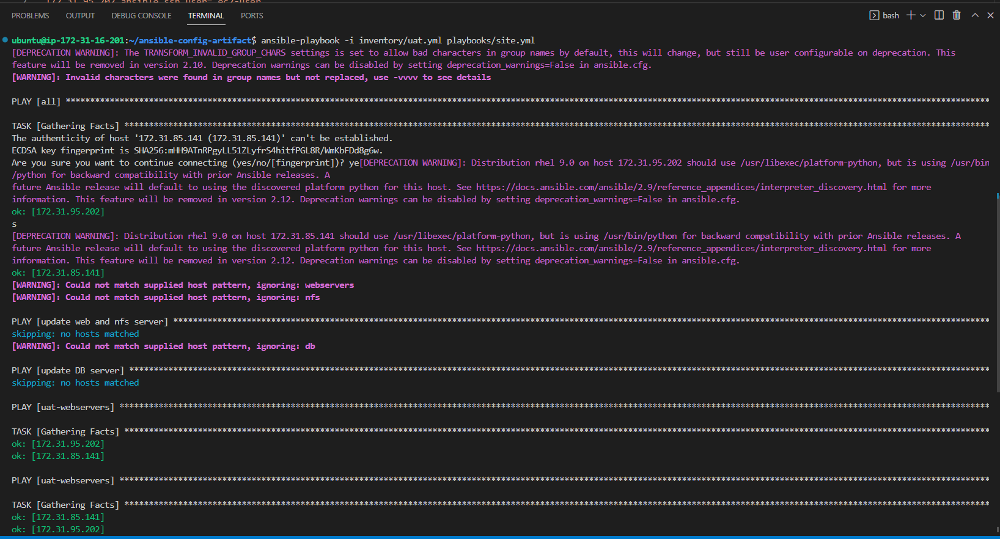


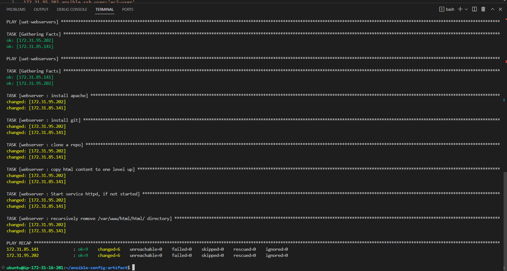


**The end of the project**

