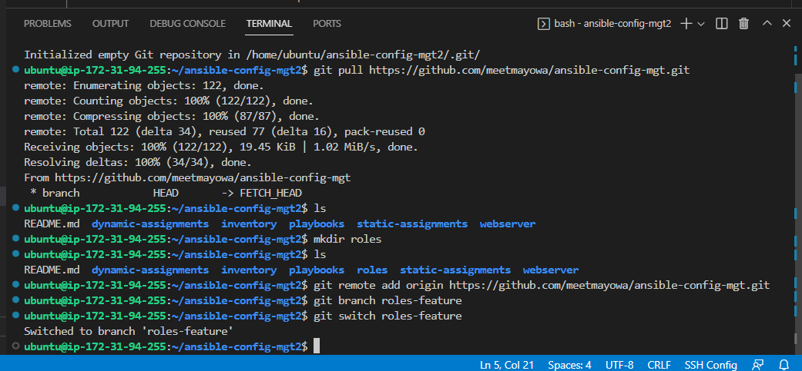

# INTRODUCING ANSIBLE DYNAMIC ASSIGNMENTS(INCLUDE) AND COMMUNITY ROLES

## BACKGROUND

In continuation with [Project 12](https://github.com/meetmayowa/DevOps-PBL/blob/main/Project12_Ansible_Refactoring_And_Static_Assignement_(Imports_And_Roles)/project12.md), dynamic assignment is introduced by making use of include modules. By dynamic, it means that all statements are processed only during execution of the playbook which is the opposite of the import modules.

The following steps outlines how include module is used for running dynamic environment variable:

## STEP 1: Introducing Dynamic Assignment Into The Project

* Checking out to a new branch in the same ansible-config-mgt repository and naming it ‘dynamic-assignments’


* Creating a new folder in the root directory of the repository and naming it ‘dynamic-assignments’


* Creating an environment variable file in the dynamic-assignments directory and naming it ‘env_vars.yml’


* Creating a folder that holds the environmental variable and naming it ‘env-var’
* Creating the following files under it: dev.yml, uat.yml, prod.yml and stage.yml
* The structure of the ansible-config-mgt folder will be as displayed below:


* Entering the following codes in the env_vars.yml file:

```
---
- name: collate variables from env specific file, if it exists
  hosts: all
  tasks:
    - name: looping through list of available files
      include_vars: "{{ item }}"
      with_first_found:
        - files:
            - dev.yml
            - stage.yml
            - prod.yml
            - uat.yml
          paths:
            - "{{ playbook_dir }}/../env-vars"
      tags:
        - always

```


* Updating site.yml file to work with dynamic-assignments:


## STEP 2: Implementing Community Roles

In order to preserve my github state whenever I install a new role in the ansible-config-mgt project on the the bastion server, I made use of git commands so I can easily commit the changes made and pushing it to the ansible-config-mgt repository directly from the bastion server

* Installing git packages: `sudo apt install git`
* Initializing the ansible-artifact-config directory: `git init`


* Pulling the ansible-config-mgt repository: `git pull https://github.com/meetmayowa/ansible-config-mgt.git`


* Registering the repo: `git remote add origin https://github.com/meetmayowa/ansible-config-mgt.git`

* Creating a new branch 'roles-feature': `git branch roles-feature`

* Switching to the new branch: `git switch roles-feature`




* Making use of community roles by installing a MySQL role already configured from ansible-galaxy by geerlingguy in the role directory: $ ansible-galaxy install geerlingguy.mysql


* Renaming the role folder to mysql: `mv geerlingguy.mysql/ mysql`


**Updating the ansible-config-mgt2 repository**

* git add .


* git commit -m "Commit new role files into GitHub"


* git push --set-upstream origin roles-feature 


* Creating a pull request


* Merging the request


## STEP 3: Implementing Load Balancer(Apache & Nginx) Roles
Two load balancer roles are setup which are Nginx and Apache roles, but because a web server can only make use of one load balancer, the playbook is configured with the use of conditionals- when statement, to ensure that only the desired load balancer role tasks gets to run on the webserver

* Setting up apache role in the role directory: `sudo ansible-galaxy init apache`
The folder structure of Apache role:


* Setting up nginx role in the role directory: `sudo ansible-galaxy init nginx`


**The folder structure of Nginx role:**


* Entering the following code task in apache/tasks/main.yml file:

```
---
- name: install apache
  become: true
  apt:
    name: apache2
    state: present

- name: Start service apache, if not started
  become: true
  service:
    name: apache2
    state: started

```


* Entering the following code in nginx/tasks/main.yml file:

```
- name: install ngnix
  become: true
  apt:
    name: nginx
    state: present

- name: Start nginx service, if not started
  become: true
  service:
    name: nginx
    state: started

```


* Declaring the following variable in the 'defaults/main.yml' file of both apache and nginx roles file which makes ansible to skip the roles during execution.


**For apache/defaults/main.yml**

```
---
enable_apache_lb: false
load_balancer_is_required: false

```


**For nginx/defaults/main.yml**

```
---
enable_apache_lb: false
load_balancer_is_required: false

```


* Creating a file in the static-assignment folder and naming it ‘loadbalancers.yml’ and entering the following codes:

```
- hosts: lb
  roles:
    - { role: nginx, when: enable_nginx_lb and load_balancer_is_required }
    - { role: apache, when: enable_apache_lb and load_balancer_is_required }

```


* Updating the site.yml file:

```
---
- name: Loadbalancers assignment
  hosts: lb
- import_playbook: ../static-assignments/loadbalancers.yml
  when: load_balancer_is_required 

```


* To define which load balancer to use, the files in the env-var folder is used to override the default settings of any of the load balancer roles. In this case the env-var/dev.yml file is used to make ansible to only run nginx load balancer task in the target server:

**env-var/dev.yml file**

```
enable_nginx_lb: true
load_balancer_is_required: true

```


* Running the playbook: `sudo ansible-playbook -i /home/ubuntu/ansible-config-mgt2/inventory/dev.yml /home/ubuntu/ansible-config-mgt2/playbooks/site.yml`

* Change Directory (cd) into the report Repo ansible-config-artifact and run this command: `ansible-playbook -i inventory/<your inventory file> playbooks/<playbook file>`
i.e `ansible-playbook -i inventory/dev.yml playbooks/site.yml`

Running the ansible-playbook command against dev.yml inventory file:


