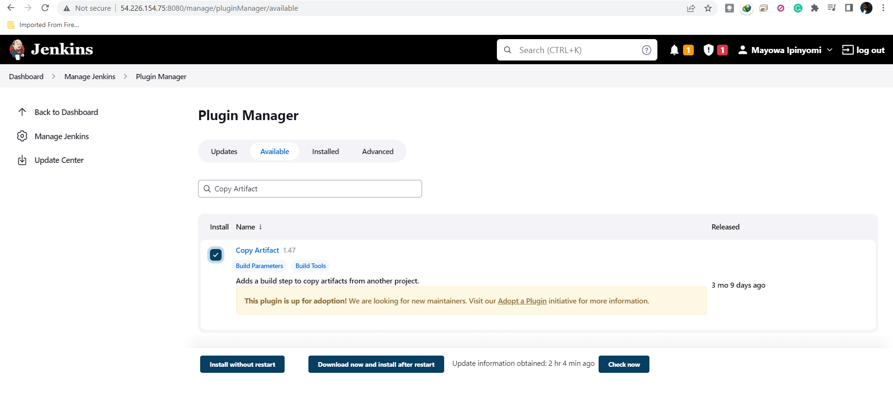

# CONTINOUS INTEGRATION WITH JENKINS, ANSIBLE, ARTIFACTORY SONARQUBE AND PHP

## INTRODUCTION
In this project, the concept of CI/CD is implemented whereby php application from github are pushed to Jenkins to run a multi-branch pipeline job(build job is run on each branches of a repository simultaneously) which is better viewed from Blue Ocean plugin. This is done in order to achieve continuous integration of codes from different developers. After which the artifacts from the build job is packaged and pushed to sonarqube server for testing before it is deployed to artifactory from which ansible job is triggered to deploy the application to production environment.

The following are the steps taken to achieve this:

## STEP 0: Setting Up Servers
I launched 3 EC2 Instances, one for Jenkins server, another for MySQL database(RedHat) and another is used for SonarQube Server

## STEP 1: Configuring Ansible For Jenkins Deployment

In order to run ansible commands from Jenkins UI, the following outlines the steps taken:

* Installing Blue Ocean plugin from ‘manage plugins’ on Jenkins:
* Creating new pipeline job on the Blue Ocean UI from Github
* Generating new personal access token in order to full access to the repository
* Pasting the token and selecting ansible-config-mgt repository to create a new pipeline job

* Checkout the feature `git checkout -b feature/jenkinspipeline-stage`