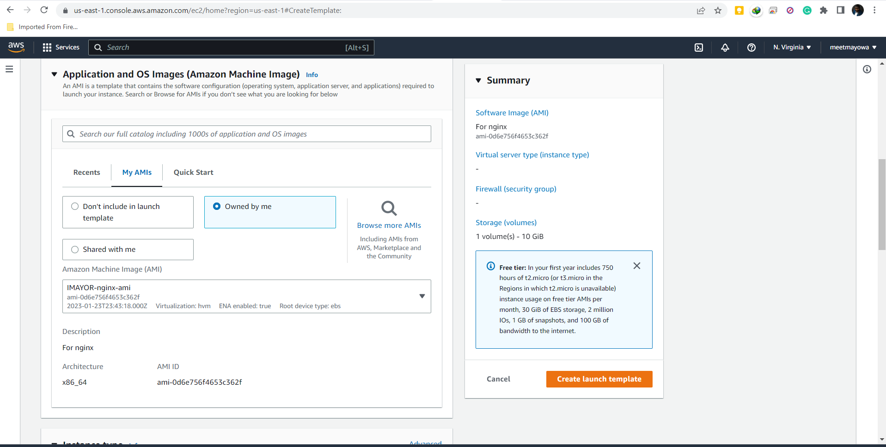
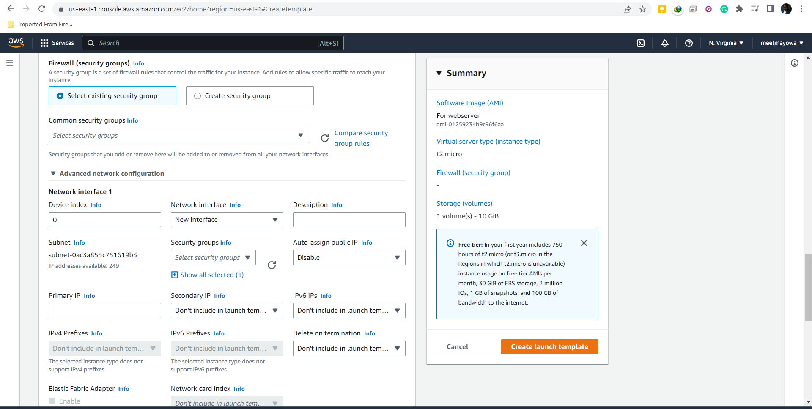

## AWS CLOUD SOLUTION FOR 2 COMPANY WEBSITES USING A REVERSE PROXY TECHNOLOGY

### INTRODUCTION

This project demostrates how a secure infrastructure inside AWS VPC (Virtual Private Cloud) network is built for a particular company, who uses WordPress CMS for its main business website, and a Tooling Website for their DevOps team. As part of the company’s desire for improved security and performance, a decision has been made to use a reverse proxy technology from NGINX to achieve this. The infrastructure will look like following diagram:

The following outlines the steps taken:

### STEP 1: Setting Up a Sub-account And Creating A Hosted Zone
* Creating a sub-account 'DevOps' from my AWS master account in the AWS Organisation Unit console

* Creating an AWS Organization Unit (OU) 'Dev' within the Root account(Dev resources will be launched in there)

* Moving the DevOps account into the Dev OU

* Logging in to the newly created AWS account

* Creating a hosted zone in the Route 53 console and mapping it to the domain name acquired from freenom.

### STEP 2: Setting Up a Virtual Private Network (VPC)

* Creating a VPC from the VPC console

* Creating subnets for the public and private resources as shown in the architecture

* Creating a route table and associating it with public subnets

* Creating a route table and associating it with private subnets

* Creating an Internet Gateway

* Attaching the Internet Gateway to the VPC

* Editing a route in public route table, and associating it with the Internet Gateway. (This is what allows a public subnet to be accessible from the Internet).

* Creating 3 Elastic IPs

* Creating a Nat Gateway and assigning one of the Elastic IPs to it

* Setting up Security Group for Application load balancer in a way that it will allow https traffic from any IP address.

* Setting up Security Group for Nginx servers in a way that it will allow https traffic only from the Application Load balancer and allow bastion servers to ssh into it.

* Setting up Security Group for bastion server in a way that it will only allow access from the workstations that need to SSH into the bastion servers.

* Setting up Security Group for internal Application Load balancer in a way that it will allow traffic only from Nginx servers

* Setting up Security Group for Webservers in a way that it will allow https traffic only from the internal Application Load balancer

* Setting Security Group for the Data Layer subnet in a way that it will allow TCP port 3306 traffic only from the webservers.

* Elastic File System (EFS) must be carefully desinged – only webservers should be able to connect to RDS 

* Nginx and Webservers will have access to EFS Mountpoint.

### STEP 3: Creating An AMI Out Of The EC2 Instance For Nginx And Bastion server

* 3 EC2 Instance based on Red Hat of the T2 micro family were launched for Nginx, bastion and the one for the two webservers

* Creating an AMI out of the Bastion EC2 instance

* For The Baston Server
After connecting to it through ssh on the terminal, the following commands are run to install some necessary softwares:

For Nginx Server

* After connecting to EC2 Instance for the Nginx through ssh on the terminal, the following commands are run to install some necessary softwares:

* Creating an AMI out of the Nginx EC2 instance

### STEP 4: Creating An AMI Out Of The EC2 Instance For The Tooling and Wordpress Webservers

* After connecting to the EC2 instance for the tooling and wordpress site through SSH on the terminal, the following commands are run to install some necessary softwares:

* Creating an AMI out of the EC2 instance

### STEP 5: Creating A Launch Template

**For Bastion Server** 

* Setting up a launch template with the Bastion AMI
* Ensuring the Instances are launched into the public subnet
* Entering the Userdata to update yum package repository and install ansible and mysql

**For Nginx Server**

* Setting up a launch template with the Nginx AMI
* Ensuring the Instances are launched into the public subnet
* Assigning appropriate security group
* Entering the Userdata to update yum package repository and install Nginx

**For Wordpress Server**

* Selecting Instances as the target type
* Ensuring the protocol HTTPS on secure TLS port 443
* Ensuring that the health check path is /healthstatus

**For Tooling Server**

* Setting up a launch template with the Bastion AMI
* Ensuring the Instances are launched into the public subnet
* Assigning appropriate security group
* Entering the Userdata to update yum package repository and apache server

### STEP 6: Configuring Target Groups

For Nginx Server

* Selecting Instances as the target type
* Ensuring the protocol HTTPS on secure TLS port 443
* Ensuring that the health check path is /healthstatus

For Tooling Server

* Selecting Instances as the target type
* Ensuring the protocol HTTPS on secure TLS port 443
* Ensuring that the health check path is /healthstatus

For Wordpress Server

* Selecting Instances as the target type
* Ensuring the protocol HTTPS on secure TLS port 443
* Ensuring that the health check path is /healthstatus

### STEP 7: Configuring AutoScaling Group
* Selecting the right launch template
* Selecting the VPC
* Selecting both public subnets
* Enabling Application Load Balancer for the AutoScalingGroup (ASG)
* Selecting the target group you created before
* Ensuring health checks for both EC2 and ALB
* Setting the desired capacity, Minimum capacity and Maximum capacity to 2
* Setting the scale out option if CPU utilization reaches 90%
* Activating SNS topic to send scaling notifications

**For Bastion Server**

**For Nginx Server**

**For Wordpress**

**For Tooling Server**

### STEP 8: Creating TLS Certificates From Amazon Certificate Manager (ACM)

TLS certificates is created to handle secured connectivity to the Application Load Balancers (ALB)

* Navigating to AWS ACM
* Requesting a public wildcard certificate for the domain name I registered in www.smartweb.com.ng
* Using DNS to validate the domain name

### STEP 9: Configuring Application Load Balancer (ALB)

**For External Load Balancer**

* Selecting Internet facing option
* Ensuring that it listens on HTTPS protocol (TCP port 443)
* Ensuring the ALB is created within the appropriate VPC, AZ and the right Subnets
* Choosing the Certificate already created from ACM
* Selecting Security Group for the external load balancer
* Selecting Nginx Instances as the target group

**For Internal Load Balancer**

* Setting the Internal ALB option
* Ensuring that it listens on HTTPS protocol (TCP port 443)
* Ensuring the ALB is created within the appropriate VPC, AZ and Subnets
* Choosing the Certificate already created from ACM
* Selecting Security Group for the internal load balancer
* Selecting webserver Instances as the target group
* Ensuring that health check passes for the target group

* Configuring the Listener on the Internal ALB to route traffic to wordpress server

### STEP 10: Setting Up EFS Storage For The Webservers
* Create an EFS filesystem
* Create an EFS mount target per AZ in the VPC, associate it with both subnets dedicated for data layer
* Associate the Security groups created earlier for data layer.
* Create an EFS access point. (Give it a name and leave all other settings as default)

### STEP 11: Creating Key Management Service(KMS)

### STEP 12: Setting Up A Relational Database System

### STEP 13: Creating DNS Records In The Route53 For the Tooling And Wordporess site

**For Tooling DNS record**

**For Wordpress record**

### STEP 14: Result
* Entering the url https://www.imayorstudios.com.ng will route traffic from the application load balancer to the nginx and then to the server for wordpress site through the internal ALB:

Entering the url https://www.imayorstudios.com.ng will route traffic from the application load balancer to the nginx and then to the internal ALB which forwards the traffic to the server for tooling site:

Done!