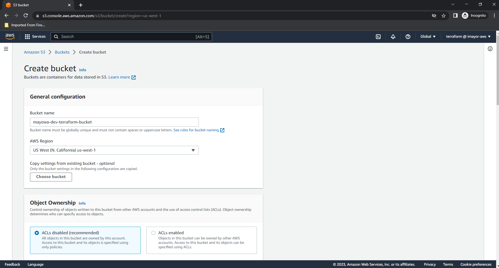
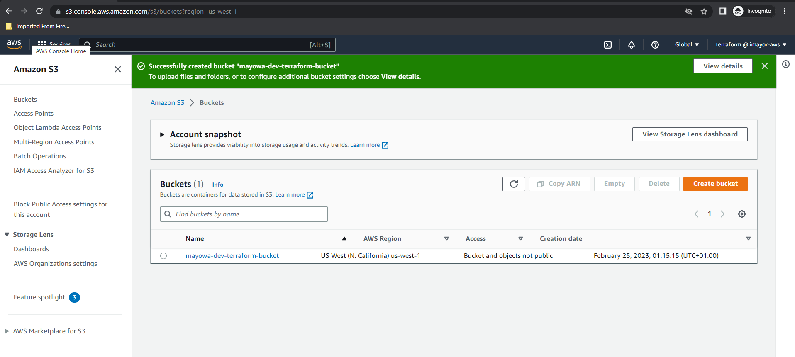
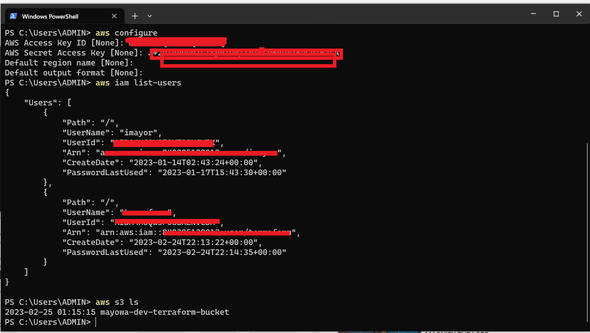
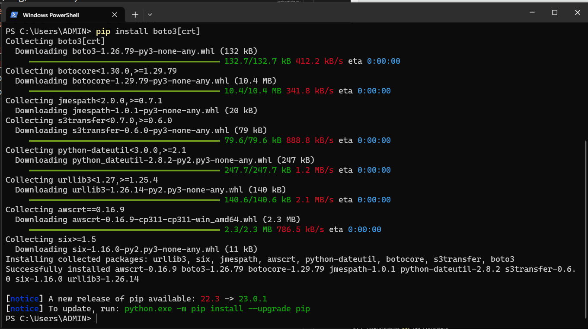
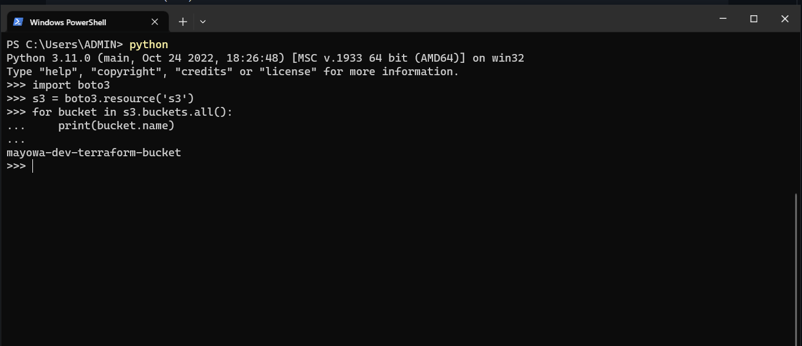

# AUTOMATING INFRASTRUCTURE WITH IAC USING TERRAFORM PART 1


## INTRODUCTION
This project demonstrates how the AWS infrastructure for 2 websites that was built manually in project 15 is automated with the use of Terraform.

The following outlines the steps taken:

## STEP 0: Setting Up AWS CLI And S3 Buckets
After creating an IAM user with AdministrativeAccess permissions in AWS and acquiring the access key and secret access key, the following step was taken:

Creating S3 bucket in AWS for storing Terraform state file and naming it mayowa-dev-terraform-bucket.





* Running the following command on my terminal to install boto3 including the AWS Common Runtime (CRT) which boto3 uses to incorporate features not otherwise available in the AWS SDK for python: `pip install boto3[crt]`




* Downloading and running the AWS CLI MSI installer for Windows from the terminal: `C:\> msiexec.exe /i https://awscli.amazonaws.com/AWSCLIV2.msi`
* Configuring access file with the Access key and secret access key: `aws configure`
* Testing AWS CLI by running the following commands on my terminal which prints my newly created buckets:

```
>>import boto3
>>s3 = boto3.resource('s3')
  for bucket in s3.buckets.all():
      print(bucket.name)
```



## Installing Terraform

### STEP 1: Creating VPC Resource

* Creating a folder called PBL
* Creating a file in the PBL folder and naming it main.tf
* Entering the following configuration which adds AWS as a provider and a resource to create a VPC in the main.tf file:

```
provider "aws" {
  region = "us-west-1"
}

# Create VPC
resource "aws_vpc" "main" {
  cidr_block                     = "172.16.0.0/16"
  enable_dns_support             = "true"
  enable_dns_hostnames           = "true"
  enable_classiclink             = "false"
  enable_classiclink_dns_support = "false"
}
```
* Running the following command which downloads the necessary plugins for Terraform to work: `terraform init`


* Inorder to check to see what terraform intends to create before we tell it to go ahead and create the aws_vpc resource the following command is run: `terraform plan`


### STEP 3: Refactoring The Codes
1- Inorder to make the work dynamic, hard coded values are removed by introducing variables
* Declaring a variable named region and giving it a default value, and updating the provider section by referring to the declared variable.

```
    variable "region" {
        default = "eu-central-1"
    }

    provider "aws" {
        region = var.region
    }
```

* Doing the same to cidr value in the vpc block, and all the other arguments.

```
variable "region" {
  default = "us-west-1"
}

variable "vpc_cidr" {
  default = "172.16.0.0/16"
}

variable "enable_dns_support" {
  default = "true"
}

variable "enable_dns_hostnames" {
  default = "true"
}

variable "enable_classiclink" {
  default = "false"
}

variable "enable_classiclink_dns_support" {
  default = "false"
}

provider "aws" {
  region = var.region
}

# Create VPC
resource "aws_vpc" "main" {
  cidr_block                     = var.vpc_cidr
  enable_dns_support             = var.enable_dns_support
  enable_dns_hostnames           = var.enable_dns_support
  enable_classiclink             = var.enable_classiclink
  enable_classiclink_dns_support = var.enable_classiclink
}

```

2 - Fixing multiple resource blocks by introducing some interesting concepts; Loops & Data sources
* Fetching Availability zones from AWS, and replacing the hard coded value in the subnet’s availability_zone section with the use of Data Sources.

```
 # Get list of availability zones
    data "aws_availability_zones" "available" {
        state = "available"
    }

```
* Introducing a count argument in the subnet block to make use of the new data resource:

```
# Create public subnet1
    resource "aws_subnet" "public" { 
        count                   = 2
        vpc_id                  = aws_vpc.main.id
        cidr_block              = "172.16.1.0/24"
        map_public_ip_on_launch = true
        availability_zone       = data.aws_availability_zones.available.names[count.index]

    }
```

* The count tells terraform to invoke a loop to create 2 subnets. and the data resource will return a list object that contains a list of AZs.
* But if Terraform is being run with this configuration, it may succeed for the first time, but by the time it goes into the second loop, it will fail because the cidr_block still has to be hard coded because the same cidr_block cannot be created twice within the same VPC.
* To make the cidr block dynamic a function cidrsubnet() is introduced which accepts 3 parameters.

```
# Create public subnet1
    resource "aws_subnet" "public" { 
        count                   = 2
        vpc_id                  = aws_vpc.main.id
        cidr_block              = cidrsubnet(var.vpc_cidr, 4 , count.index)
        map_public_ip_on_launch = true
        availability_zone       = data.aws_availability_zones.available.names[count.index]

    }
```

* Introuducing length() function, which basically determines the length of a given list and passing it to data.aws_availability_zones.available.names
* But since this returns the value of 3 instead of 2 that is preffered, the variable to store the desired number of public subnets is declared and it is set to the default value.

```
variable "preferred_number_of_public_subnets" {
  default = 2
}
```

* Updating the count argument with a condition of which Terraform checks first if there is a desired number of subnets, Otherwise, it will use the data returned by the lenght function.

```
# Create public subnets
resource "aws_subnet" "public" {
  count  = var.preferred_number_of_public_subnets == null ? length(data.aws_availability_zones.available.names) : var.preferred_number_of_public_subnets   
  vpc_id = aws_vpc.main.id
  cidr_block              = cidrsubnet(var.vpc_cidr, 4 , count.index)
  map_public_ip_on_launch = true
  availability_zone       = data.aws_availability_zones.available.names[count.index]

}

```