# AUTOMATING INFRASTRUCTURE WITH IAC USING TERRAFORM PART 3
  

## INTRODUCTION
In continuation to Project 17, the entire code is refactored inorder to simplify the code using a Terraform tool called Module.

The following outlines detailed step taken to achieve this:

## STEP 1: Configuring A Backend On The S3 Bucket

By default the Terraform state is stored locally, to store it remotely on AWS using S3 bucket as the backend and also making use of DynamoDB as the State Locking the following setup is done:

* Creating a file called Backend.tf and entering the following code:

```
resource "aws_s3_bucket" "terraform-state" {
  bucket = "somex-terraform"
  force_destroy = true
}
resource "aws_s3_bucket_versioning" "version" {
  bucket = aws_s3_bucket.terraform-state.id
  versioning_configuration {
    status = "Enabled"
  }
}
resource "aws_s3_bucket_server_side_encryption_configuration" "first" {
  bucket = aws_s3_bucket.terraform-state.id
  rule {
    apply_server_side_encryption_by_default {
      sse_algorithm = "AES256"
    }
  }
}

```

* Adding the following code which creates a DynamoDB table to handle locks and perform consistency checks:


```
resource "aws_dynamodb_table" "terraform_locks" {
  name         = "terraform-locks"
  billing_mode = "PAY_PER_REQUEST"
  hash_key     = "LockID"
  attribute {
    name = "LockID"
    type = "S"
  }
}

```


* Since Terraform expects that both S3 bucket and DynamoDB resources are already created before configuring the backend, executing terraform apply command:

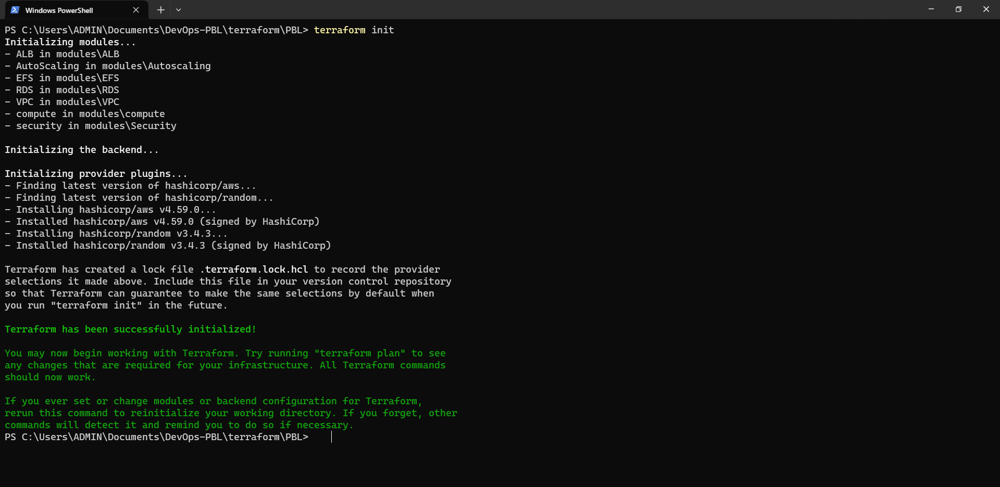


* Entering the following code to configure the backend:

```
terraform {
  backend "s3" {
    bucket         = "imayor-terraform-bucket"
    key            = "global/s3/terraform.tfstate"
    region         = "us-east-1"
    dynamodb_table = "terraform-locks"
    encrypt        = true
  }
}

```

## STEP 2: Refactoring The Codes Using Module

* Creating a folder called modules
* Creating the following folders inside the modules folder to combine resources of the similar type: ALB, VPC, Autoscaling, Security, EFS, RDS, Compute
* Creating the following files for each of the folders: `main.tf`, `variables.tf` and `output.tf`

pbl folder structure

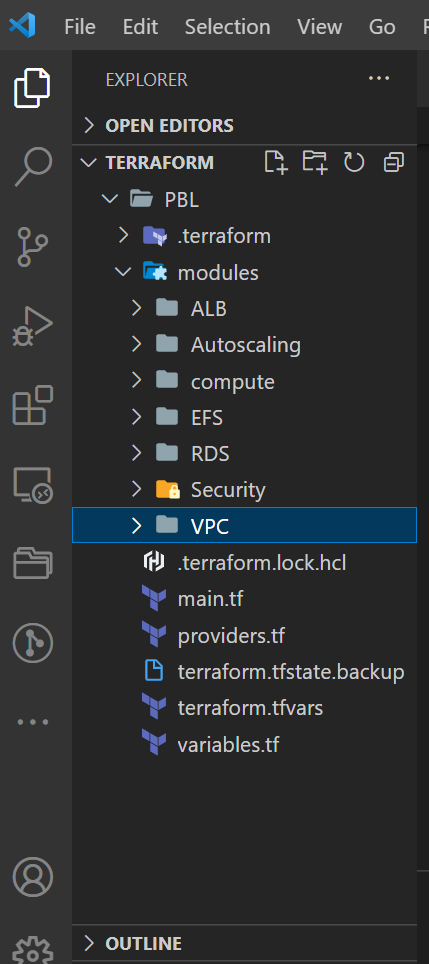

* Refactoring the code for VPC folder:
`outputs.tf`

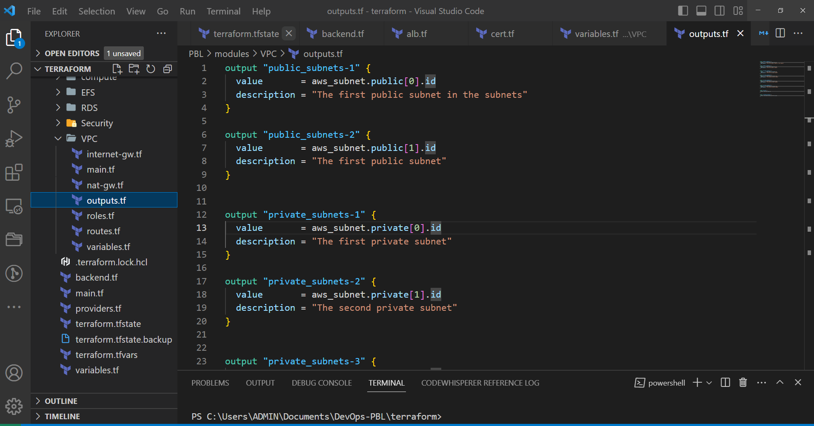

* Refactoring the code for ALB folder:
`variables.tf`

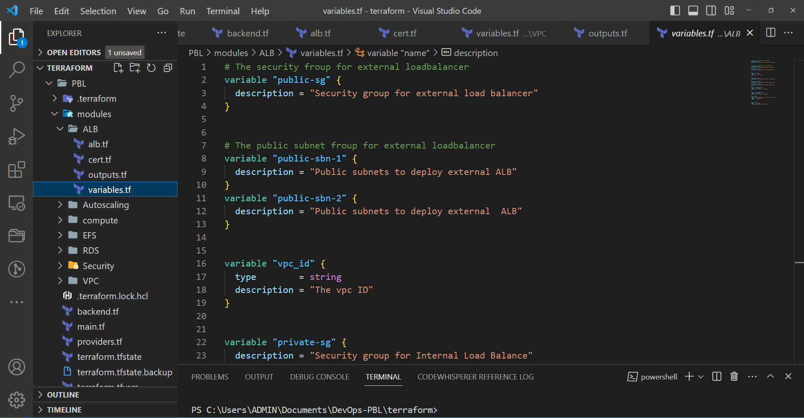

`outputs.tf`

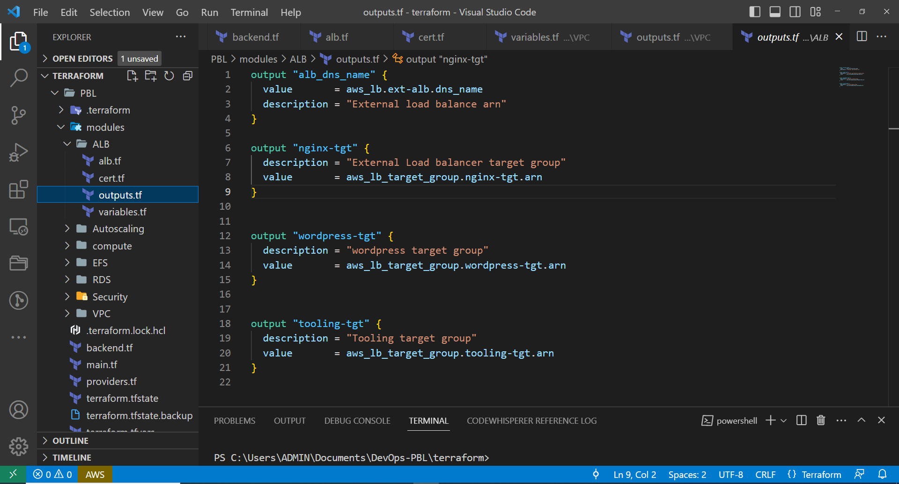

* Refactoring the code for Autoscaling folder:
`variables.tf`


* Refactoring the code for security folder:
`outputs.tf`

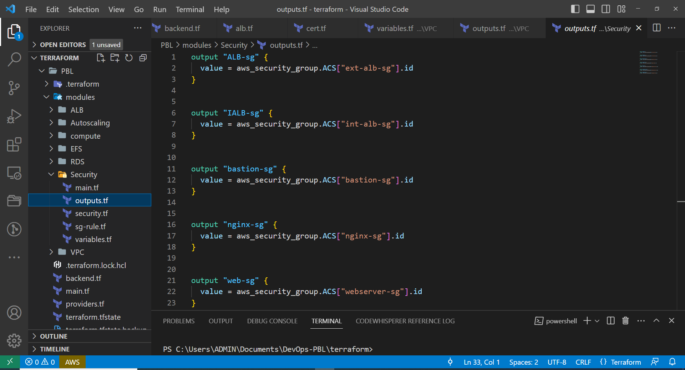

* Refactoring the code for EFS folder:
`variables.tf`

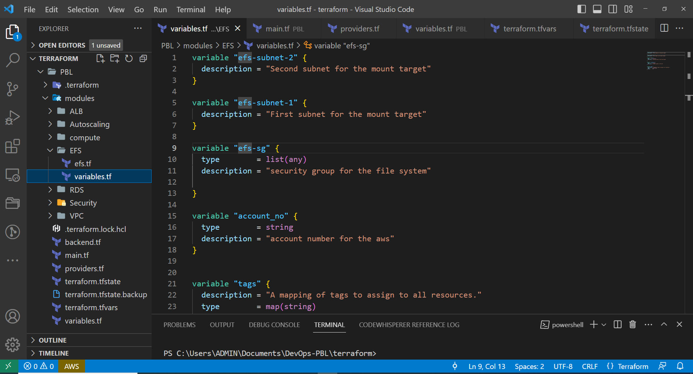

* Refactoring the code for RDS folder:
`variables.tf`

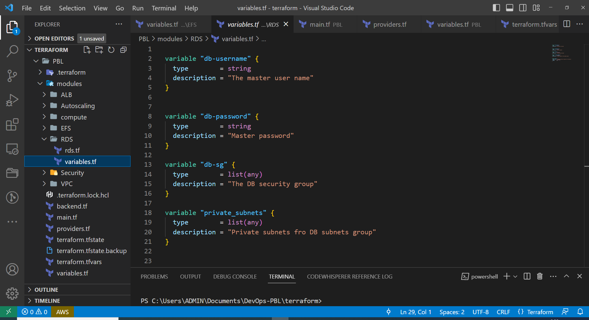

* Refactoring the code the root `main.tf` folder:

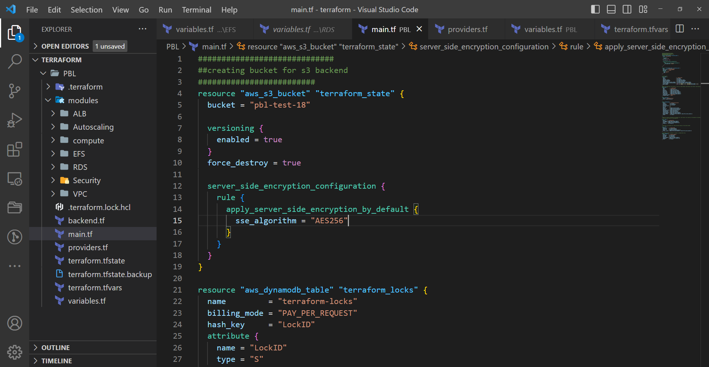
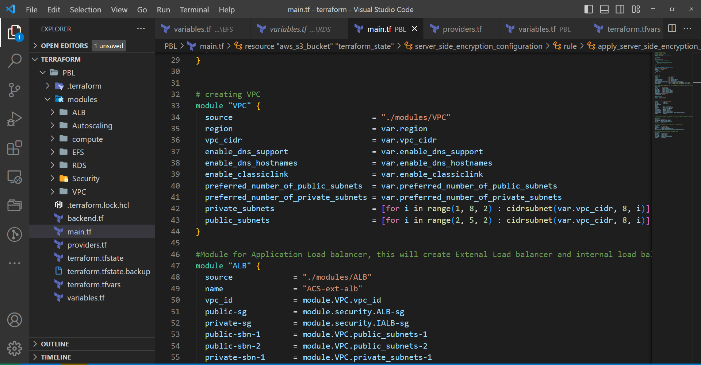
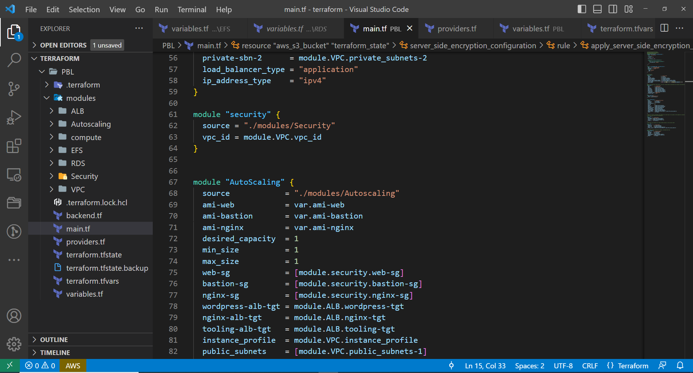
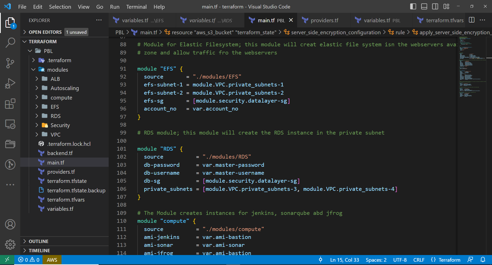
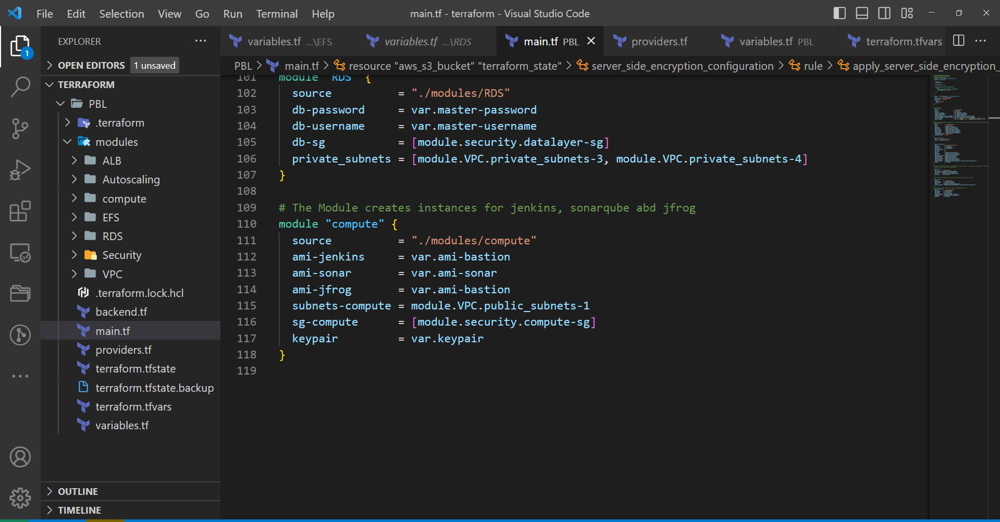

## STEP 3: Executing The Terraform Plan

* To ensure the validation of the whole setup, running the command `terraform validate`

* Testing the configuration by running the command `terraform plan`


* Testing the configuration by running the command `terraform apply --auto-approve`

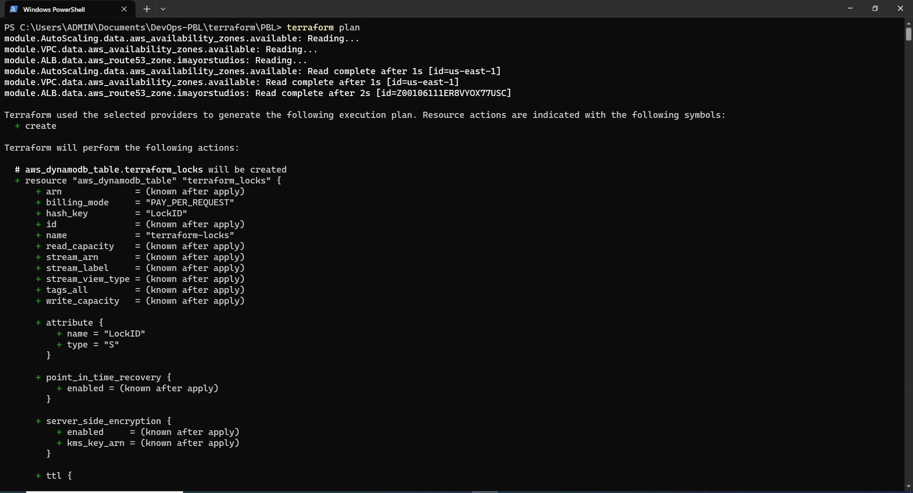

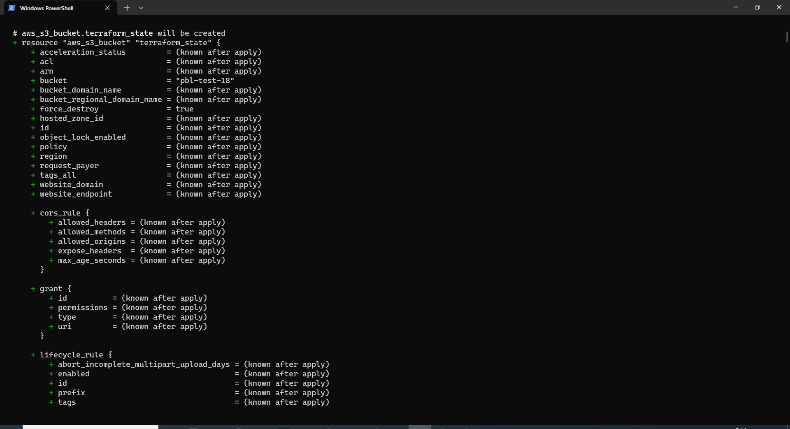

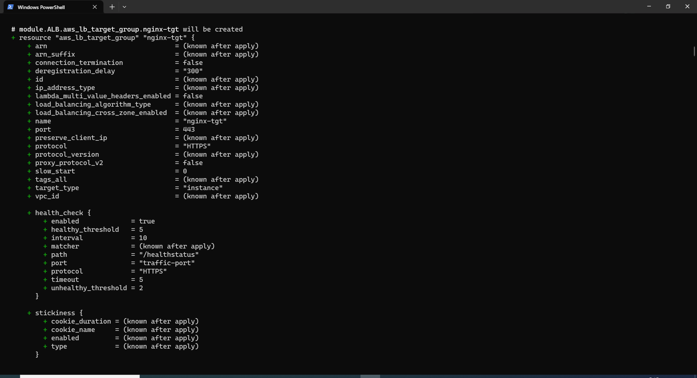

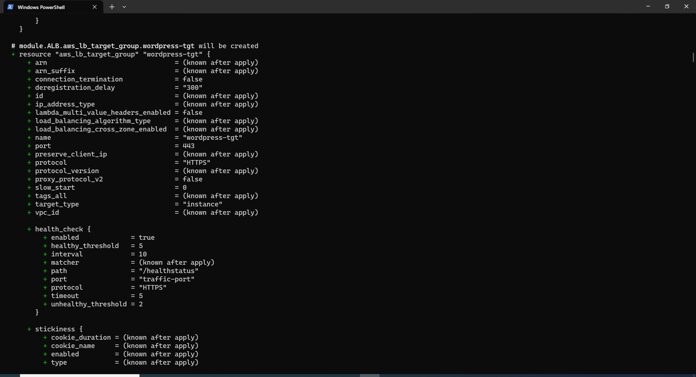

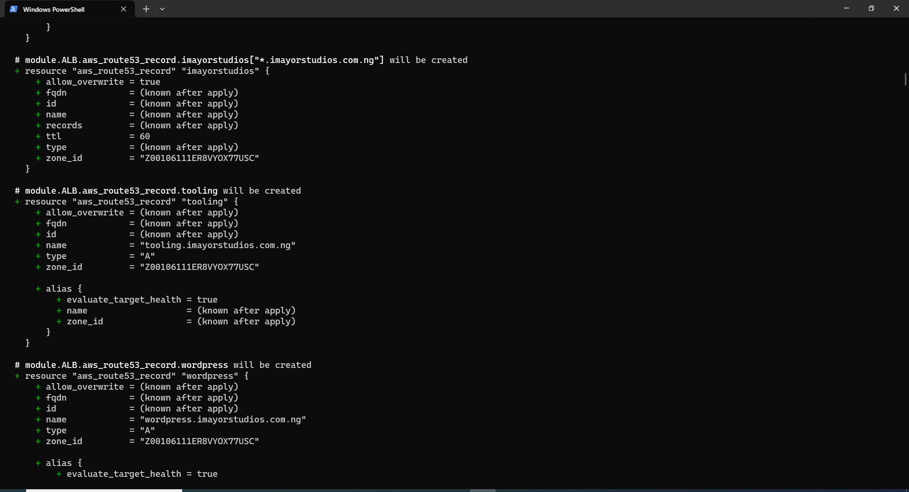

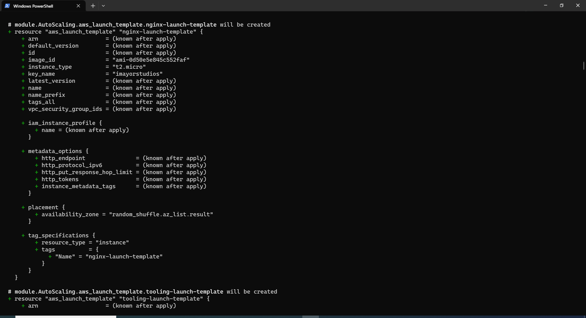