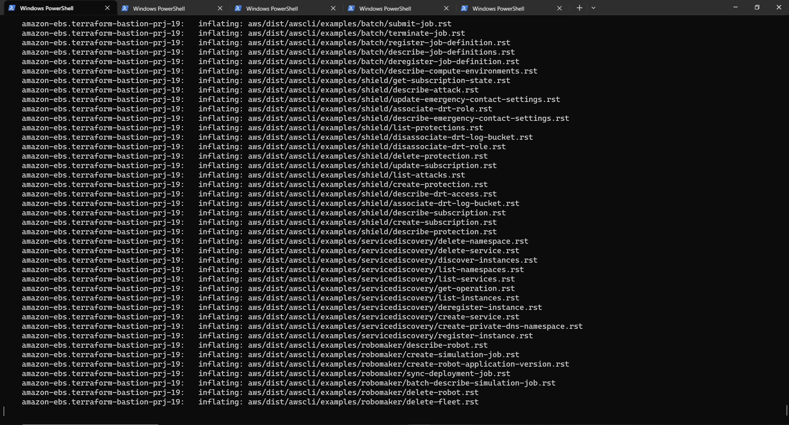
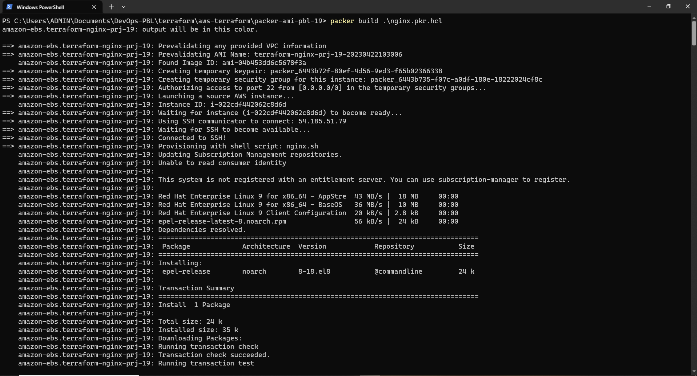
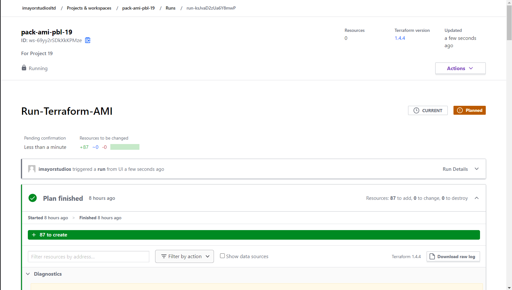

# AUTOMATING INFRASTRUCTURE WITH IAC USING TERRAFORM PART 4 - TERRAFORM CLOUD
  

## INTRODUCTION
In this project, instead of running the Terraform codes in project 18 from a command line, rather it is being executed from Terraform cloud console. The AMI is built differently with packer while Ansible is used to configure the infrastructure after its been provisioned by Terraform.

The following outlines the steps:

## STEP 1: Setting Up A Terraform Account

* Create an Organization
* After verifying my email and creating an organisation in the terraform cloud site, then on the configure workspace page, selecting **version control workflow** option inorder to run Terraform commands triggered from my git repository.
* Creating a new repository called terraform-cloud and pushing my terraform codes developed in project 18 into the repository
* Connecting the workspace to the new repository created and clicking on **create workspace**

* Clicking on configure variables on the next page to setup my AWS credentials as environment variables.

* Now my Terraform cloud is all set to apply the codes from GitHub and create all necessary AWS resources.

### STEP 2: Building AMI With Packer

* Installing packer on my local machine:

* Cloning the repository and changing directory to the AMI folder

* Running the packer commands to build AMI for Bastion server, Nginx server and webserver

For Bastion Server

For Nginx Server

For Tooling and Wordpress Server

For Jenkins, Artifactory and sonarqube Server

### STEP 3: Running The Terraform Cloud To Provision Resources

* Inputing the AMI ID in my terraform.tfvars file for the servers built with packer which terraform will use to provision Bastion, Nginx, Tooling and Wordpress server

* Pushing the codes to my repository will cause terraform cloud to trigger a plan

* Accepting the plan to to trigger an apply command

