# LAMP STACK IMPLEMENTATION 
**By Mayowa Ipinyomi**

Date: 10/09/2022

Table of Contents
* 1- Step 1 - Installing Apache and updating the firewall
* 2- Step 2 - Installing Mysql
* 3- Step 3 - Installing PHP
* 4- Step 4 - Creating a virtualhost for your website your Apache
* 5- Step 5 - Enable PHP on the website

## STEP 1 — INSTALLING APACHE AND UPDATING THE FIREWALL   
Apache is an open source software available for free. The Apache web server is among the most popular web servers in the world. To install the Apache on the Ubuntu OS, we shall carry out the following steps; 

1- Install Apache using Ubuntu’s package manager `‘apt’`:

Start by updating the package manager cache to update the software repository on the server. 

#update a list of packages in package manager
`sudo apt update`

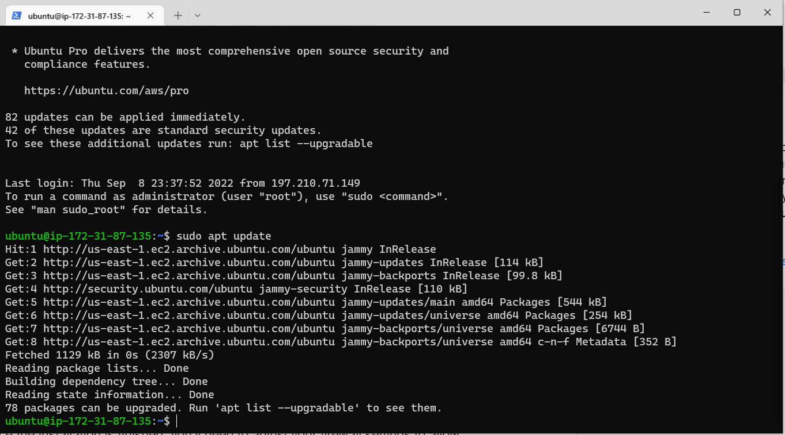


2- Then, install Apache with:
#run apache2 package installation
`sudo apt install apache2`

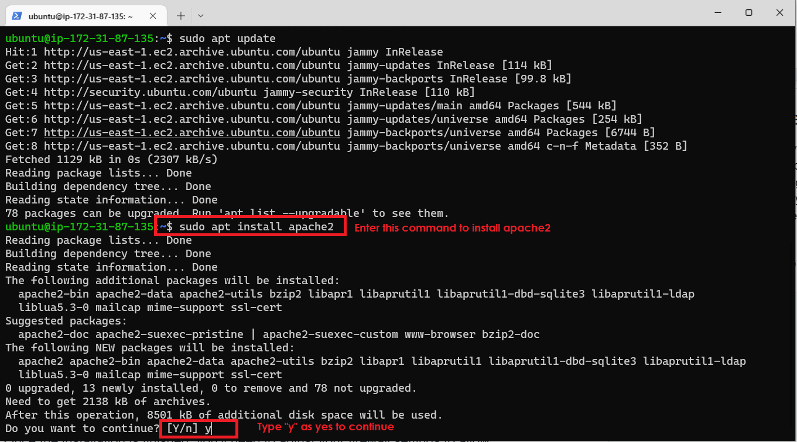

3- You’ll also be prompted to confirm Apache’s installation by pressing `Y`, then ENTER.

4-To verify that apache2 is running as a Service in our OS, use following command
#verify that apache2 is running
`sudo systemctl status apache2`

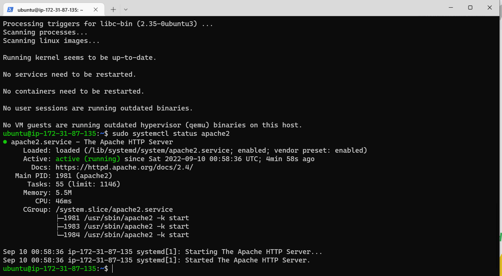

**Note: If it is green and running, then you did everything correctly**

5- Before we can receive any traffic by our Web Server, we need to open TCP port 80 which is the default port that web browsers use to access web pages on the Internet.

Therefore, using the AWS Management Console, we shall configure it to open the port 80 for the Apache to run. 


6- First, let us try to check how we can access it locally in our Ubuntu shell, run:
`curl http://localhost:80  or  curl http://127.0.0.1:80`

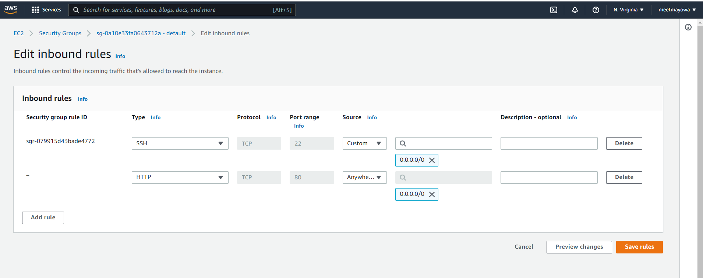

7- Now it is time for us to test how our Apache HTTP server can respond to requests from the Internet. Open a web browser of your choice and try to access following url

`http://<Public-IP-Address>:80`

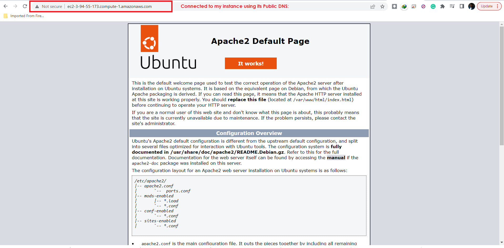

## Step 2 — Installing MySQL
Now that you have a web server up and running, you need to install a Database Management System (DBMS) to be able to store and manage data for your site in a relational database. MySQL is a popular relational database management system used within PHP environments, so we will use it in our project. 

1- Again, use `‘apt’` to acquire and install this software:

`$ sudo apt install mysql-server`


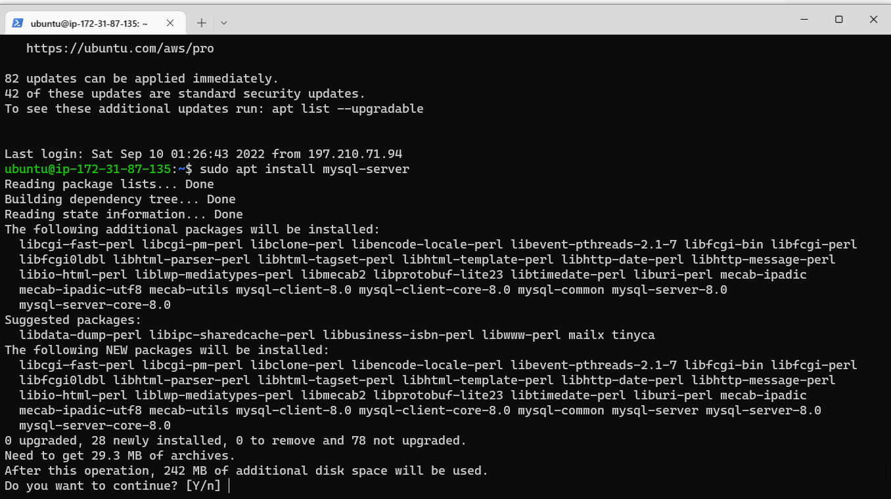

2-When prompted, confirm installation by typing `Y`, and then ENTER

When the installation is finished, log in to the MySQL console by typing:

`$ sudo mysql`
This will connect to the MySQL server as the administrative database user root, which is inferred by the use of sudo when running this command

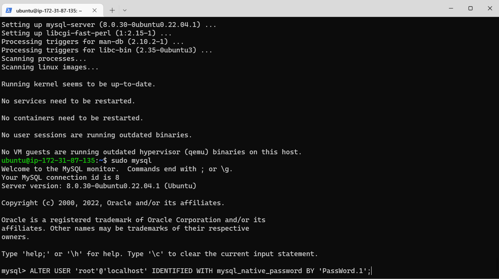

3- Before running the script you will set a password for the root user, using mysql_native_password as default authentication method. We’re defining this user’s password as `PassWord.1`


`ALTER USER 'root'@'localhost' IDENTIFIED WITH mysql_native_password BY 'PassWord.1';`


4-Start the interactive script by running:

5- If you enabled password validation, you’ll be shown the password strength for the root password you just entered and your server will ask if you want to continue with that password. If you are happy with your current password, enter `Y`
 for `“yes”` at the prompt:

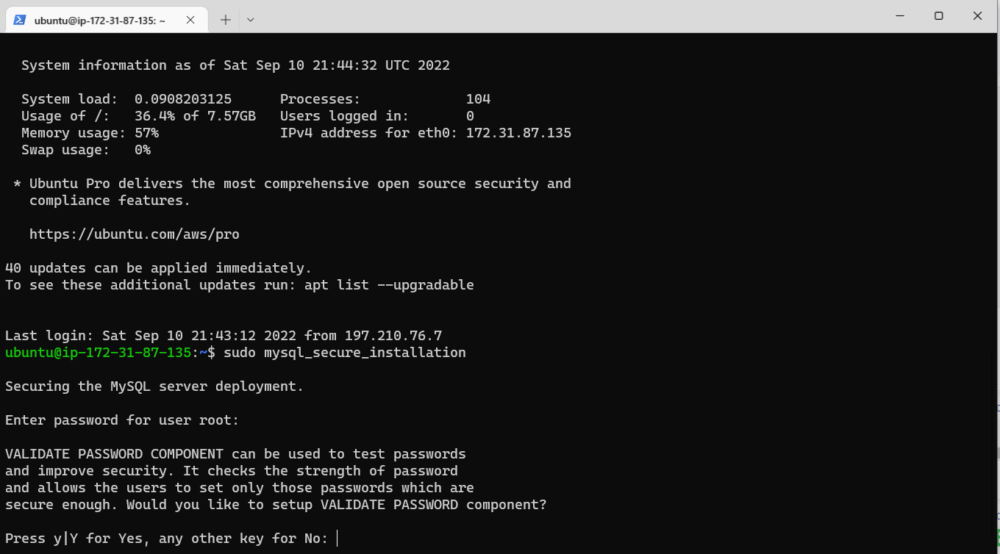


6- When you’re finished, test if you’re able to log in to the MySQL console by typing:
 `$ sudo mysql -p`
 `$ mysql -u root -p`

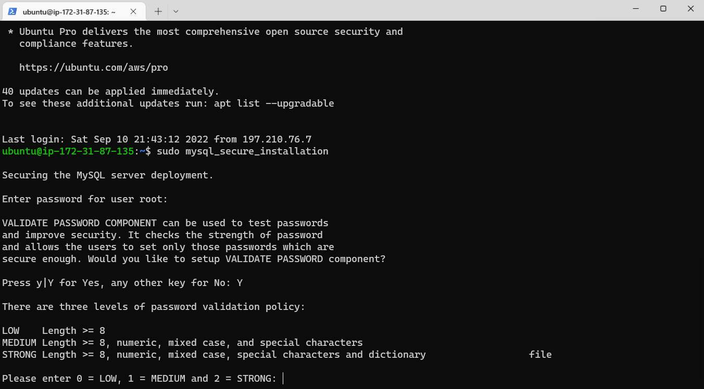

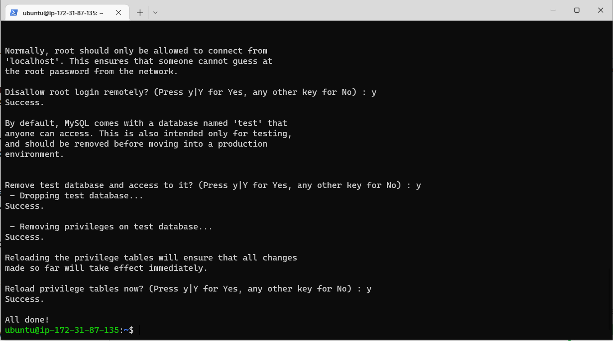

### STEP 3 — INSTALLING PHP

You have Apache installed to serve your content and MySQL installed to store and manage your data. PHP is the component of our setup that will process code to display dynamic content to the end user. In addition to the PHP package, you’ll needphp-mysql

1 - a PHP module that allows PHP to communicate with MySQL-based databases. You’ll also need  to enable Apache to handle PHP files. Core PHP packages will automatically be installed as dependencies.
To install these 3 packages at once, 

run:`sudo apt install php libapache2-mod-php php-mysql`

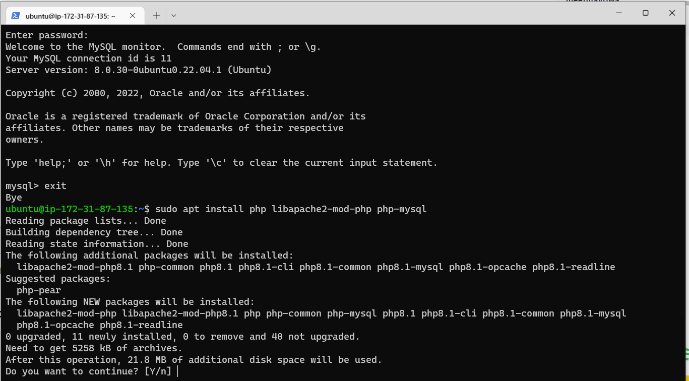

2-Version Confirmation 

`php -v`

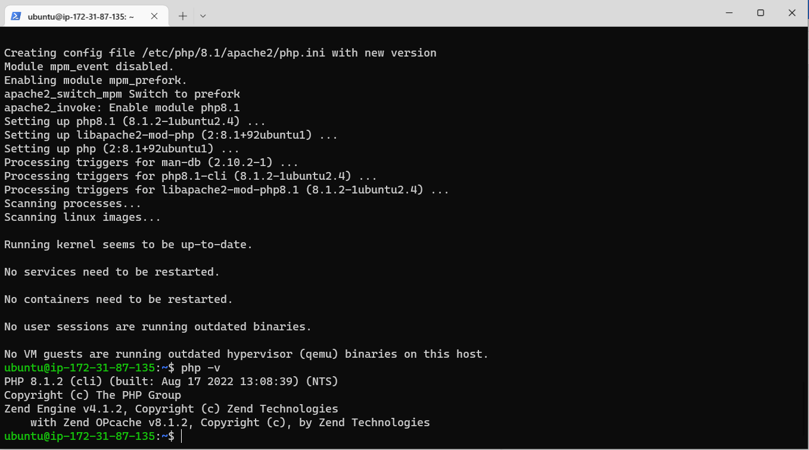

At this point, your LAMP stack is completely installed and fully operational.


### STEP 4 — CREATING A VIRTUAL HOST FOR YOUR WEBSITE USING APACHE
Apache on Ubuntu 20.04 has one server block enabled by default that is configured to serve documents from the /var/www/html directory.
We will leave this configuration as is and will add our own directory next to the default one.

1-Create the directory for projectlamp using `‘mkdir’` 
command as follows:
`sudo mkdir /var/www/projectlamp`

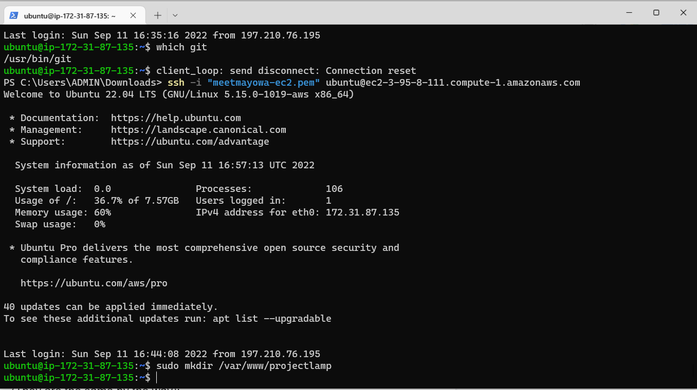

2- Next, I assigned  ownership of the directory with my current system user:
`sudo chown -R $USER:$USER /var/www/projectlamp`

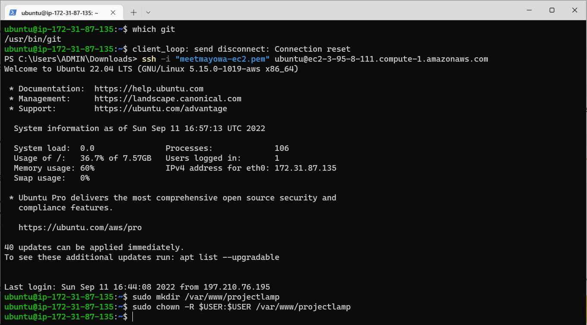

3- Then, create and open a new configuration file in Apache’s 
`sites-available` directory using your preferred command-line editor. Here, we’ll be using  vi or vim (They are the same by the way):
`sudo vi /etc/apache2/sites-available/projectlamp.conf`

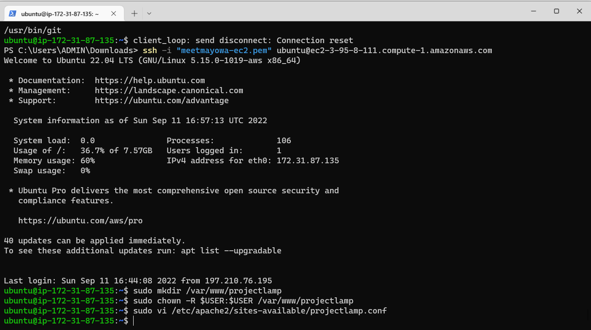

4-This will create a new blank file. Paste in the following bare-bones configuration by hitting on `i` on the keyboard to enter the insert mode, and paste the text:

```
<VirtualHost *:80>
    ServerName projectlamp
    ServerAlias www.projectlamp 
    ServerAdmin webmaster@localhost
    DocumentRoot /var/www/projectlamp
    ErrorLog ${APACHE_LOG_DIR}/error.log
    CustomLog ${APACHE_LOG_DIR}/access.log combined
</VirtualHost>

```
6- To save and close the file, simply follow the steps below:
To save and close the file, simply follow the steps below:
1. Hit the `esc` button on the keyboard
2. Type `:`
3. Type `wq.` w for write and `q` for quit
4. Hit `ENTER` to save the file

7- You can use the `ls`  command to show the new file in the sites-available directory
`sudo ls /etc/apache2/sites-available`

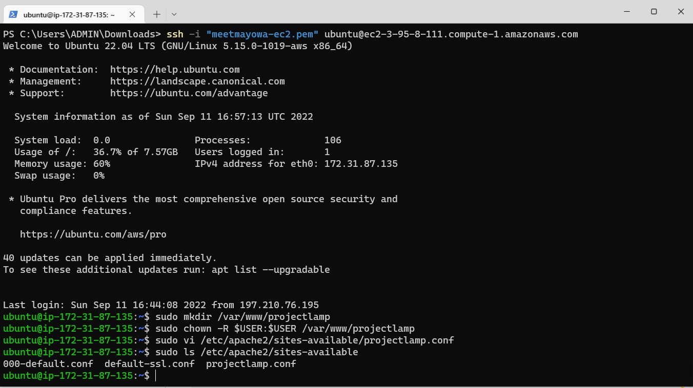

8- You can now use a2ensite command to enable the new virtual host:
`sudo a2ensite projectlamp`

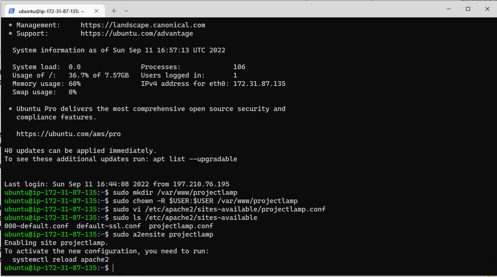

9- To disable Apache’s default website use **a2dissite** command , type:
`sudo a2dissite 000-default`

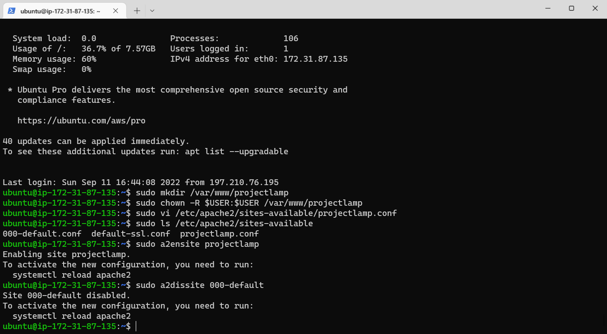

10- To make sure your configuration file doesn’t contain syntax errors, run:
`sudo apache2ctl configtest`

11- To make sure your configuration file doesn’t contain syntax errors, run:
`sudo apache2ctl configtest`

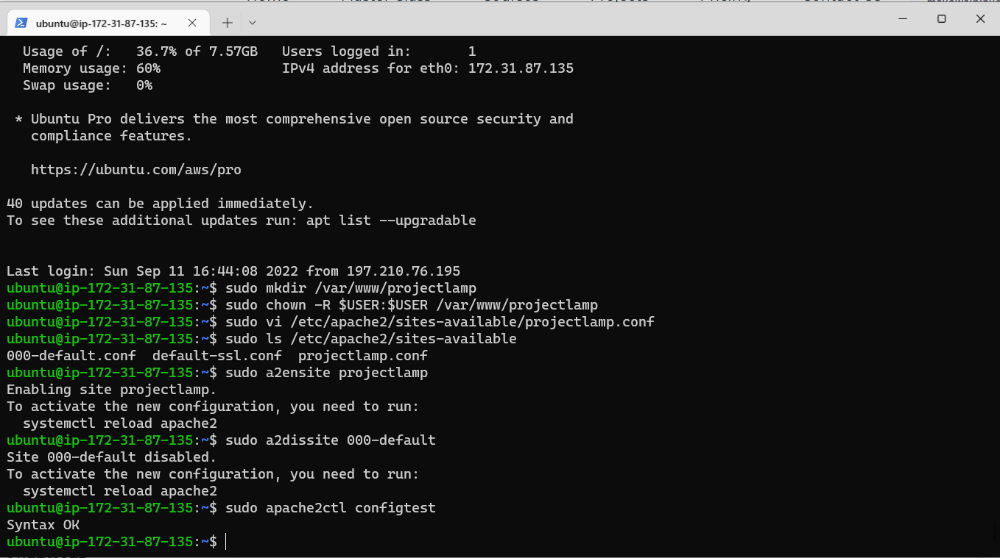

12- Your new website is now active, but the web root /var/www/projectlamp is still empty. Create an index.html file in that location so that we can test that the virtual host works as expected:

`sudo echo 'Hello LAMP from hostname' $(curl -s http://169.254.169.254/latest/meta-data/public-hostname) 'with public IP' $(curl -s http://169.254.169.254/latest/meta-data/public-ipv4) > /var/www/projectlamp/index.html`

13- Now go to your browser and try to open your website URL using IP address:
`http://<Public-IP-Address>:80`
`http://3.95.8.111:80`


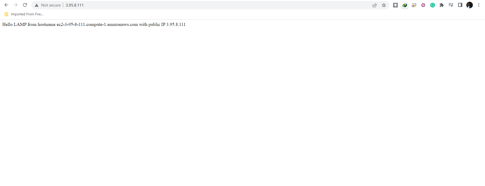

If you see the text from `‘echo’` command you wrote to index.html file, then it means your Apache virtual host is working as expected.


### STEP 5 — ENABLE PHP ON THE WEBSITE

Because this page will take precedence over the `index.php` page, it will then become the landing page for the application. Once maintenance is over, the `index.html` is renamed or removed from the document root, bringing back the regular application page.

1- In case you want to change this behavior, you’ll need to edit the `/etc/apache2/mods-enabled/dir.conf` file and change the order in which the `index.php` file is listed within the DirectoryIndex directive:

`sudo vim /etc/apache2/mods-enabled/dir.conf`

```
<IfModule mod_dir.c>
        #Change this:
        #DirectoryIndex index.html index.cgi index.pl index.php index.xhtml index.htm
        #To this:
        DirectoryIndex index.php index.html index.cgi index.pl index.xhtml index.htm
</IfModule>

```

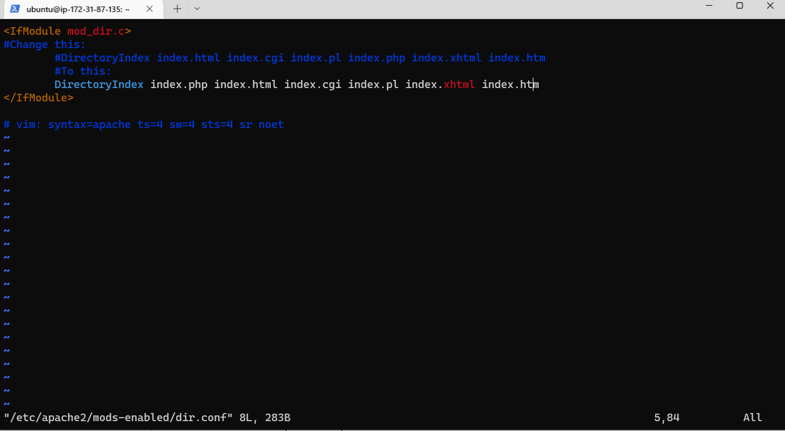

2- After saving and closing the file, you will need to reload Apache so the changes take effect:
`sudo systemctl reload apache2`

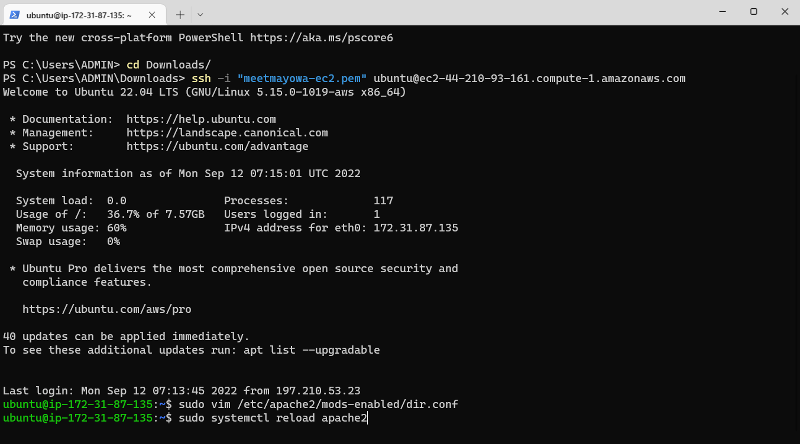

3- Finally, we will create a PHP script to test that PHP is correctly installed and configured on your server.

Now that you have a custom location to host your website’s files and folders, we’ll create a PHP test script to confirm that Apache is able to handle and process requests for PHP files.
Create a new file named index.php inside your custom web root folder:
`vim /var/www/projectlamp/index.php`

4- This will open a blank file. Add the following text, which is valid PHP code, inside the file: 
```
<?php
phpinfo();

```

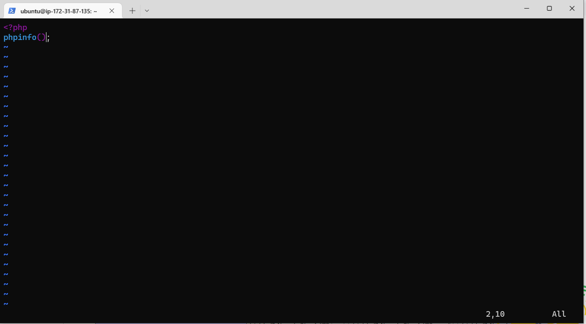


5- When you are finished, save and close the file, refresh the page and you will see a page similar to this:

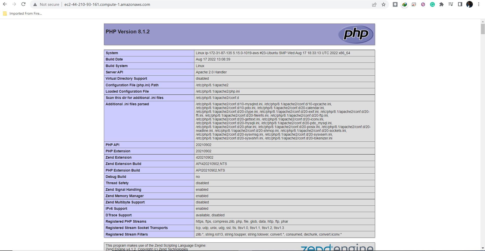

This page provides information about your server from the perspective of PHP. It is useful for debugging and to ensure that your settings are being applied correctly.
If you can see this page in your browser, then your PHP installation is working as expected.
6- After checking the relevant information about your PHP server through that page, it’s best to remove the file you created as it contains sensitive information about your PHP environment -and your Ubuntu server. You can use rm to do so:
`sudo rm /var/www/projectlamp/index.php`

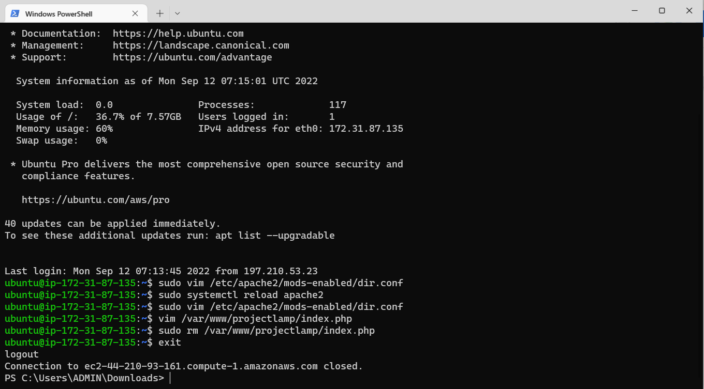
