# DEPLOYING APPLICATIONS INTO KUBERNETES CLUSTER

## INTRODUCTION
This project demonstrates how containerised applications are deployed as pods in Kubernetes and how to access the application from the browser.

The following outlines the steps:

### STEP 1: Creating A Pod For The Nginx Application

* Setting up a minikube environment to be able to run kubernetes on a local engine. 

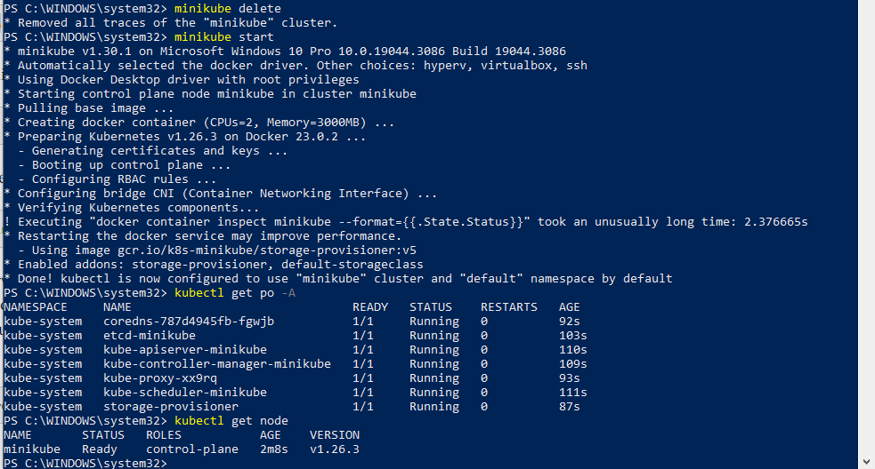

* Creating nginx pod by applying the manifest file: `$ kubectl apply -f nginx-pod.yaml`

* nginx-pod.yaml manifest file

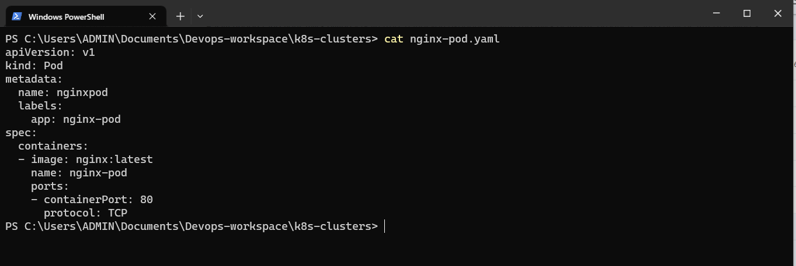

* Running the following commands to inspect the setup:

```
$ kubectl get pod nginx-pod --show-labels

$ kubectl get pod nginx-pod -o wide

```

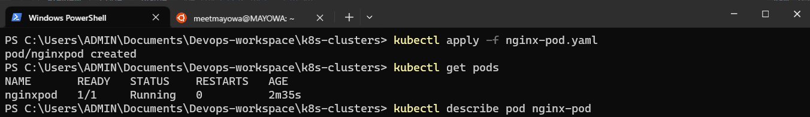

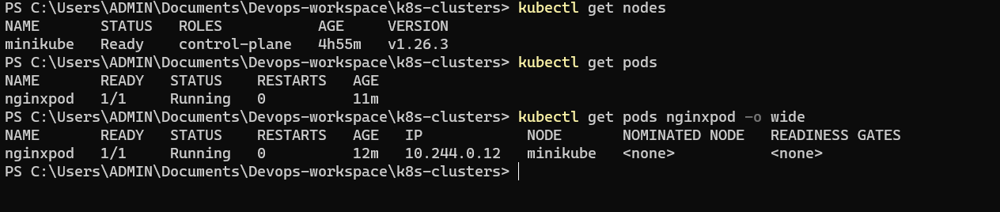


### STEP 2: Accessing The Nginx Application Through A Browser

* First of all, Let's try accessing the Nginx Pod through its IP address from within the Kubernetes cluster. To do this an image that already has curl software installed is needed.
* Running the kubectl command to run the container that has curl software in it as a pod:`$ kubectl run curl --image=dareyregistry/curl -i --tty`
* Running curl command and pointing it to the IP address of the Nginx Pod:`$ curl -v 172.50.202.214:80`

**Notice that the IP address of the Pod, is NOT the IP address of the server it is running on. Kubernetes, through the implementation of network plugins assigns virtual IP adrresses to each Pod.**


```
apiVersion: v1
kind: Service
metadata:
  name: nginx-service
spec:
  type: NodePort
  selector:
    app: nginx-pod
  ports:
    - protocol: TCP
      port: 80
      nodePort: 30080


```

* Running the following commands to inspect the setup:


```
$ kubectl get service nginx-service -o wide

$ kubectl get svc nginx-service --show-labels

```


* Since the type of service created for the Nginx pod is a ClusterIP which cannot be accessed externally, we can do port-forwarding in order to bind the machine's port to the ClusterIP service port, i.e, tunnelling traffic through the machine's port number to the port number of the nginx-service: `$ kubectl port-forward svc/nginx-service 8089:80`

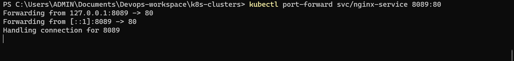

* Accessing the Nginx application from the browser: `http://localhost:8089`

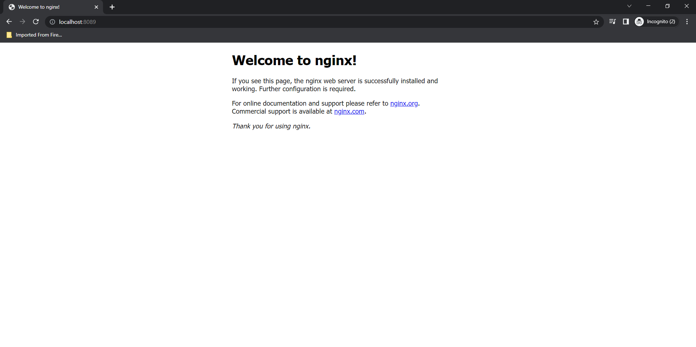

* Another way of accessing the Nginx app through browser is the use of NodePort which is a type of service that exposes the service on a static port on the node’s IP address and they range from 30000-32767 by default.
* Editing the nginx-service.yml manifest file to expose the Nginx service in order to be accessible to the browser by adding NodePort as a type of service:

```
apiVersion: v1
kind: Service
metadata:
  name: nginx-service
spec:
  type: NodePort
  selector:
    app: nginx-pod
  ports:
    - protocol: TCP
      port: 80
      nodePort: 30080

```

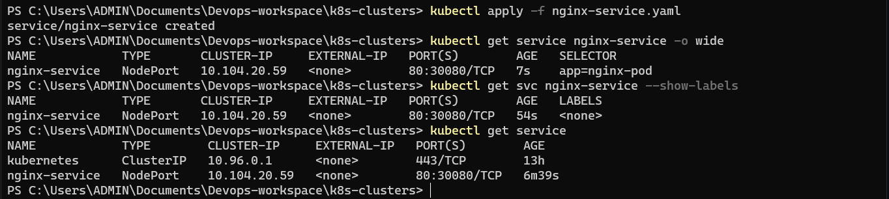

* Accessing the nginx application from the browser with the value of the nodeport 30080 which is a port on the node in which the Pod is scheduled to run: `http://3.82.220.4:30080`


### STEP 3: Creating A Replica Set

* The replicaSet object helps to maintain a stable set of Pod replicas running at any given time to achieve availability in case one or two pods dies.
* Deleting the nginx-pod:`$ kubectl delete pod nginx-pod.yaml`
* Creating the replicaSet manifest file and applying it:`$ kubectl apply -f rss.yaml`

**rss.yaml manifest file**

```

apiVersion: apps/v1
kind: ReplicaSet
metadata:
  name: nginx-rs
  labels:
    app: nginx-pod
spec:
  replicas: 3
  selector:
    matchLabels:
      app: nginx-pod
  template:
    metadata:
      labels:
        app: nginx-pod
    spec:
      containers:
      - name: nginx-pod
        image: nginx:latest
        ports:
        - containerPort: 80
          protocol: TCP

```

* Inspecting the setup:

```
$ kubectl get pods
$ kubectl get rs -o wide
```
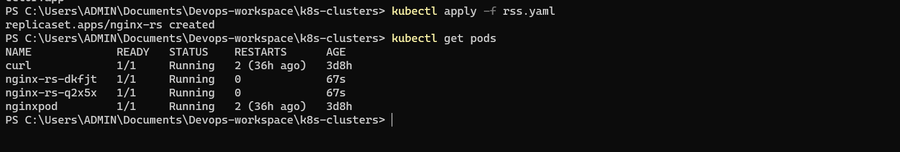

* Deleting one of the pods will cause another one to be scheduled and set to run:`$ kubectl delete pod nginx-rs-q2x5x`

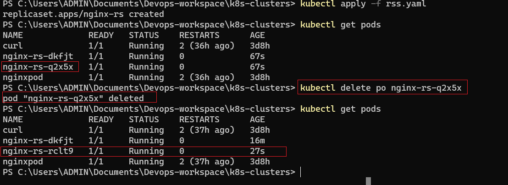

* Another pod scheduled

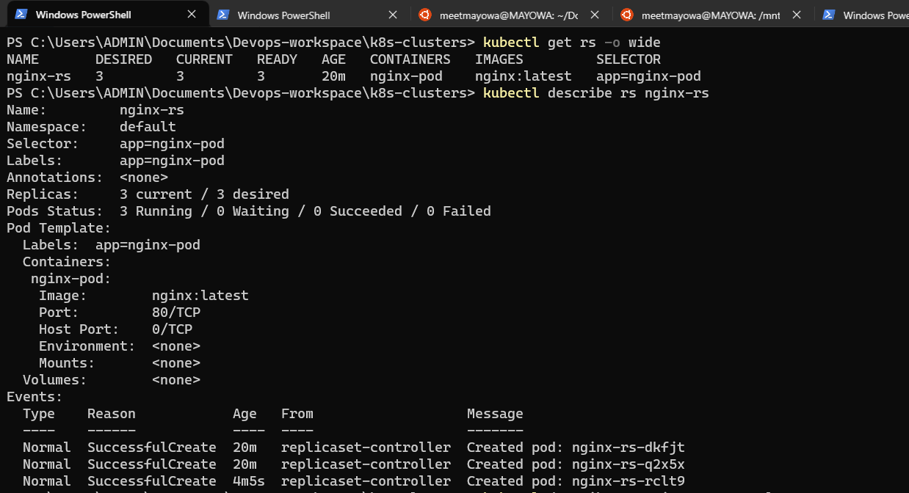


* Two ways pods can be scaled: Imperative and Declarative
* Imperative method is by running a command on the CLI: `$ kubectl scale --replicas 5 replicaset nginx-rs`

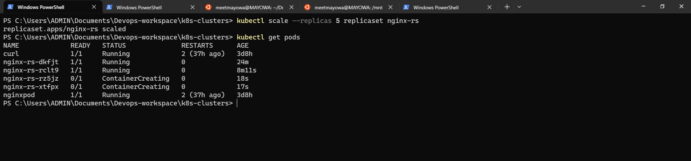 


* Declarative method is done by editing the rs.yaml manifest and changing to the desired number of replicas and applying the update


### STEP 4: Creating Deployment

A Deployment is another layer above ReplicaSets and Pods, It manages the deployment of ReplicaSets and allows for easy updating of a ReplicaSet as well as the ability to roll back to a previous version of deployment. To see it in action:

* Deleting the ReplicaSet that was created before: `$ kubectl delete rs nginx-rs`
* Creating deployment manifest file called deployment.yaml and applying it:`$ kubectl apply -f deployment.yaml`

```
apiVersion: apps/v1
kind: Deployment
metadata:
  name: nginx-deployment
  labels:
    tier: frontend
spec:
  replicas: 3
  selector:
    matchLabels:
      tier: frontend
  template:
    metadata:
      labels:
        tier: frontend
    spec:
      containers:
      - name: nginx
        image: nginx:latest
        ports:
        - containerPort: 8

```

* Inspecting the setup:

```
$ kubectl get po

$ kubectl get deploy

$ kubectl get rs

```

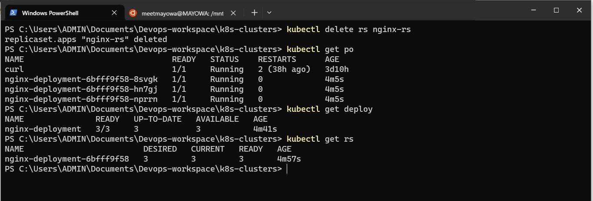  

* To exec into one of the pods: `kubectl exec nginx-deployment-6fdcffd8fc-x57f9 -i -t -- bash`

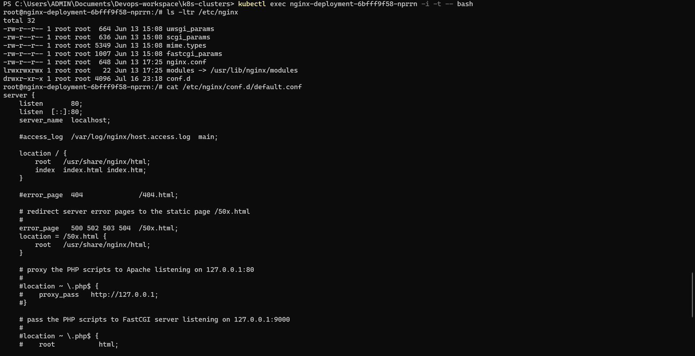 


### STEP 5: Deploying Tooling Application With Kubernetes
The tooling application that was containerised with Docker on Project 20, the following shows how the image is pulled and deployed as pods in Kubernetes:

* Creating deployment manifest file for the tooling aplication called tooling-deploy.yaml and applying it:

```
apiVersion: apps/v1
kind: Deployment
metadata:
  name: tooling-deployment
  labels:
    app: tooling-app
spec:
  replicas: 1
  selector:
    matchLabels:
      app: tooling-app
  template:
    metadata:
      labels:
        app: tooling-app
    spec:
      containers:
      - name: tooling
        image: meetmayowa/tooling:0.0.1
        ports:
        - containerPort: 80
```

* Creating Service manifest file for the tooling aplication called tooling-service.yaml and applying it

```
apiVersion: v1
kind: Service
metadata:
  name: tooling-service
spec:
  selector:
    app: tooling-app
  ports:
    - protocol: TCP
      port: 80
      targetPort: 80

```

* Creating deployment manifest file for the MySQL database application called mysql-deploy.yaml and applying it

```
apiVersion: apps/v1
kind: Deployment
metadata:
 name: mysql-deployment
 labels:
   tier: mysql-db
spec:
 replicas: 1
 selector:
   matchLabels:
     tier: mysql-db
 template:
   metadata:
     labels:
       tier: mysql-db
   spec:
     containers:
     - name: mysql
       image: mysql:5.7
       env:
       - name: MYSQL_DATABASE
         value: toolingdb
       - name: MYSQL_USER
         value: somex
       - name: MYSQL_PASSWORD
         value: password123
       - name: MYSQL_ROOT_PASSWORD
         value: password1234
       ports:
       - containerPort: 3306
```


* Creating Service manifest file for the MySQL database application called mysql-service.yaml and applying it

```

apiVersion: v1
kind: Service
metadata:
  name: db
spec:
  selector:
    tier: mysql-db
  ports:
    - protocol: TCP
      port: 3306
      targetPort: 3306
```

* Accessing the application from the browser by port forwarding the service:

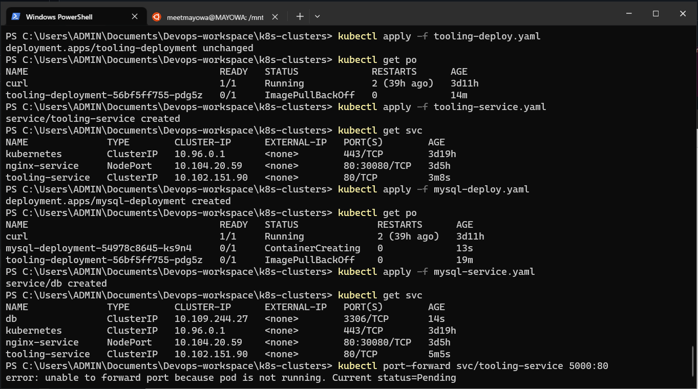 


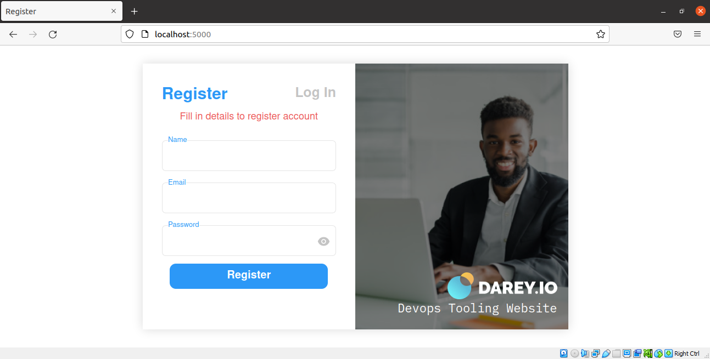 
