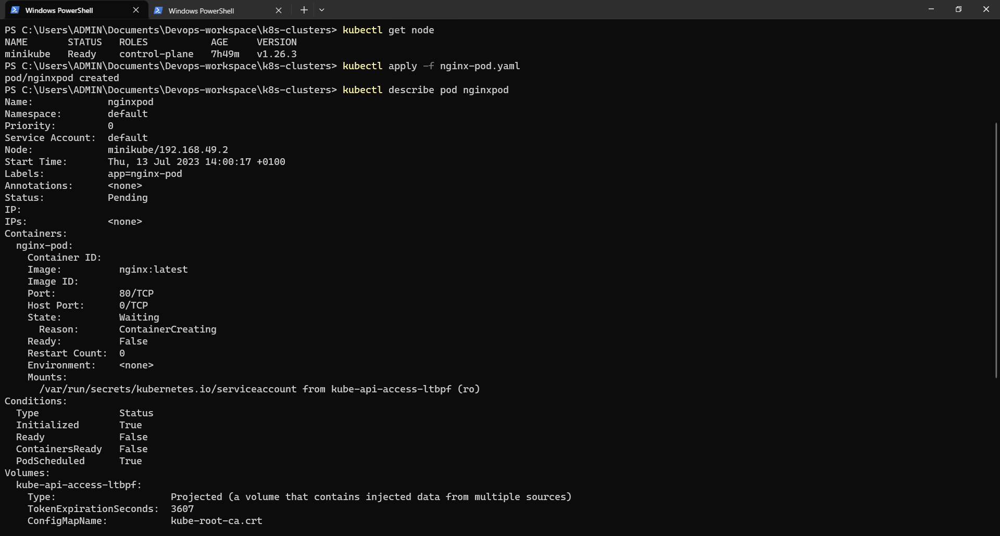

# DEPLOYING APPLICATIONS INTO KUBERNETES CLUSTER

## INTRODUCTION
This project demonstrates how containerised applications are deployed as pods in Kubernetes and how to access the application from the browser.

The following outlines the steps:

### STEP 1: Creating A Pod For The Nginx Application

* Setting up a minikube environment to be able to run kubernetes on a local engine. 


* Creating nginx pod by applying the manifest file: `$ kubectl apply -f nginx-pod.yaml`

* nginx-pod.yaml manifest file


* Running the following commands to inspect the setup:

```
$ kubectl get pod nginx-pod --show-labels

$ kubectl get pod nginx-pod -o wide

```




### STEP 2: Accessing The Nginx Application Through A Browser

* First of all, Let's try accessing the Nginx Pod through its IP address from within the Kubernetes cluster. To do this an image that already has curl software installed is needed.
* Running the kubectl command to run the container that has curl software in it as a pod:`$ kubectl run curl --image=dareyregistry/curl -i --tty`
* Running curl command and pointing it to the IP address of the Nginx Pod:`$ curl -v 172.50.202.214:80`