## PERSISTING DATA IN KUBERNETES
### INTRODUCTION
The pods created in Kubernetes are ephemeral, they don't run for long. When a pod dies, any data that is not part of the container image will be lost when the container is restarted because Kubernetes is best at managing stateless applications which means it does not manage data persistence. To ensure data persistent, the PersistentVolume resource is implemented to acheive this.

The following outlines the steps:

### STEP 1: Setting Up AWS Elastic Kubernetes Service With kOps on AWS

Using this link as a guideline 
https://kops.sigs.k8s.io/getting_started/install/
https://kops.sigs.k8s.io/getting_started/aws/

* Install the necessary dependencies: 
   - Download the kops binary for Linux by running the following command
 
 `curl -Lo kops https://github.com/kubernetes/kops/releases/download/$(curl -s https://api.github.com/repos/kubernetes/kops/releases/latest | grep tag_name | cut -d '"' -f 4)/kops-linux-amd64
 `

* Make the binary executable by running:
`chmod +x kops`

* Move the binary to a directory in your PATH:
`sudo mv kops /usr/local/bin/kops`

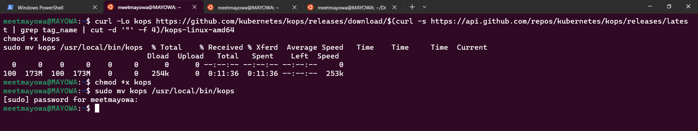


### Prepare local environment
* We're ready to start creating our first cluster! Let's first set up a few environment variables to make the process easier.

* Setting up KOPS cluster with a single commandline:

```
# Kops cluster state bucket
aws s3api create-bucket \
    --bucket p23-kops-cluster \
    --region us-east-1

# List the AWS s3
aws s3 ls

# Enable versioning
aws s3api put-bucket-versioning --bucket p23-kops-cluster  --versioning-configuration Status=Enabled

# Export variables
export NAME=my-first-cluster.k8s.local
export KOPS_STATE_STORE=s3://p23-kops-cluster

# Create Cluster
kops create cluster --name=${NAME} --cloud=aws --zones=us-east-1a --state=s3://p23-kops-cluster

#Edit Cluster
kops edit cluster --name ${NAME}
$ kops edit cluster --name my-first-cluster.k8s.local

#Build the cluster

kops update cluster --name ${NAME} --yes --admin
$ kops update cluster --name my-first-cluster.k8s.local --yes --admin
#Validate the cluster
kops validate cluster --wait 10m


kubectl -n kube-system get po

#Delete the cluster
kops delete cluster --name ${NAME} --yes

```

* Kops cluster state bucket

```
aws s3api create-bucket \
    --bucket p23-kops-cluster \
    --region us-east-1

### List the AWS s3
aws s3 ls
```

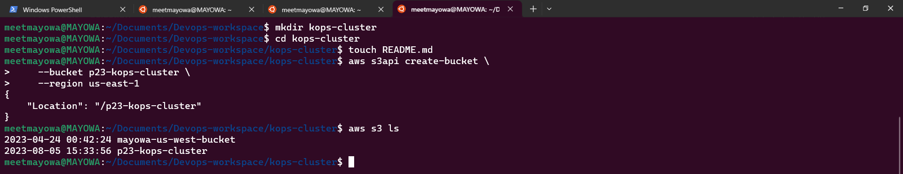


*  Enable versioning 

`aws s3api put-bucket-versioning --bucket p23-kops-cluster  --versioning-configuration Status=Enabled`

* Export variables

`export NAME=my-first-cluster.k8s.local`

`export KOPS_STATE_STORE=s3://p23-kops-cluster`

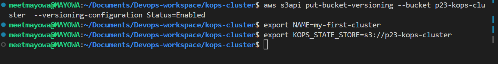

* Create Cluster

`kops create cluster --name=${NAME} --cloud=aws --zones=us-east-1a --state=s3://p23-kops-cluster`

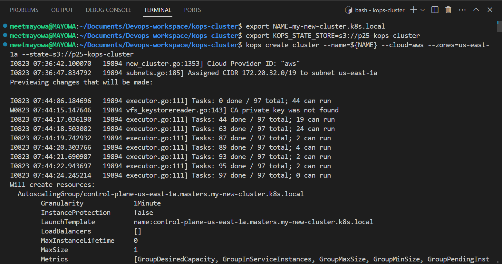
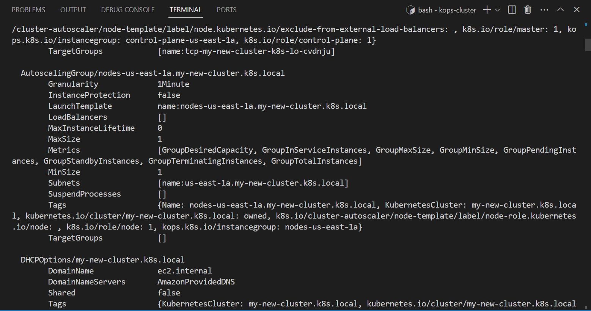
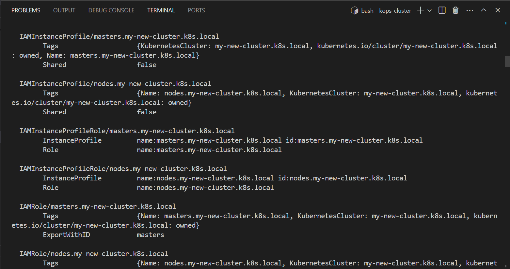
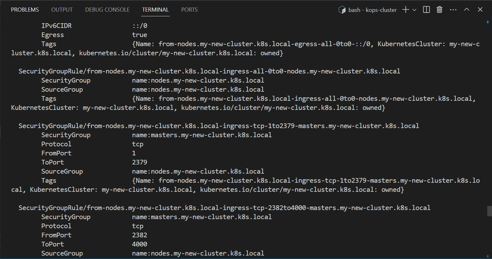
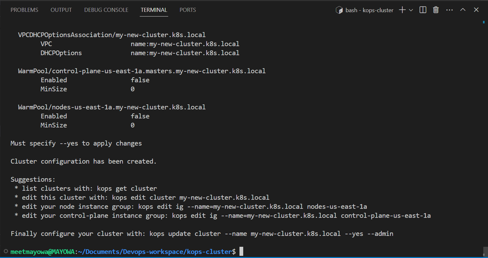

* Edit Cluster

`kops edit cluster --name my-first-cluster.k8s.local`

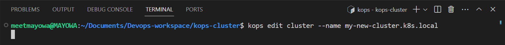
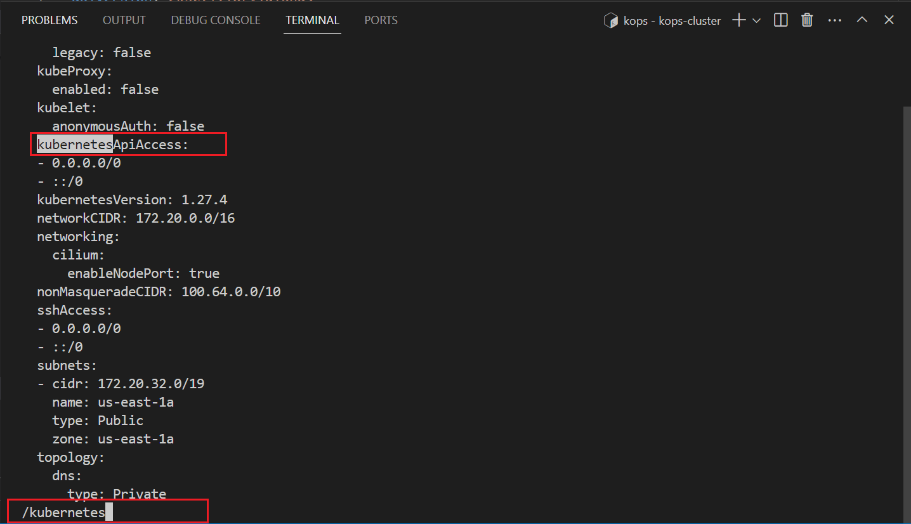
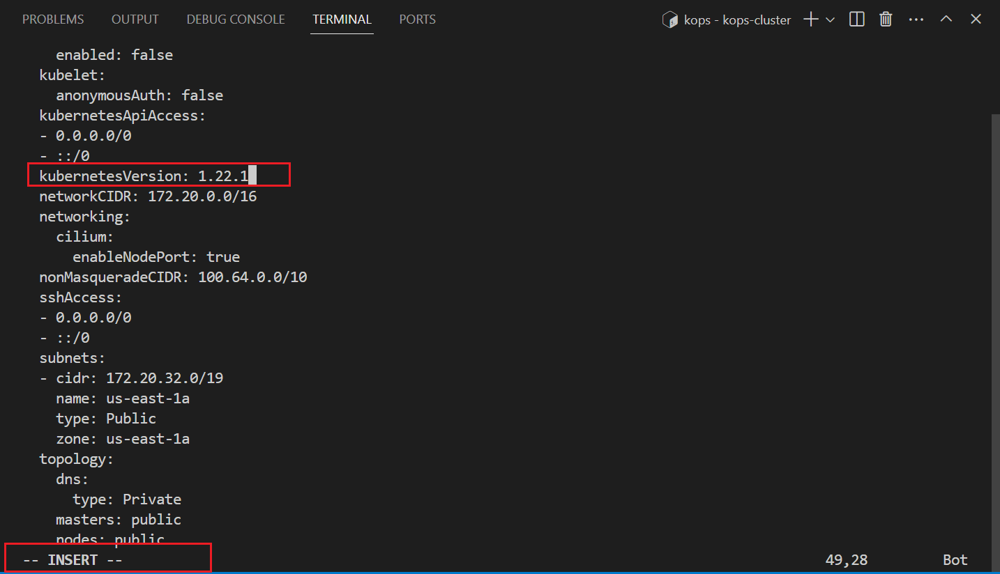

* Build the cluster
`kops update cluster --name my-first-cluster.k8s.local --yes --admin`


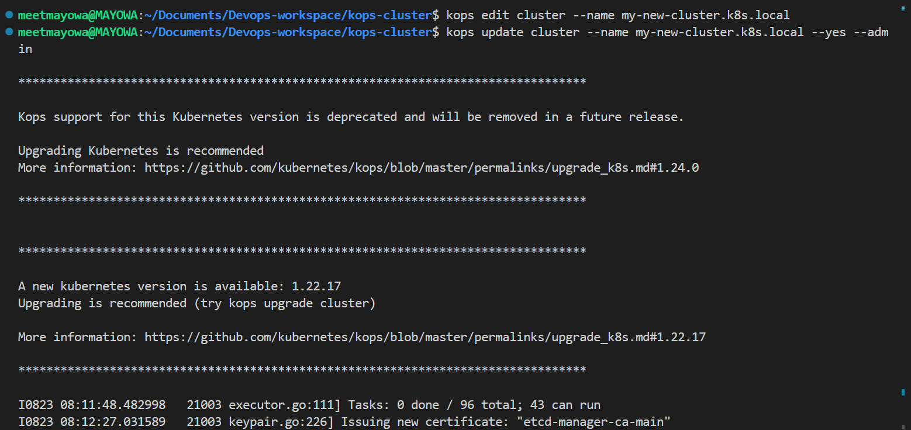
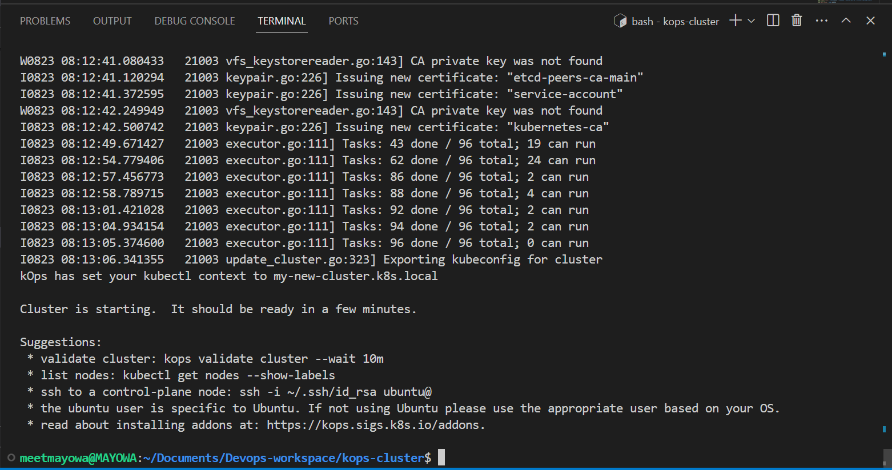

* Validate the cluster

`kops validate cluster --wait 10m`

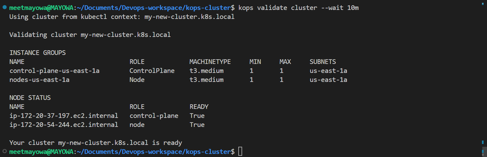

* From Management console, view the vpc

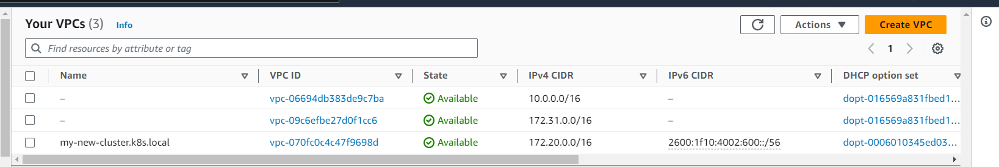
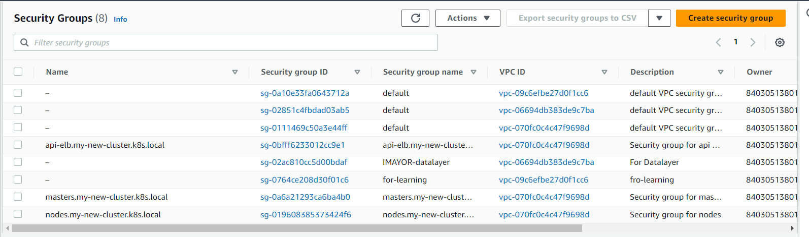
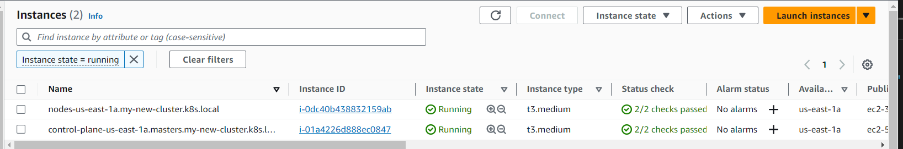
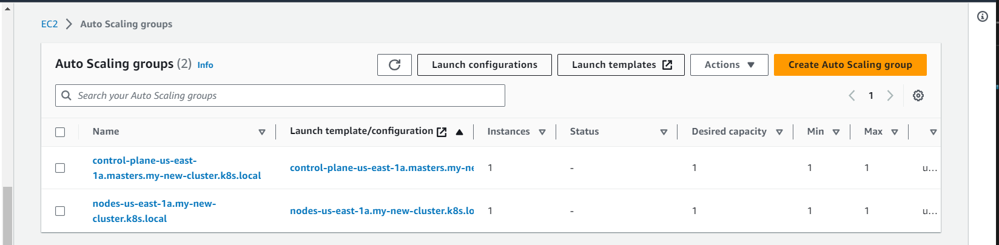

* kubectl -n kube-system get po

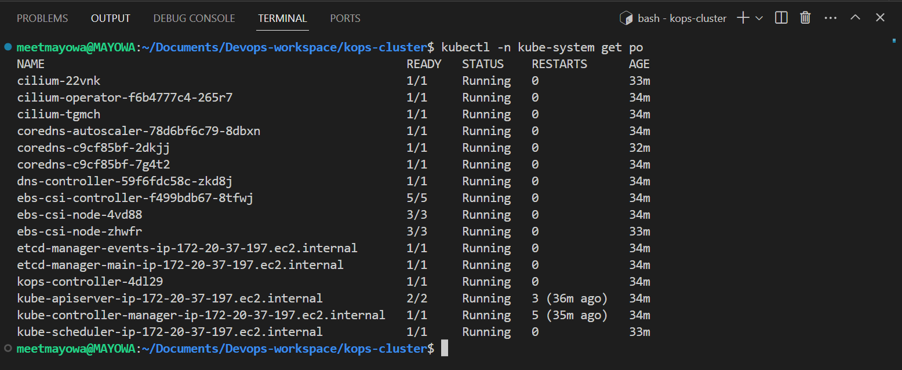

* Delete the cluster

`kops delete cluster --name my-first-cluster.k8s.local --yes`

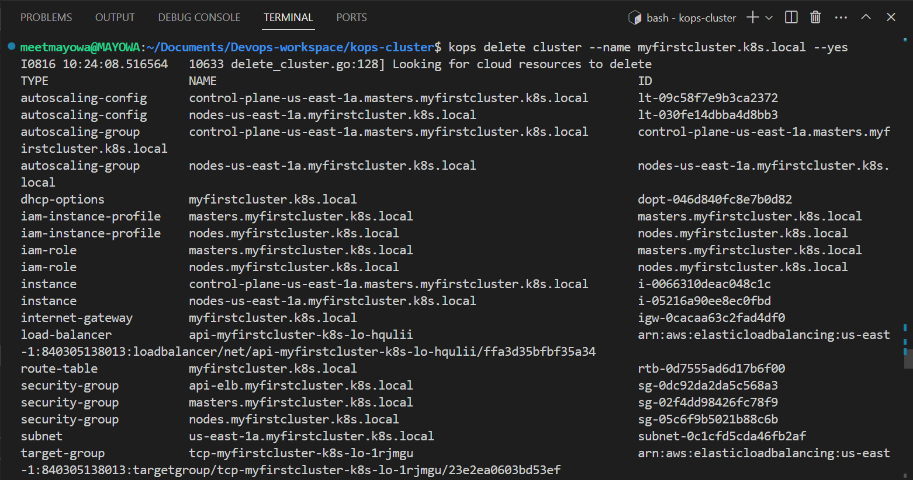

### STEP 2: Creating Persistent Volume Manually For The Nginx Application
* Creating a deployment manifest file for the Nginx application and applying it:

```
sudo cat <<EOF | sudo tee ./nginx-pod.yaml
apiVersion: apps/v1
kind: Deployment
metadata:
  name: nginx-deployment
  labels:
    tier: frontend
spec:
  replicas: 3
  selector:
    matchLabels:
      tier: frontend
  template:
    metadata:
      labels:
        tier: frontend
    spec:
      containers:
      - name: nginx
        image: nginx:latest
        ports:
        - containerPort: 80
EOF


```

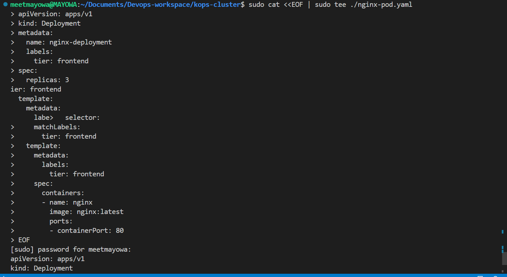


* Verifying that the pod is running: `$ kubectl get pod`

* Exec into the pod and navigating to the nginx configuration file:

```
$ kubectl exec nginx-deployment-6fdcffd8fc-tj9c6 -i -t -- bash

cd /etc/nginx/conf.d
cat default.conf

```

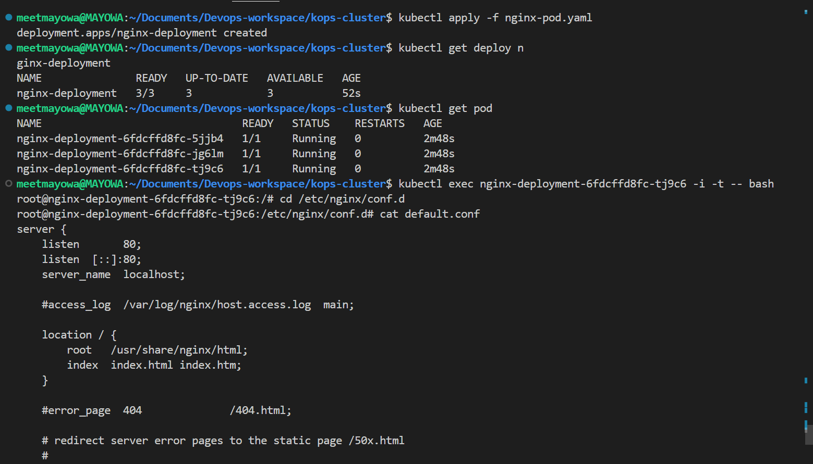
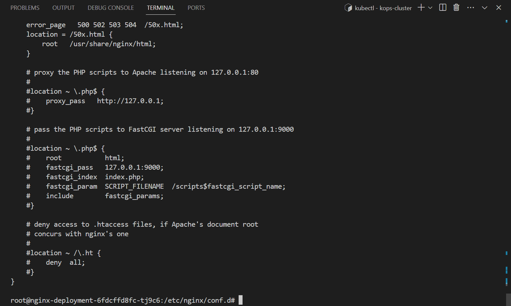

* When creating a volume it must exists in the same region and availability zone as the EC2 instance running the pod. To confirm which node is running the pod: `$ kubectl get po nginx-deployment-6fdcffd8fc-tj9c6 -o wide`


* To check the Availability Zone where the node is running: `$ kubectl describe node ip-172-20-54-244.ec2.internal`


* Creating a volume in the Elastic Block Storage section in AWS in the same AZ as the node running the nginx pod which will be used to mount volume into the Nginx pod.


* Updating the deployment configuration with the volume spec and volume mount:

```
apiVersion: apps/v1
kind: Deployment
metadata:
  name: nginx-deployment
  labels:
    tier: frontend
spec:
  replicas: 1
  selector:
    matchLabels:
      tier: frontend
  template:
    metadata:
      labels:
        tier: frontend
    spec:
      containers:
      - name: nginx
        image: nginx:latest
        ports:
        - containerPort: 80
        volumeMounts:
        - name: nginx-volume
          mountPath: /usr/share/nginx/
      volumes:
      - name: nginx-volume
        awsElasticBlockStore:
          volumeID: "vol-07b537651bbe68be0"
          fsType: ext4

```


* But the problem with this configuration is that when we port forward the service and try to reach the endpoint, we will get a 403 error. This is because mounting a volume on a filesystem that already contains data will automatically erase all the existing data. To solve this issue is by implementing Persistent Volume(PV) and Persistent Volume claims(PVCs) resource.


### STEP 3: Managing Volumes Dynamically With PV and PVCs
* PVs are resources in the cluster. PVCs are requests for those resources and also act as claim checks to the resource.By default in EKS, there is a default storageClass configured as part of EKS installation which allow us to dynamically create a PV which will create a volume that a Pod will use.

* Verifying that there is a storageClass in the cluster:$ kubectl get storageclass

* Creating a manifest file for a PVC, and based on the gp2 storageClass a PV will be dynamically created:

```
apiVersion: v1
kind: PersistentVolumeClaim
metadata:
    name: nginx-volume-claim
spec:
      accessModes:
      - ReadWriteOnce
      resources:
        requests:
          storage: 2Gi
      storageClassName: gp2

```

* Checking the setup:`$ kubectl get pvc`


* Checking for the volume binding section:`$ kubectl describe storageclass gp2`


* The PVC created is in pending state because PV is not created yet. Editing the nginx-pod.yaml file to create the PV:

```
apiVersion: apps/v1
kind: Deployment
metadata:
  name: nginx-deployment
  labels:
    tier: frontend
spec:
  replicas: 1
  selector:
    matchLabels:
      tier: frontend
  template:
    metadata:
      labels:
        tier: frontend
    spec:
      containers:
      - name: nginx
        image: nginx:latest
        ports:
        - containerPort: 80
        volumeMounts:
        - name: nginx-volume-claim
          mountPath: /tmp/mayodir
      volumes:
      - name: nginx-volume-claim
        persistentVolumeClaim:
          claimName: nginx-volume-claim

```

* The `'/tmp/mayodir'` directory will be persisted, and any data written in there will be stored permanetly on the volume, which can be used by another Pod if the current one gets replaced.

* Checking the dynamically created PV:`$ kubectl get pv`


* Another approach is creating a volumeClaimTemplate within the Pod spec of nginx-pod.yaml file so rather than having 2 manifest files, everything will be defined within a single manifest:


### STEP 4: Use Of ConfigMap As A Persistent Storage

* ConfigMap is an API object used to store non-confidential data in key-value pairs. It is a way to manage configuration files and ensure they are not lost as a result of Pod replacement.
* To demonstrate this, the HTML file that came with Nginx will be used.
* Exec into the container and copying the HTML file:

```
$ kubectl exec nginx-deployment-6fdcffd8fc-77rfh -i -t -- bash

$ cat /usr/share/nginx/html/index.html 

```


* Creating the ConfigMap manifest file and customizing the HTML file and applying the change:


```
cat <<EOF | tee ./nginx-configmap.yaml
apiVersion: v1
kind: ConfigMap
metadata:
  name: website-index-file
data:
  # file to be mounted inside a volume
  index-file: |
    <!DOCTYPE html>
    <html>
    <head>
    <title>Welcome to Nginx!</title>
    <style>
    html { color-scheme: light dark; }
    body { width: 35em; margin: 0 auto;
    font-family: Tahoma, Verdana, Arial, sans-serif; }
    </style>
    </head>
    <body>
    <h1>Welcome to Nginx!</h1>
    <p>If you see this page, the nginx web server is successfully installed and
    working. Further configuration is required.</p>

    <p>For online documentation and support please refer to
    <a href="http://nginx.org/">nginx.org</a>.<br/>
    Commercial support is available at
    <a href="http://nginx.com/">nginx.com</a>.</p>

    <p><em>Thank you for using nginx.</em></p>
    </body>
    </html>
EOF


```


* Updating the deployment file to use the configmap in the volumeMounts section

```
apiVersion: apps/v1
kind: Deployment
metadata:
  name: nginx-deployment
  labels:
    tier: frontend
spec:
  replicas: 1
  selector:
    matchLabels:
      tier: frontend
  template:
    metadata:
      labels:
        tier: frontend
    spec:
      containers:
      - name: nginx
        image: nginx:latest
        ports:
        - containerPort: 80
        volumeMounts:
          - name: config
            mountPath: /usr/share/nginx/html
            readOnly: true
      volumes:
      - name: nginx-volume
        configMap:
          name: website-index-file
          items:
          - key: index-file
            path: index.html

```

* Now the index.html file is no longer ephemeral because it is using a configMap that has been mounted onto the filesystem. This is now evident when you exec into the pod and list the `/usr/share/nginx/html` directory


* To see the configmap created:`$ kubectl get configmap`
* To see the change in effect, updating the configmap manifest:`$ kubectl edit cm website-index-file`

```
 <!DOCTYPE html>
    <html>
    <head>
    <title>Welcome to ChassTech Services!</title>
    <style>
    html { color-scheme: light dark; }
    body { width: 35em; margin: 0 auto;
    font-family: Tahoma, Verdana, Arial, sans-serif; }
    </style>
    </head>
    <body>
    <h1>Welcome to ChassyTech Services!</h1>
    <p>If you see this page, the nginx web server is successfully installed and
    working. Further configuration is required.</p>

    <p>For online documentation and support please refer to
    <a href="http://nginx.org/">nginx.org</a>.<br/>
    Commercial support is available at
    <a href="http://nginx.com/">nginx.com</a>.</p>

    <p><em>Thank you for using nginx.</em></p>
    </body>
    </html>

```