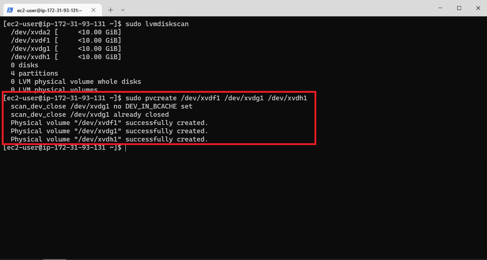
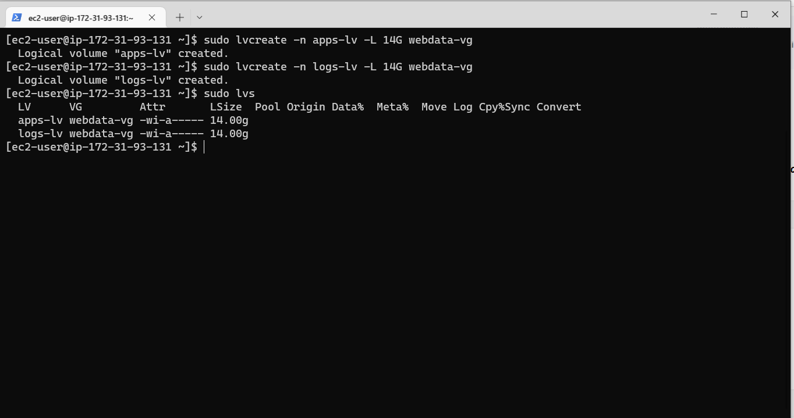
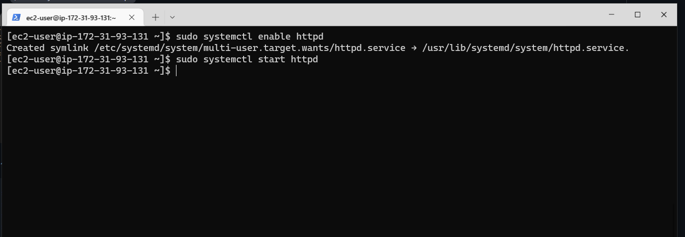

# IMPLEMENTING LOGICAL VOLUME MANAGEMENT AND WORDPRESS WEB SOLUTION PROJECT

## BACKGROUND:

In this project, storage infrastructure is prepared to implement a Three-tier Architecture(in this case - a laptop to serve as a client, an EC2 linux server as a web server and an EC2 Linux server as a database server) of which the web solution used is wordpress and the disks used to store files are adequately partitioned and managed through programs such as gdisk and LVM respectively.

My 3-Tier Setup
1- A Laptop or PC to serve as a client
2- An EC2 Linux Server as a web server (This is where I installed WordPress)
3- An EC2 Linux server as a database (DB) server
Use RedHat OS for this project

The following are the steps I took to implementing LVM and basic web solution-wordpress:


## STEP 1: SETTING UP AND ATTACHING EBS VOLUMES TO AN EC2 SERVER FOR THE “WEB SERVER”

* Launching a two EC2 instance(Red Hat Enterprise Linux 8 HVM) that will serve as a “web server” and the "database-server" respectively. Note that we are going to configure the websever first. 


* Creating 3 EBS volumes in the same Availability Zone (us-east-1c) with my EC2 instance created. 


* Attach a volume to an instance to use it as you would a regular physical hard disk drive.


## STEP 2: PARTITIONING THE VOLUMES ATTACHED TO THE EC2 INSTANCE AND CREATING LOGICAL VOLUME WITH IT.

Open the Linux terminal to start the configuration and partitioning. 

Partitioning the volumes attached to the Ec2 Instance and creating Logical volume with It

After a successful SSH connection to the EC2 instance on my terminal, running the following commands:

* To inspect what block devices are attached to the server: `lsblk`
* To see all mounts and free space: `df –h`


Creating a single partition on each of the 3 disks:

* For xdvf disk:  `sudo gdisk /dev/xvdf`
* Entering `‘n’` key to add a new partition
* Accepting all the defaults settings and selecting Linux LVM type of partition by entering `8e00` code and hit enter
* Entering the `‘w’` key to write the new partition created and confirming with the `‘Y’` and hit enter.


* I followed the same process to create single partition for the xvdg and xvdh drives respectively

* Use `lsblk` utility to view the newly configured partition on each of the 3 disks.


* Installing LVM2 package for creating logical volumes on a linux server using this command: `sudo yum install lvm2`


Note: Previously, in Ubuntu we used apt command to install packages, in RedHat/CentOS a different package manager is used, so we shall use yum command instead.

* Checking for available partitions:  `sudo lvmdiskscan`


 

* Use `pvcreate` utility to mark each of 3 disks as physical volumes (PVs) to be used by LVM: `sudo pvcreate /dev/xvdf1 /dev/xvdg1 /dev/xvdh1` 



* Check if all the physical voulumes have been created properly 


* Use vgcreate utility to add all 3 PVs to a volume group (VG). Name the VG webdata-vg: `sudo vgcreate webdata-vg /dev/xvdf1 /dev/xvdg1 /dev/xvdh1`

* Verify that my VG has been created successfully by running `sudo vgs`


* On the Volume group, we can now create our Logical Volume (app-lv and logs-lv)

Use lvcreate utility to create 2 logical volumes. apps-lv (Use half of the PV size), and logs-lv Use the remaining space of the PV size. NOTE: apps-lv will be used to store data for the Website while, logs-lv will be used to store data for logs.



* To display the entire setup, use this command: `sudo vgdisplay -v`


* And also use this command: `sudo lsblk` to display the entire setup


 ## STEP 3: FORMATTING AND MOUNTING THE LOGICAL VOLUMES

We are going to make the 2 Logical Volume a filesystem 
* Formatting the 2 logical volumes with ext4 filesystem:

    `sudo mkfs –t ext4 /dev/webdata-vg/apps-lv`

    `sudo mkfs –t ext4 /dev/webdata-vg/logs-lv`


* Next is to create a mount point for our devices
* Creating a directory where the website files will be stored: `sudo mkdir –p /var/www/html`
* Create /home/recovery/logs to store backup of log data: `sudo mkdir -p /home/recovery/logs`
* Mounting apps-lv logical volume on /var/www/html: `sudo mount /dev/webdata-vg/apps-lv /var/www/html`

* Check the log to make sure it is empty, if it is not then you will need to back it up. Use this command to check: `sudo ls -l /var/log`


* Using rsync utility to backup all the files in the log directory /var/log into /home/recovery/logs: `sudo rsync –av /var/log/. /home/recovery/logs/`


*Use this command line to confirm that it has been backed up: `sudo ls -l /home/recovery/logs/log`
* We can go ahead and mount on var/log directory: `sudo mount /dev/webdata-vg/logs-lv /var/log`
* Its very important we restore back the files that we backup earlier into var/log directory by using the following command: `sudo rsync -av /home/recovery/logs/. /var/log`


* Locate the UUID of the device that will be used to update the /etc/fstab file and copy it;

    `sudo blkid`


* Updating the fstab file so that mount configuration will persist after restart of the server: 

   `sudo vi /etc/fstab`


* Test the configuration:  `sudo mount -a`

* Reload the daemon: `sudo systemctl daemon-reload`
 

* Verify your setup by running `df -h`, output must look like this:


## STEP 4: PREPARING THE DATABASE SERVER

Please note that I created the db-server along side with the web server at the beginning of the setup.

 **Note: We are going to repeat all the steps taken to configure the webserver on the  db server. We changed the apps-lv logiical voulme to db-lv**


* Attach the volume 


* Creating 3 EBS volumes in the same Availability Zone (us-east-1c) with my EC2 instance created. 

* After a successful SSH connection to the EC2 instance on my terminal, running the following commands:

* To inspect what block devices are attached to the server: `lsblk`

* To see all mounts and free space: `df –h`


**Creating a single partition on each of the 3 disks:**

* For xdvf disk: sudo gdisk /dev/xvdf
* Entering `‘`n’` key to add a new partition
* Accepting all the defaults settings and selecting Linux LVM type of partition by entering `8e00` code and hit enter
* Entering the `‘w’` key to write the new partition created and confirming with the `‘Y’` and hit enter.

* I followed the same process to create single partition for the xvdg and xvdh drives respectively

* Use `lsblk` utility to view the newly configured partition on each of the 3 disks.


* Installing LVM2 package for creating logical volumes on a linux server using this command: `sudo yum install lvm2`


* Checking for available partitions: `sudo lvmdiskscan`
* Use pvcreate utility to mark each of 3 disks as physical volumes (PVs) to be used by LVM: `sudo pvcreate /dev/xvdf1 /dev/xvdg1 /dev/xvdh1`

* Check if all the physical voulumes have been created properly: `sudo pvs`


* Use vgcreate utility to add all 3 PVs to a volume group (VG). Name the VG webdata-vg: `sudo vgcreate vg-database /dev/xvdf1 /dev/xvdg1 /dev/xvdh1`
* Verify that my VG has been created successfully by running `sudo vgs`

* On the Volume group, we can now create our Logical Volume (db-lv)


* In the root directory create an directory called db: `sudo mkdir /db`
* We are going to make the Logical Volume a filesystem. Formatting with ext4 filesytem before we mount: `sudo mkfs.ext4 /dev/vg-database/dv-lv`


* We can go ahead and mount using this command: `sudo mount /dev/vg-database/db-lv  /db `

* I verified by using this command: `df -h`


**Persisting Mount Points**
* To ensure that all our mounts are not erased on restarting the server, we persist the mount points by configuring the /etc/fstab directory

* Using this code `sudo blkid` to get UUID of each mount points
* Editing the /etc/fstab directory by using this command: `sudo vi /etc/fstab`


* Test the configuration: `sudo mount -a`

* Reload the daemon: `sudo systemctl daemon-reload`

* Verify your setup by running `df -h`, output must look like this:


## STEP 5: INSTALLING WORDPRESS ON THE WEB SERVER EC2 INSTANCE

1. Update the repository: `sudo yum -y update`

2. Install wget, Apache and it’s dependencies: `sudo yum -y install wget httpd php php-mysqlnd php-fpm php-json`


3. Start Apache: 

    `sudo systemctl enable httpd`

    `sudo systemctl start httpd `



4. To install PHP and it’s dependencies

```
sudo yum install https://dl.fedoraproject.org/pub/epel/epel-release-latest-8.noarch.rpm
sudo yum install yum-utils http://rpms.remirepo.net/enterprise/remi-release-8.rpm
sudo yum module list php
sudo yum module reset php
sudo yum module enable php:remi-7.4
sudo yum install php php-opcache php-gd php-curl php-mysqlnd
sudo systemctl start php-fpm
sudo systemctl enable php-fpm
setsebool -P httpd_execmem 1

```


5. Restart Apache:  `sudo systemctl restart httpd`

6. Downloading Wordpress
 
* Creating a folder and entering into it: `mkdir wordpress && cd wordpress`

* Downloading wordpress: `sudo wget http://wordpress.org/latest.tar.gz`

* Extracting the file: `sudo tar xzvf latest.tar.gz`


* Renaming the file wp-config-sample.php to wp-config.php: `cp -R wp-config-sample.php wp-config.php`


* We now copy the content of wordpress into the var/www/html: `sudo cp -R wordpress/. /var/www/html/`
* Verify the content: `sudo ls -l /var/www/html`


## STEP 6: INSTALLING MYSQL ON THE DATABASE SERVER EC2 INSTANCE

* Configuring the database server: `sudo yum update`

* Installing MySQL: `sudo yum install mysql-server`


* Verify that the service is up and running by using `sudo systemctl status mysqld`


## STEP 7: CONFIGURING DB TO WORK WITH WORDPRESS

* Activating the mysql shell: `sudo mysql`
* Enter Mysql Password: `sudo mysql -u root -p`
* Creating a database called ‘wordpress’: `mysql> CREATE DATABASE wordpress;`

* Creating a remote user: `mysql> CREATE USER 'myuser'@'%' IDENTIFIED WITH mysql_native_password by 'PassWord.1';`

* Granting all privileges to the user: `mysql> GRANT ALL PRIVILEGES ON wordpress.* TO 'myuser'@'%';`

* Flushing the privileges so that MySQL will begin to use them: `mysql> FLUSH PRIVILEGES;`
* Checking the user and host assigned to: `mysql> select user, host from mysql.users`
* Exiting from MySQL shell: `mysql> exit`


## STEP 7: CONFIGURING WORDPRESS TO CONNECT TO REMOTE DATABASE


* Adding a rule to the database server security group to be able to listen to TCP port 3306 and allow access to the web server IP address only.


* Configure the mysql: `sudo vi /etc/my.cnf`
* Restart the server: `sudo systemctl restart mysqld`


* Installing mysql client: `sudo yum install mysql`


* Connecting the Database server with Mysql: `sudo mysql -u admin -p -h <DB-Server-Private-IP-address>`

`sudo mysql -u wordpress -p -h 172.31.87.180` (I changed the username from 'wordpress' to 'myuser')

`sudo mysql -u myuser -p -h 172.31.87.180`


* Verify if you can successfully execute SHOW DATABASES; command and see a list of existing databases.


* Enable TCP port 80 in Inbound Rules configuration for your Web Server EC2 (enable from everywhere 0.0.0.0/0 or from your workstation’s IP)


* I accessed from your browser the link to your WordPress 
`http://<Web-Server-Public-IP-Address>`

   `http://54.92.208.222/wp-admin`


* Wordpress Configuration page


* Wordpress Login page


* I have successfully configured Linux storage susbystem and have also deployed a full-scale Web Solution using WordPress CMS and MySQL RDBMS!


