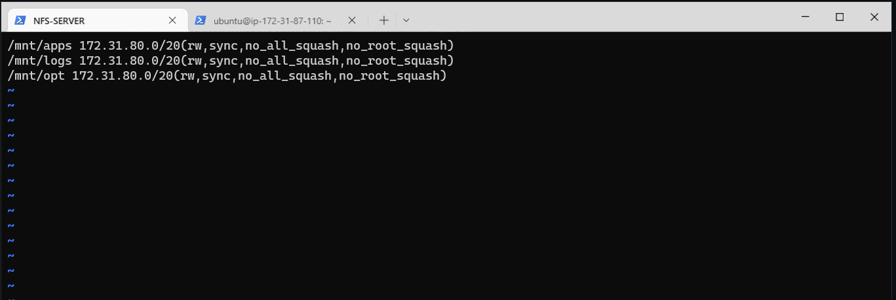
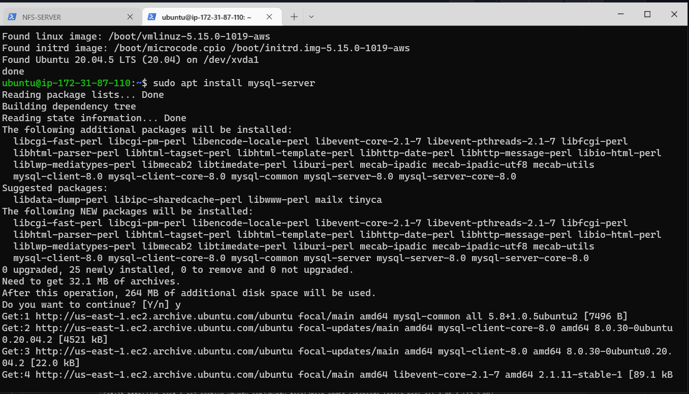
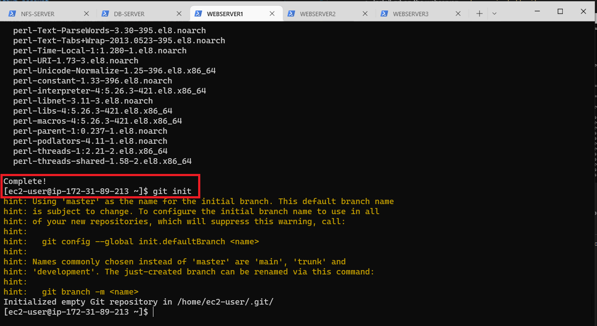
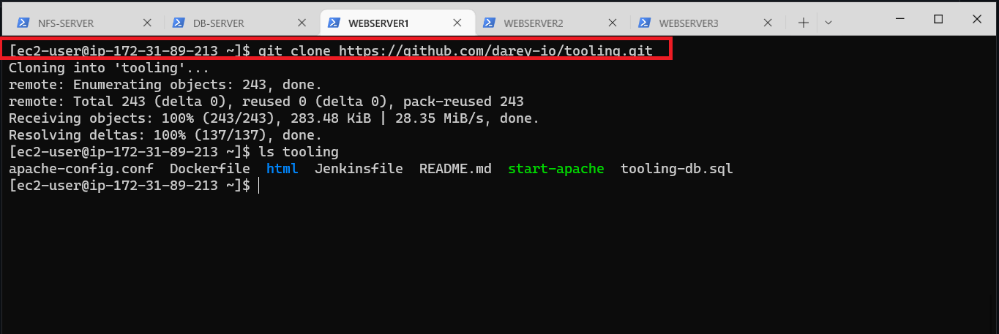

# IMPLEMENTATION OF WEB APPLICATION ARCHITECTURE WITH A SINGLE DATABASE AND NFS SERVER

## BACKGROUND
In this project, I implemented a DevOps tooling website solution which makes access to DevOps tools with the following components:

1- Infrastructure: AWS

2- 3 Linux Webservers: Red Hat Enterprise Linux 8 that will serve the DevOps tooling website

3- A Database Server: Ubuntu 20.04 for reads and write

4- A Storage Server: Red Hat Enterprise Linux 8 that will serve as NFS Server for storing shared files that the 3 Web Servers will use.

5- Programming Language: PHP

6- Code Repository: GitHub

The following are the steps I took to set up this 3-tier 
Web Application Architecture with a single database and an NFS server as a shared file storage:

## STEP 1: PREPARE NFS SERVER

1 - Launching a four (4) EC2 instance(Red Hat Enterprise Linux 8 HVM) where one will serve as "NFS server” and while the  remaining will three (3) we be user for "Web-servers" which will be connected to the NFS server to make it stateless.

   

2 - Creating 3 EBS volumes in the same Availability Zone (us-east-1c) with my EC2 instance created.
  
   

* Attach a volume each to an instance to use it as you would a regular physical hard disk drive.


PARTITIONING THE VOLUMES ATTACHED TO THE EC2 INSTANCE AND CREATING LOGICAL VOLUME WITH IT.

Open the Linux terminal to start the configuration and partitioning.

Partitioning the volumes attached to the Ec2 Instance and creating Logical volume with It

After a successful SSH connection to the EC2 instance on my terminal, running the following commands:

* To inspect what block devices are attached to the server: `lsblk`
* To see all mounts and free space: `df –h`


* Creating a single partition on each of the 3 disks:
* For xdvf disk: `sudo gdisk /dev/xvdf`
* Entering `‘n’` key to add a new partition
* Accepting all the defaults settings and selecting Linux LVM type of partition by entering 8300 code and hit enter
* Entering the `‘w’` key to write the new partition created and confirming with the `‘Y’` and hit enter.


* I followed the same process to create single partition for the xvdg and xvdh drives respectively

* Use lsblk utility to view the newly configured partition on each of the 3 disks. `lsblk`


* Installing LVM2 package for creating logical volumes on a linux server using this command: `sudo yum install lvm2 -y`


Note: Previously, in Ubuntu we used apt command to install packages, in RedHat/CentOS a different package manager is used, so we shall use yum command instead.

* Checking for available partitions: `sudo lvmdiskscan`


* Use pvcreate utility to mark each of 3 disks as physical volumes (PVs) to be used by LVM: `sudo pvcreate /dev/xvdf1 /dev/xvdg1 /dev/xvdh1`


* Check if all the physical voulumes have been created properly: `sudo pvs`


* Use vgcreate utility to add all 3 PVs to a volume group (VG). Name the VG webdata-vg: `sudo vgcreate webdata-vg /dev/xvdf1 /dev/xvdg1 /dev/xvdh1`

* Verify that my VG has been created successfully by running:  `sudo vgs`


* On the Volume group, we can now create our Logical Volume (lv-apps, lv-logs and lv-opt)

* Use lvcreate utility to create 3 logical volumes. lv-apps, and lv- logs and lv-opt. Use the remaining space of the PV size. 

NOTE: 

`lv-apps` was used by the webserver, 

`lv-logs` was used by webserver logs while 

`lv-opt` will be used by Jenkins server in Project 8.


* To display the entire setup, use this command: `sudo vgdisplay -v`


* And also use this command: `sudo lsblk`  to display the entire setup


### FORMATTING AND MOUNTING THE LOGICAL VOLUMES

We are going to make the 2 Logical Volume a filesystem

* Formatting the 2 logical volumes with ext4 filesystem:

`sudo mkfs -t xfs /dev/webdata-vg/lv-apps`

`sudo mkfs -t xfs /dev/webdata-vg/lv-logs`

`sudo mkfs -t xfs /dev/webdata-vg/lv-opts`


* ## Next is to create a mount point for our devices

* Create mount points on /mnt directory for the logical volumes as follow: 
  
   `sudo mkdir /mnt/apps`

   `sudo mkdir /mnt/logs`

   `sudo mkdir /mnt/opt`
  
 * Mounting the 3 logical volumes:
 
   `sudo mount /dev/webdata-vg/lv-apps /mnt/apps`

   `sudo mount /dev/webdata-vg/lv-logs /mnt/logs`

   `sudo mount /dev/webdata-vg/lv-opt /mnt/opt`

  


* To verify the mounts:$ df -h


* To get information on the UUID of the disk mounted: `sudo blkid`


* Configuring the fstab file to enable the mounts to persist on boot: `sudo vi /etc/fstab` 


* Test the configuration: `sudo mount -a`

* Reload the daemon: `sudo systemctl daemon-reload`

* Verify your setup by running `df -h`, output must look like this:


**4 - Install NFS server, configure it to start on reboot and make sure it is u and running**


* Update the server: `sudo yum -y update`


* Installing NFS server utilities: `sudo yum install nfs-utils -y`


* Starting nfs server: `sudo systemctl start nfs-server.service`

* Enabling nfs server: `sudo systemctl enable nfs-server.service`

* Viewing the status of the nfs server: `sudo systemctl status nfs-server.service`


* Make sure we set up permission that will allow our Web servers to read, write and execute files on NFS.

Changing the ownership of the 3 directories where disks are mounted:

   `sudo chown -R nobody: /mnt/apps`

   `sudo chown -R nobody: /mnt/logs`

   `sudo chown -R nobody: /mnt/opt`


* Changing the permission of the 3 directories where disks are mounted:

   `sudo chmod -R 777 /mnt/apps`     

   `sudo chmod -R 777 /mnt/logs`

   `sudo chmod -R 777 /mnt/opt`

* Restarting the nfs service: `sudo systemctl restart nfs-server.service`


* Configure access to NFS for clients within the same subnet (example of Subnet CIDR – 172.31.32.0/20 ):

* Opening the NFS export file `sudo vi /etc/exports`
* Entering the following configuration:

```
sudo vi /etc/exports

/mnt/apps <Subnet-CIDR>(rw,sync,no_all_squash,no_root_squash)
/mnt/logs <Subnet-CIDR>(rw,sync,no_all_squash,no_root_squash)
/mnt/opt <Subnet-CIDR>(rw,sync,no_all_squash,no_root_squash)

```



* Export the mounts for webservers’ subnet cidr to connect as clients.


**6 - Check which port is used by NFS and open it using Security Groups (add new Inbound Rule)**

`rpcinfo -p | grep nfs`


* Important note: In order for NFS server to be accessible from our client, we must also open following ports: TCP 111, UDP 111, UDP 2049


## STEP 2: CONFIGURE THE DATABASE SERVER

* Configuring the database server: `sudo apt update`


* upgrade the database server: `sudo apt upgrade`


* Installing MySQL: `sudo apt install mysql-server`




**CONFIGURE THE DATABASE SERVER**

* Activating the mysql shell: `sudo mysql`

* Creating a database called ‘tooling’: `mysql> CREATE DATABASE tooling;`

* Creating a remote user called 'webaccess': `mysql> CREATE USER 'webaccess'@'172.31.80.0/20' IDENTIFIED WITH mysql_native_password by 'PassWord.1';`

* Grant permission to webaccess user on tooling database to do anything only from the webservers subnet cidr: `mysql> GRANT ALL PRIVILEGES ON tooling.* TO 'webaccess'@'172.31.80.0/20';`

* Flushing the privileges so that MySQL will begin to use them: `mysql> FLUSH PRIVILEGES;`

* Checking the user and host assigned to: `mysql> select user, host from mysql.users`

* Exiting from MySQL shell: `mysql> exit;`


* Adding a rule in the database security group to listen to TCP port 3306 and only allow access from webservers’ subnet cidr:


* Editing the mysqld.cnf file `sudo vi /etc/mysql/mysql.conf.d/mysqld.cnf` and changing the bind-address value from ‘127.0.0.1’ to ‘0.0.0.0’


* Restarting the mysql service: `sudo systemctl restart mysql`


# STEP 3: PREPARE THE WEB SERVER

We need to make sure that our Web Servers can serve the same content from shared storage solutions, in our case – NFS Server and MySQL database.

During the next steps we will do following:

* Configure NFS client (this step must be done on all three servers)
* Deploy a Tooling application to our Web Servers into a shared NFS folder
* Configure the Web Servers to work with a single MySQL database


*  Launch a new EC2 instance with RHEL 8 Operating System for the 3 webservers 


1- Update the 3 Webservers: `sudo yum update`

* WEBSERVER 1


* WEBSERVER 2


* WEBSERVER 3


2- Install NFS client: `sudo yum install nfs-utils nfs4-acl-tools -y`


3- Mount /var/www/ and target the NFS server’s export for apps:

```
sudo mkdir /var/www
sudo mount -t nfs -o rw,nosuid <NFS-Server-Private-IP-Address>:/mnt/apps /var/www 

```

4- Verify that NFS was mounted successfully by running `df -h`.
* Make sure that the changes will persist on Web Server after reboot:
`sudo vi /etc/fstab`

add following line

`<NFS-Server-Private-IP-Address>:/mnt/apps /var/www nfs defaults 0 0`

e.g `172.31.84.225:/mnt/apps /var/www nfs defaults 0 0`


5- Install Remi’s repository, Apache and PHP

```
sudo yum install httpd -y

sudo dnf install https://dl.fedoraproject.org/pub/epel/epel-release-latest-8.noarch.rpm

sudo dnf install dnf-utils http://rpms.remirepo.net/enterprise/remi-release-8.rpm

sudo dnf module reset php

sudo dnf module enable php:remi-7.4

sudo dnf install php php-opcache php-gd php-curl php-mysqlnd

sudo systemctl start php-fpm

sudo systemctl enable php-fpm

setsebool -P httpd_execmem 1

```

**Repeat steps 1-5 for another 2 Web Servers.**

6 - Verify that Apache files and directories are available on the Web Server in /var/www and also on the NFS server in /mnt/apps

You can try to create a new file touch test.txt from one server


For NFS SERVER


7 - Locate the log folder for Apache on the Web Server and mount it to NFS server’s export for logs
`sudo mount -t nfs -o rw,nosuid 172.31.17.5:/mnt/logs /var/log/httpd`

For WEBSERVER 1


For WEBSERVER 2


For WEBSERVER 3


* Repeat step №4 to make sure the mount point will persist after reboot.

`sudo vi /etc/fstab`
`<NFS-Server-Private-IP-Address>:/mnt/logs /var/log/httpd nfs defaults 0 0`
e.g `172.123.8.1:/mnt/apps /var/log/httpd nfs defaults 0 0`

For WEBSERVER 1


For WEBSERVER 2


For WEBSERVER 3


## 8 - Fork the tooling source code from Darey.io Github Account to your Github account.

* Install git on the webserver: `sudo yum install git`


* Initialize a git entry repository: `git init`



* Go to Darey.io Github account, click on code and copy the HTTPS url from the Github repository.


* Next clone the git url on our terminal with this command: 
`git clone https://github.com/darey-io/tooling.git`
 





 9 - Deploy the tooling website’s code to the Webserver. Ensure that the html folder from the repository is deployed to /var/www/html

 * Change Directory into tooling directory: `cd tooling`


* Copy the content of html directory inside the tooling directory into the /var/www/html with this command: `sudo cp -R html/. /var/www/html/`

* We can now confirm that the files are copied to the right location: `ls /var/www/html`


* Note: To allow http connection into the webserver, we opened Port 80 on our webserver inside the EC2 instance 


* To make this change permanent – open following config file `sudo vi /etc/sysconfig/selinux` and set `SELINUX=disabled`then restrt httpd.


### 10 - Update the website’s configuration to connect to the database (in `/var/www/html/functions.php` file) using this command:

`sudo vi /var/www/html/functions.php`

* Update the mysqli_connect `$db = mysqli_connect('172.31.87.110', 'webaccess', 'PassWord.1', 'tooling');`


* 11 -  Apply tooling-db.sql script to your database using this command: `mysql -h <database-private-ip> -u <db-username> -p <db-pasword> < tooling-db.sql`


e.g `mysql -h 172.31.87.110 -u webaccess -p PassWord.1 < tooling-db.sql`


* 12 - I opened the website in my browser `http://<Web-Server-Public-IP-Address-or-Public-DNS-Name>/index.php` 

e.g `http://44.202.44.72/index.php`


* After login, the homepage the website was displayed


**Hola, Done!**