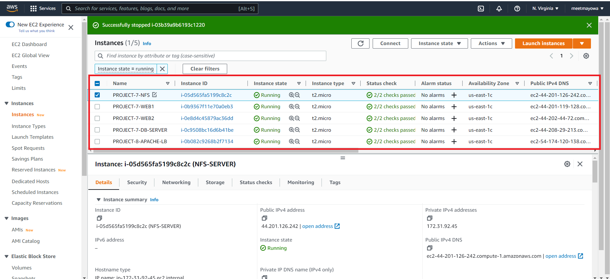

# LOAD BALANCER SOLUTION WITH APACHE

## BACKGROUND


In this project, I implemented a load balancer solution using Apache which points traffic to two of the webservers in the 3-tier Web Application Architecture that I setup in project 7.

The following are the steps I took in implementing a load balancer solution:

I deployed and configured an Apache Load Balancer for Tooling Website solution on a separate Ubuntu EC2 intance.

I also make sure that users can be served by Web servers through the Load Balancer.

To simplify, let us implement this solution with 2 Web Servers, the approach will be the same for 3 and more Web Servers.

**Prerequisites**

Make sure that you have following servers installed and configured within Project-7:

* Two RHEL8 Web Servers
* One MySQL DB Server (based on Ubuntu 20.04)
* One RHEL8 NFS server

## Step 1: Launching The Servers

I launched a new EC2 Instance(Ubuntu 20.04) that will serve as the load balancer and called it `Project-8-apache-lb` and starting the EC2 Instances used in my project 7. But in this case, out of the 3 EC2 Instances initially launched which are tagged as webservers only 2 were used instead. 



## Step 2: Configure the Secure group

Open TCP port 80 on Project-8-apache-lb by creating an Inbound Rule in Security Group.


## Step 3: Configuring Apache As A Load Balancer In The Ubuntu server

Install Apache Load Balancer on `Project-8-apache-lb` server and configure it to point traffic coming to LB to both Web Servers:

* Updating the server: `sudo apt update`

* Upgrade the server: `sudo apt upgrade`

* Installing Apache: `sudo apt install apache2 -y`
 
* Installing libxml2-dev: `sudo apt install libxml2-dev`


* Enable following modules:


```
sudo a2enmod rewrite
sudo a2enmod proxy
sudo a2enmod proxy_balancer
sudo a2enmod proxy_http
sudo a2enmod headers
sudo a2enmod lbmethod_bytraffic

```


* Restarting Apache: `sudo systemctl restart apache2`


* To make sure apache2 is up and running


## Step 4: To Configure load balancing

* To configure the load balancer, opening the 000-default.conf file: `sudo vi /etc/apache2/sites-available/000-default.conf`

* Entering the following configuration:

```
<Proxy "balancer://mycluster">
               BalancerMember http://<WebServer1-Private-IP-Address>:80 loadfactor=5 timeout=1
               BalancerMember http://<WebServer2-Private-IP-Address>:80 loadfactor=5 timeout=1
               ProxySet lbmethod=bytraffic
               # ProxySet lbmethod=byrequests
</Proxy>

        ProxyPreserveHost On
        ProxyPass / balancer://mycluster/
        ProxyPassReverse / balancer://mycluster/

```

* Restart the Apache server: `sudo systemctl restart apache2`


* Verify that our configuration works – try to access your LB’s public IP address or Public DNS name from your browser:  `http://<Load-Balancer-Public-IP-Address-or-Public-DNS-Name>/index.php`


* Open two ssh/Putty consoles for both Web Servers and run following command o see how the load balancer works: `sudo tail -f /var/log/httpd/access_log`

**Webserver A**


**Webserver B**


* Entering the IP address of the load balancer on my web browser: http://100.24.24.6/index.php

* **I tried to refresh my browser page http://<Load-Balancer-Public-IP-Address-or-Public-DNS-Name>/index.php (172.180.0.1/index.php) several times and made sure that both servers receive HTTP GET requests from my LB** 

* **New records appear in each server’s log file. The number of requests to each server was approximately the same since I set loadfactor to the same value for both servers – it means that traffic will be distributed evenly between them.**


## Optional Steps: Configure Local DNS Names Resolution

* Sometimes it is tedious to remember and switch between IP addresses, especially if you have a lot of servers under your management.

* Open this file on your LB server: `sudo vi /etc/hosts`


* We added 2 records into this file with Local IP address and arbitrary name for both of our Web Servers

```
<WebServer1-Private-IP-Address> Web1
<WebServer2-Private-IP-Address> Web2
```
```
172.31.85.151 web1
172.31.82.212 web2
```


* Updating the load balancer config file with those names instead of IP address: `sudo vi /etc/apache2/sites-available/000-default.conf`
	
  ```  
    BalancerMember http://Web1:80 loadfactor=5 timeout=1
	BalancerMember http://Web2:80 loadfactor=5 timeout=1
  ```


* Using curl to test the configuration on my load balancer locally: `curl http://web1/index.php`  or 

   `curl http://web1/index.php`


Hola! I just implemented a Load balancing Web Solution for my DevOps team.