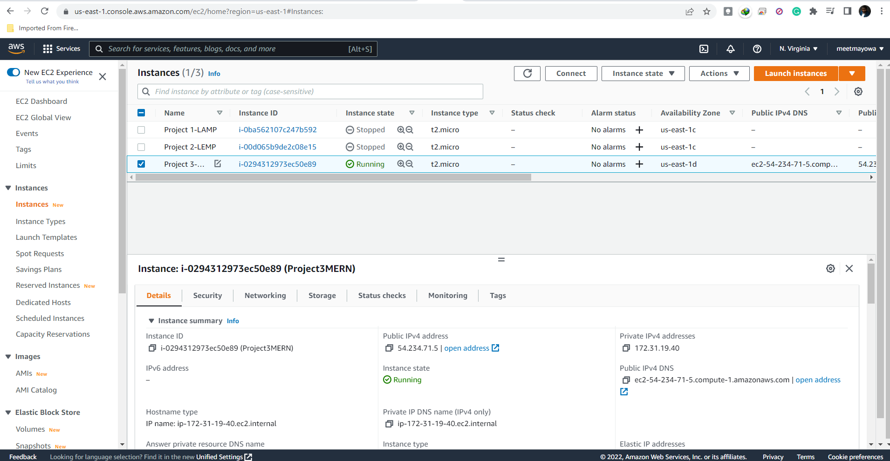
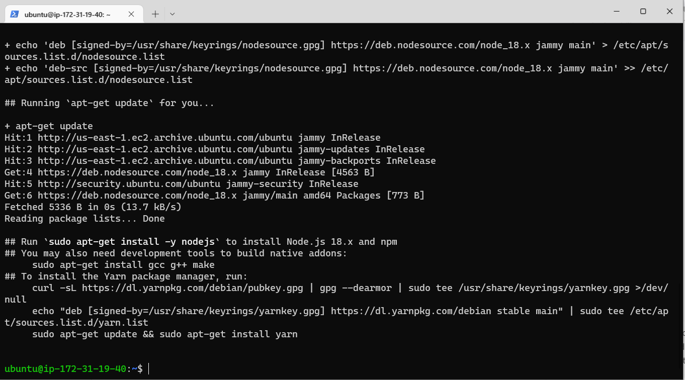
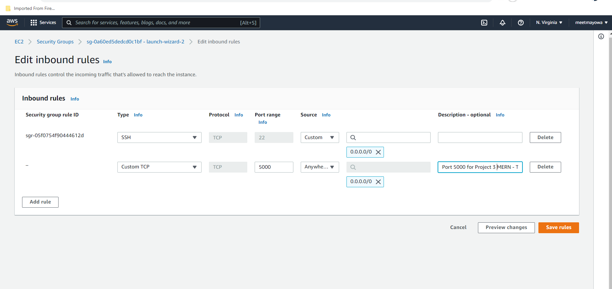
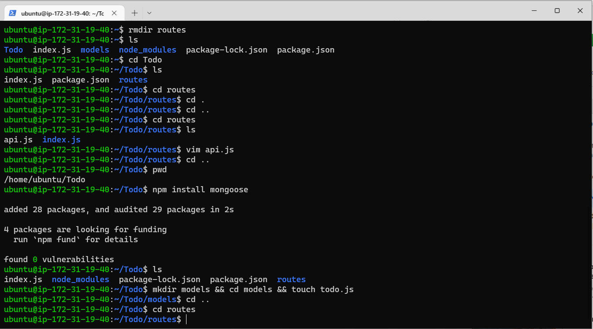
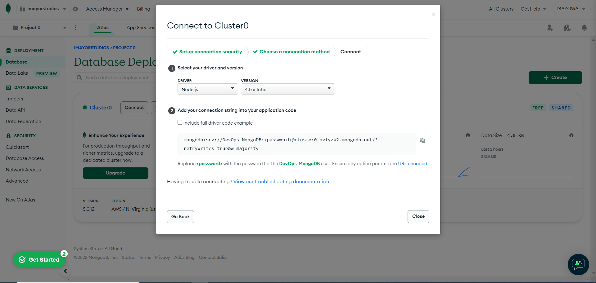
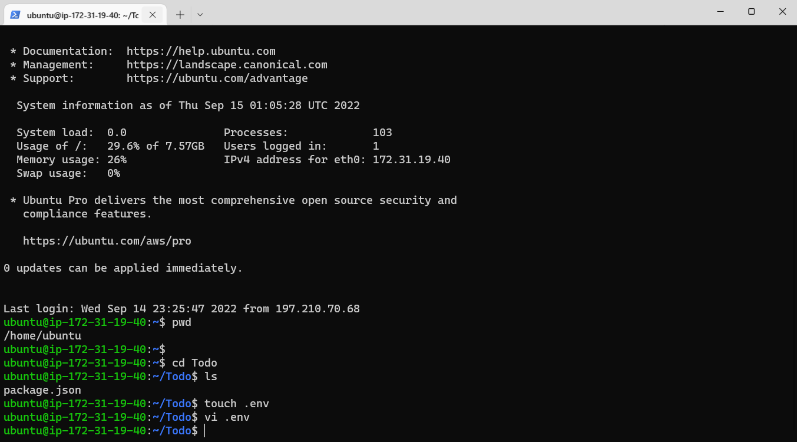
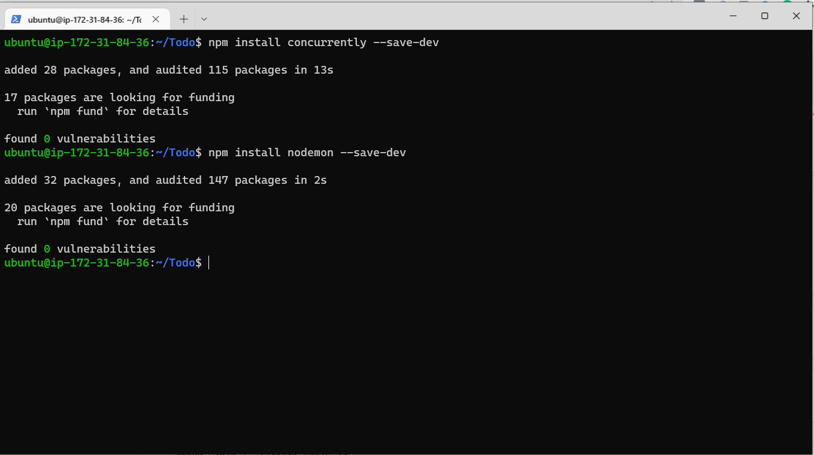
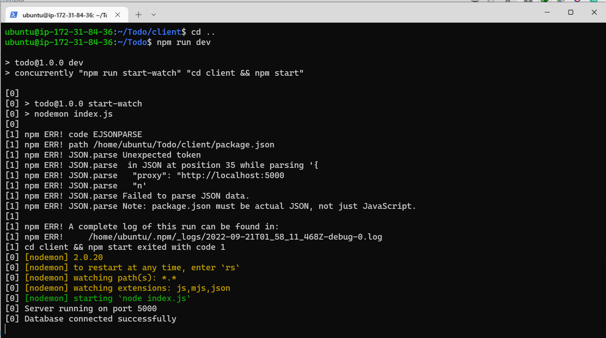
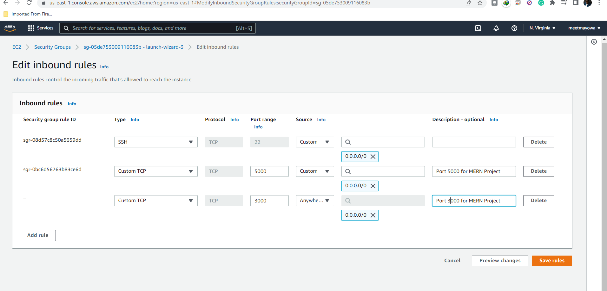

# PROJECT 3 - MERN STACK IMPLEMENTATION 
## SIMPLE TO-DO APPLICATION ON MERN WEB STACK

In this project, I was tasked to implement a web solution based on MERN stack in AWS Cloud.

**MERN Web stack** consists of following components:

**MongoDB:** A document-based, No-SQL database used to store application data in a form of documents.

**ExpressJS:** A server side Web Application framework for Node.js.
ReactJS: A frontend framework developed by Facebook. It is based on JavaScript, used to build User Interface (UI) components.

**Node.js:** A JavaScript runtime environment. It is used to run JavaScript on a machine rather than in a browser


## STEP 1: Preparing Prerequisites ##
---
To setup a virtual server, I Created a new EC2 Instance of t2.nano family with Ubuntu Server 20.04 LTS (HVM) image from aws account which is the free tier(limited) offered by aws. After a successful launch of the EC2 instance(ubuntu server), I connected to the EC2 instance from as a window user terminal with my private key(.pem file).




**CREATE A NEW INSTANCE AND CONNECT TO IT - Using its Public DNS 

## STEP 2: Backend Configuration
---

* Update ubuntu `sudo apt update`

* Upgrade ubuntu`sudo apt upgrade`


* Lets get the location of Node.js software from Ubuntu repositories: `curl -fsSL https://deb.nodesource.com/setup_18.x | sudo -E bash -`



## STEP 3: Installing Node.js on the Server ##
---

I Installed Node.js with this command  `sudo apt-get install -y nodejs`

Note: The command above installs both nodejs and npm NPM is a package manager for Node like apt for Ubuntu, it is used to install Node modules & packages and to manage dependency conflicts.


* Verify the node installation with this command  `node -v`

* Verify the node installation with this command  `npm -v`


## STEP 4: Application Code Setup ##
---
* Create a new directory for your To-Do project: `mkdir Todo`

* Run this command to verify that the Todo directory is created with ls command: `ls`

* Now change the current directory to the newly created one: `cd Todo`


* Next, I used the command npm init to initialise the project, so that a new file named package.json will be created. This file will normally contain information about the application and the dependencies that it needs to run. I followed the prompts after running the command. I pressed Enter several times to accept default values, then accept to write out the package.json file by typing yes 

`npm init`


* Run the command `ls` to confirm that you have package.json file created.


## STEP5: Installing ExpressJs ##
---

Remember that Express is a framework for Node.js, therefore a lot of things developers would have programmed is already taken care of out of the box.

* To use express, I installed it using npm: `npm install express`


*  I created a file index.js with this command:  `touch index.js`

* Run `ls` to confirm that your `index.js` file is successfully created


* Install the `dotenv` module with the command: 
 `npm install dotenv`


* Open the `index.js` file with this command: `vim index.js`

* Update index.js code and save.


*  Notice that we have specified to use port 5000 in the code.

I used `:w` to save in `vim` and use `:qa` to exit vim

*  Now it is time to start my server to see if it works. I opened the terminal in the same directory as the `index.js` file and type:
 `node index.js`


* Every thing went well, and the Server running on port 5000 in the terminal.
 
* I created port 5000 in the Security group. Configuring the security group of the EC2 instance to be able to listen to port 5000 





* Open up your browser and try to access your server’s Public IP or Public DNS name followed by port 5000:


http://3.95.205.69:5000/


## STEP 6: Creating Routes ##
---

There are three actions that our To-Do application needs to be able to do:

i-Create a new task

ii-Display list of all tasks

iii-Delete a completed task


* For each task, we need to create routes that will define various endpoints that the To-do app will depend on. So let us create a folder routes: `mkdir routes`

* Change directory to routes folder: `cd routes`
 
* Now, create a file `api.js` with this command: `touch api.js`



* Open the file with this command:`vim api.js`

write this code in the file.


## STEP 7: To create a Schema and a model ##
---
We will also use models to define the database schema . 

This is important so that we will be able to define the fields stored in each Mongodb document

* To create a Schema and a model, install mongoose which is a `Node.js` package that makes working with mongodb easier.

* Change directory back Todo folder with `cd ..` and install Mongoose: `npm install mongoose`

* Create a new folder models `mkdir models`

* Change directory into the newly created `models` folder with `cd models`
 
Tip: All three commands above can be defined in one line to be executed consequently with help of 
&&
 operator, like this:

`mkdir models && cd models && touch todo.js`


* Open the file created with `vim todo.js` then write the code below in the file:


* Now we need to update our routes from the file `api.js` in ‘routes’ directory to make use of the new model.

In Routes directory, open `api.js` with `vim api.js`, delete the code inside with `:%d` command and paste there code below into it then save and exit


 ## STEP 8 - Configuration of  MongoDB Database
 ---

 I need a database where I will store my data. For this I will make use of mLab. mLab provides MongoDB database as a service solution (DBaaS), so to make life easy, I signed up for a shared clusters free account, which is ideal for my use case. 

* Complete a get started checklist as shown on the image below

* Allow access to the MongoDB database from anywhere (Not secure, but it is ideal for testing)

* Create a MongoDB database and collection inside mLab

 


In the `index.js file`, we specified process `.env` to access environment variables, but we have not yet created this file. So we need to do that now.

Create a file in your Todo directory and name it `.env.`

`touch .env`

`vi .env`




Add the connection string to access the database in it, just as below:

DB = 'mongodb+srv://<username>:<password>@<network-address>/<dbname>?retryWrites=true&w=majority'
Ensure to update <username>, <password>, <network-address> and <database> 

according to your setup


Now I need to update the `index.js` to reflect the use of `.env` so that `Node.j`s can connect to the database.

I Simply deleted existing content in the file, and updated it with the entire code below.

Open the file with `vim index.js`


Start your server using the command: `node index.js`


## STEP 9: Testing Backend Code without Frontend using RESTful API
---

In this project, I used Postman to test our API.

I tested all the API endpoints and make sure they are working. For the endpoints that require body, I sent JSON back with the necessary fields since it’s what we setup in our code.

I opened the Postman, create a POST request to the Api

http://<PublicIP-or-PublicDNS>:5000/api/todos

 This request sends a new task to our To-Do list so the application could store it in the database.


This same process was repeated for the GET REQUEST and the DELETE REQUEST.

## STEP 10: Creating the Frontend
---
To create the frontend with react, the following steps are taken:

* To start out with the frontend of the To-do app, I used the `create-react-app` command to scaffold our app.

In the same root directory as your backend code, which is the Todo directory, run

`npx create-react-app client`


`npm install concurrently --save-dev`


`npm install nodemon --save-dev`



* Replacing the script tag in the package.json in the Todo directory with the following code:


``` "scripts": {
"start": "node index.js",
"start-watch": "nodemon index.js",
"dev": "concurrently \"npm run start-watch\" \"cd client && npm start\""
},  
```
* Configure Proxy in package.json

  Change directory to `‘client’`

   `cd client`

* Starting the server in the Todo directly by entering the following command: ` npm run dev` 

Note:
I made sure I returned back to the Todo Directory



* Configuring the security group of my EC2 instance to be able to listen to TCP port 3000



