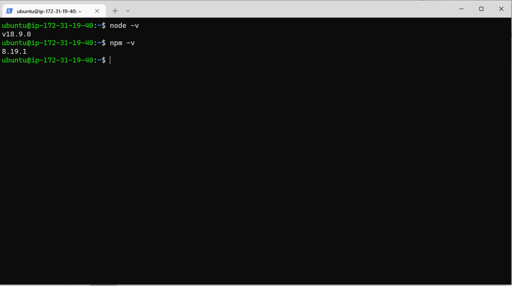
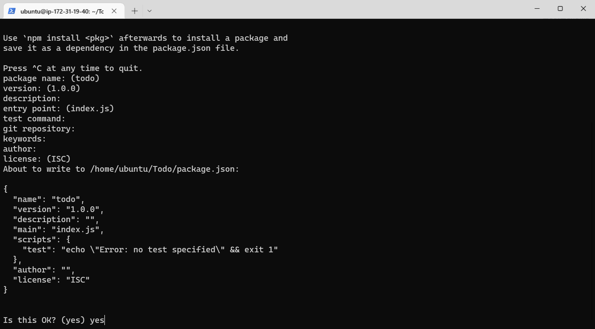
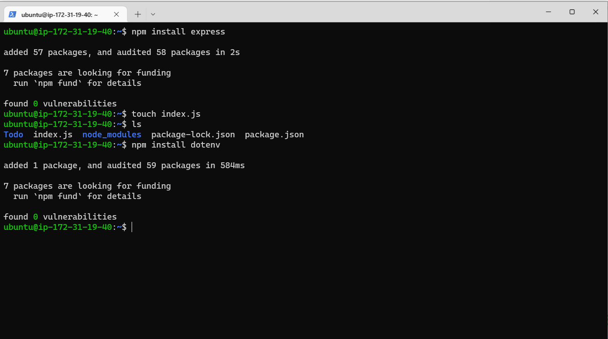
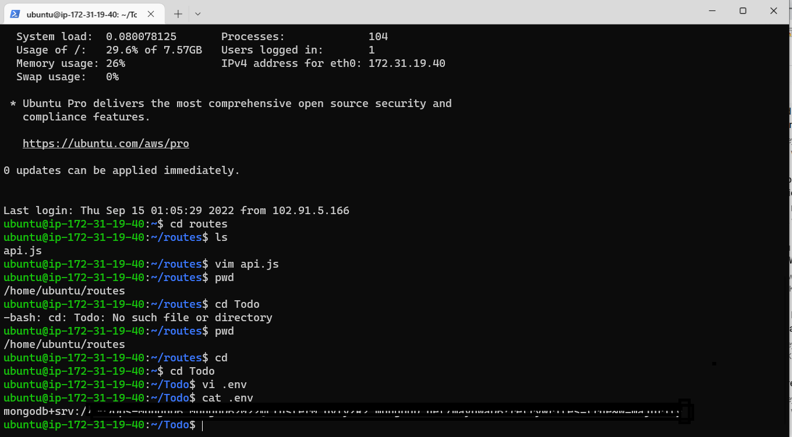

## PROJECT 3 - MERN STACK IMPLEMENTATION 
### SIMPLE TO-DO APPLICATION ON MERN WEB STACK

In this project, you are tasked to implement a web solution based on MERN stack in AWS Cloud.

**MERN Web stack** consists of following components:

**MongoDB:** A document-based, No-SQL database used to store application data in a form of documents.

**ExpressJS:** A server side Web Application framework for Node.js.
ReactJS: A frontend framework developed by Facebook. It is based on JavaScript, used to build User Interface (UI) components.

**Node.js:** A JavaScript runtime environment. It is used to run JavaScript on a machine rather than in a browser

**STEP 0 - PREPARING PREREQUISITES**

**CREATE A NEW INSTANCE AND CONNECT TO IT - Using its Public DNS 

**STEP 1 — BACKEND CONFIGURATION**

1 - Update ubuntu

`sudo apt update`

2 - Upgrade ubuntu

`sudo apt upgrade`

3 - Lets get the location of Node.js software from Ubuntu repositories.

`curl -fsSL https://deb.nodesource.com/setup_18.x | sudo -E bash -`

4- Install Node.js on the server
Install Node.js with the command below

`sudo apt-get install -y nodejs`

Note: The command above installs both nodejs and npm NPM is a package manager for Node like apt for Ubuntu, it is used to install Node modules & packages and to manage dependency conflicts.

5- Verify the node installation with the command below

`node -v`

6- Verify the node installation with the command below

`npm -v`

**Application Code Setup**

7- Create a new directory for your To-Do project:

`mkdir Todo`

8- Run the command below to verify that the Todo directory is created with ls command

`ls`

9- Now change your current directory to the newly created one:

`cd Todo`

10- Next, you will use the command npm init to initialise your project, so that a new file named package.json will be created. This file will normally contain information about your application and the dependencies that it needs to run. Follow the prompts after running the command. You can press Enter several times to accept default values, then accept to write out the package.json file by typing yes 

`npm init`

11- Run the command ls to confirm that you have package.json file created.

**INSTALL EXPRESSJS**

Remember that Express is a framework for Node.js, therefore a lot of things developers would have programmed is already taken care of out of the box.

12- To use express, install it using npm:

`npm install express`

13- Now create a file index.js with the command below

`touch index.js`

14- Run `ls` to confirm that your `index.js` file is successfully created

15- Install the `dotenv` module

`npm install dotenv`

16- Open the `index.js` file with the command below

`vim index.js`

17- Update index.js code and save.

18- Notice that we have specified to use port 5000 in the code. This will be required later when we go on the browser.

Use `:w` to save in `vim` and use `:qa` to exit vim

19- Now it is time to start our server to see if it works. Open your terminal in the same directory as your `index.js` file and type:

`node index.js`

20- If every thing goes well, you should see Server running on port 5000 in your terminal.
 
21- Now we need to open this port in EC2 Security Groups. You need to create port 5000, 

22- Open up your browser and try to access your server’s Public IP or Public DNS name followed by port 5000:

http://3.95.205.69:5000/

## A - Routes ##

There are three actions that our To-Do application needs to be able to do:

i-Create a new task

ii-Display list of all tasks

iii-Delete a completed task

1- For each task, we need to create routes that will define various endpoints that the To-do app will depend on. So let us create a folder routes

`mkdir routes`

2- Change directory to routes folder.

`cd routes`
 
3- Now, create a file `api.js` with the command below

`touch api.js`

4- Open the file with the command below

`vim api.js`

write this code in the file.

## B. MODEL ##
We will also use models to define the database schema . 

This is important so that we will be able to define the fields stored in each Mongodb document

1- To create a Schema and a model,

install mongoose which is a `Node.js` package that makes working 
with mongodb easier.

Change directory back Todo folder with `cd ..` and install `Mongoose`

`npm install mongoose`

2- Create a new folder models

`mkdir models`

3- Change directory into the newly created `models` folder with

`cd models`
 
Tip: All three commands above can be defined in one line to be executed consequently with help of 
&&
 operator, like this:

`mkdir models && cd models && touch todo.js`

4- Open the file created with `vim todo.js` then write the code below in the file:

5- Now we need to update our routes from the file `api.js` in ‘routes’ directory to make use of the new model.

In Routes directory, open `api.js` with `vim api.js`, delete the code inside with `:%d` command and paste there code below into it then save and exit

 ## STEP 4 - MONGODB DATABASE 

 We need a database where we will store our data. For this we will make use of mLab. mLab provides MongoDB database as a service solution (DBaaS), so to make life easy, you will need to sign up for a shared clusters free account, which is ideal for our use case. 

* Complete a get started checklist as shown on the image below

* Allow access to the MongoDB database from anywhere (Not secure, but it is ideal for testing)

* Create a MongoDB database and collection inside mLab

 
In the `index.js file`, we specified process `.env` to access environment variables, but we have not yet created this file. So we need to do that now.

Create a file in your Todo directory and name it `.env.`

`touch .env`

`vi .env`

Add the connection string to access the database in it, just as below:

DB = 'mongodb+srv://<username>:<password>@<network-address>/<dbname>?retryWrites=true&w=majority'
Ensure to update <username>, <password>, <network-address> and <database> 

according to your setup

Now we need to update the `index.js` to reflect the use of `.env` so that `Node.j`s can connect to the database.

Simply delete existing content in the file, and update it with the entire code below.

Open the file with `vim index.js`

Start your server using the command:

`node index.js`

## Testing Backend Code without Frontend using RESTful API

In this project, we will use Postman to test our API.

You should test all the API endpoints and make sure they are working. For the endpoints that require body, you should send JSON back with the necessary fields since it’s what we setup in our code.

Now open your Postman, create a POST request to the Api

http://<PublicIP-or-PublicDNS>:5000/api/todos

 This request sends a new task to our To-Do list so the application could store it in the database.

