# DEPLOYING A SIMPLE BOOK REGISTER APPLICATION WITH MEAN STACK IN AWS CLOUD

**MEAN** Stack is a combination of following components:

**MongoDB (Document database)** – Stores and allows to retrieve data.

**Express (Back-end application framework)** – Makes requests to Database for Reads and Writes.

**Angular (Front-end application framework)** – Handles Client and Server Requests

**Node.js (JavaScript runtime environment)** – Accepts requests and displays results to end user

## STEP 1: Preparing Prerequisite - Setting up a virtual server in the cloud (Using AWS)
To setup a virtual server, I Created a new EC2 Instance of t2.nano family with Ubuntu Server 20.04 LTS (HVM) image from AWS account. 

After a successful launch of the EC2 instance(ubuntu server), I connected to the EC2 instance from Windpws terminal with my private key(.pem file).

## STEP 2: Installing NodeJS

The following commands are used to configure the ubuntu server:

* Update ubuntu : `$ sudo apt update`
* Upgrade ubuntu: `$ sudo apt upgrade` 

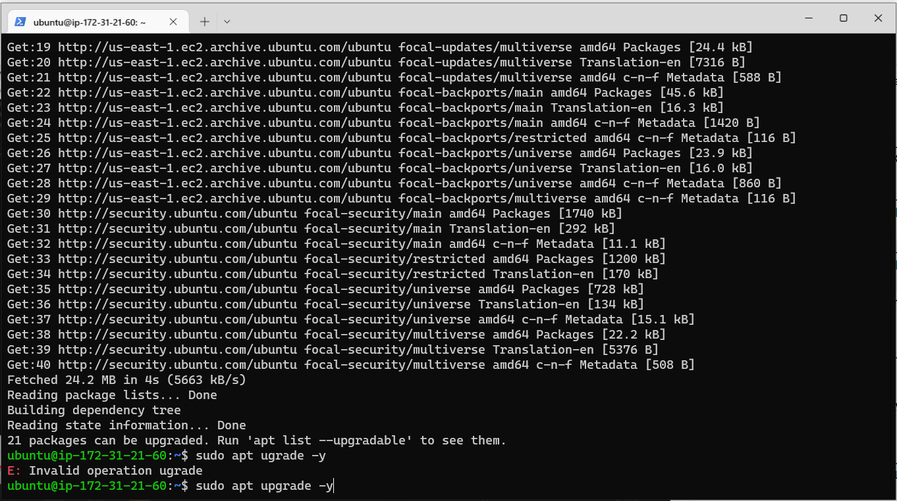 


* Adding certificates: `$ sudo apt -y install curl dirmngr apt-transport-https lsb-release ca-certificates` 
* To get the location of Node.js software from Ubuntu repositories: `$ curl -sL https://deb.nodesource.com/setup_12.x | sudo -E bash –`
* Installing NodeJS: `$ sudo apt install –y nodejs` 

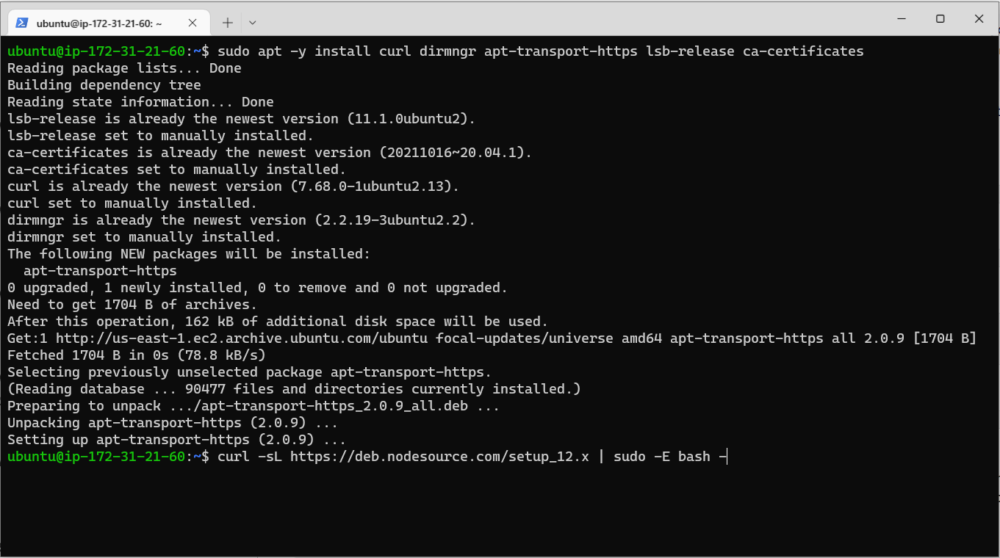

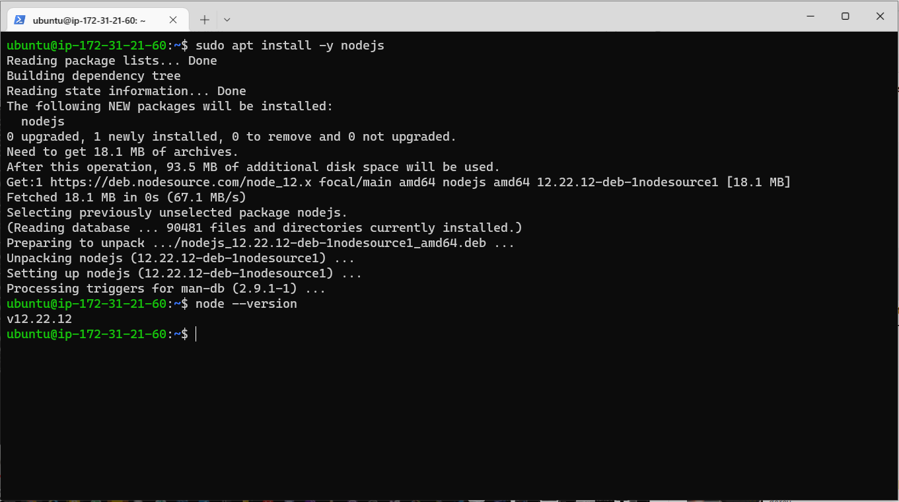
## STEP 3: Installing MongoDB

MongoDB stores data in flexible, JSON-like documents. Fields in a database can vary from document to document and data structure can be changed over time.

* Adding the key used to protect the package: `$ sudo apt-key adv --keyserver hkp://keyserver.ubuntu.com:80 --recv 0C49F3730359A14518585931BC711F9BA15703C6`
* Adding the repo where ubuntu will fetch mongodb package to the sources.list file: `$ echo "deb [ arch=amd64 ] https://repo.mongodb.org/apt/ubuntu trusty/mongodb-org/3.4 multiverse" | sudo tee /etc/apt/sources.list.d/mongodb-org-3.4.list`

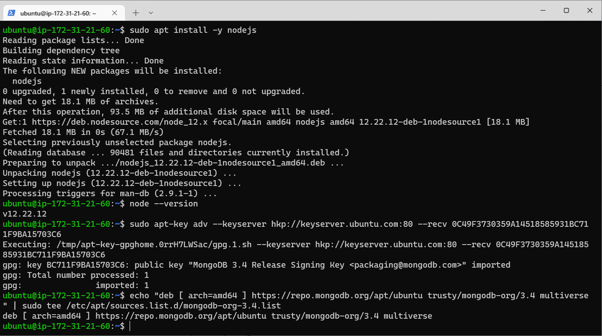

* Installing the mongodb : `$ sudo apt install -y mongodb`
* Starting the mongodb server: `$ sudo service mongodb start`
* Verify that the service is up and running: `$ sudo systemctl status mongodb`

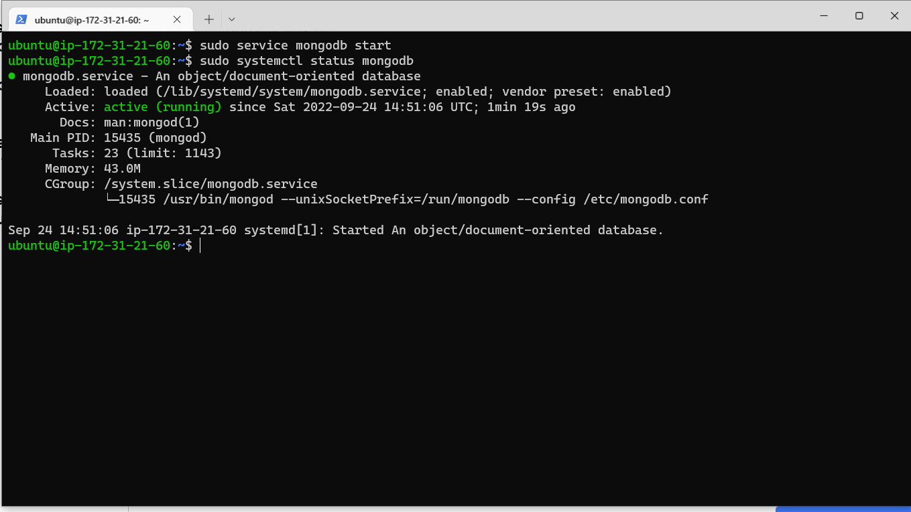

* Install body-parser package which helps in processing JSON files passed in requests to the server: `$ sudo npm install body-parser`

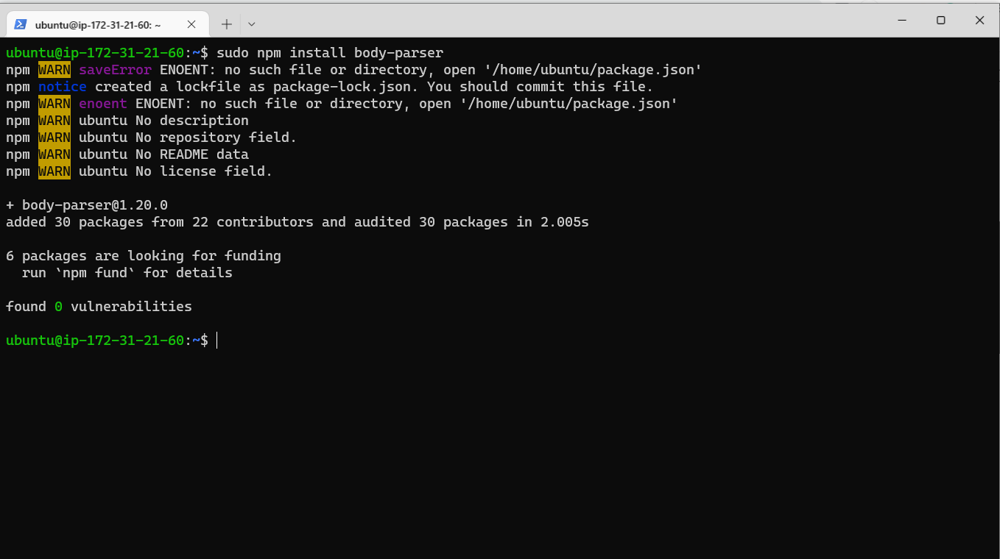

* Create a folder called Books and move into it: `$ mkdir Books && cd Books`
* Initializing npm project in the Books directory: `$ npm init` 
* Creating a file called 'server' and opening it in a file editor: `$ vi server`
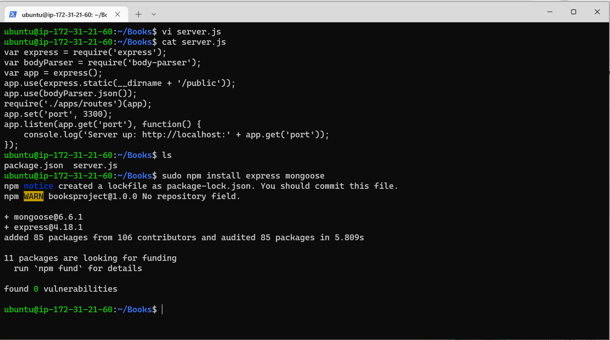

* Entering the following codes:

```var express = require('express');
var bodyParser = require('body-parser');
var app = express();
app.use(express.static(__dirname + '/public'));
app.use(bodyParser.json());
require('./apps/routes')(app);
app.set('port', 3300);
app.listen(app.get('port'), function() {
    console.log('Server up: http://localhost:' + app.get('port'));
});
```

## Step 4: Install Express And Set Up Routes To The Server
Express is a minimal and flexible Node.js web application framework that provides features for web and mobile applications. We will use Express in to pass book information to and from our MongoDB database.

We also used Mongoose package which provides a straight-forward, schema-based solution to model our application data. We used Mongoose to establish a schema for the database to store data of our book register.

* Installing express and mongoose to establish a schema for the database to store data of our book register: `$ sudo npm install express mongoose`
* Creating a folder called `'apps'` in the Books directory and moving into it: `$ mkdir apps && cd apps`
* Creating a file called `'routes'` by opening it in an editor: `$ vi routes`

Entering the following codes:

```
var Book = require('./models/book');
module.exports = function(app) {
  app.get('/book', function(req, res) {
    Book.find({}, function(err, result) {
      if ( err ) throw err;
      res.json(result);
    });
  }); 
  app.post('/book', function(req, res) {
    var book = new Book( {
      name:req.body.name,
      isbn:req.body.isbn,
      author:req.body.author,
      pages:req.body.pages
    });
    book.save(function(err, result) {
      if ( err ) throw err;
      res.json( {
        message:"Successfully added book",
        book:result
      });
    });
  });
  app.delete("/book/:isbn", function(req, res) {
    Book.findOneAndRemove(req.query, function(err, result) {
      if ( err ) throw err;
      res.json( {
        message: "Successfully deleted the book",
        book: result
      });
    });
  });
  var path = require('path');
  app.get('*', function(req, res) {
    res.sendfile(path.join(__dirname + '/public', 'index.html'));
  });
};
```

* In the ‘apps’ folder, create a folder named models: `mkdir models && cd models`
* Create a file named book.js  and open it in an editor :  `vi book.js` 
* Entering the following codes:
```
var mongoose = require('mongoose');
var dbHost = 'mongodb://localhost:27017/test';
mongoose.connect(dbHost);
mongoose.connection;
mongoose.set('debug', true);
var bookSchema = mongoose.Schema( {
  name: String,
  isbn: {type: String, index: true},
  author: String,
  pages: Number
});
var Book = mongoose.model('Book', bookSchema);
module.exports = mongoose.model('Book', bookSchema);
```

## Step 5 – Accessing the routes with AngularJS

* Changing the directory back to Books directory: `$ cd ../..`
* Creating a folder called 'public' and moving into it: `$ mkdir public && cd public`
* Creating a file called 'script.js' by opening it in an editor: `$ vi script.js`
* Entering the following codes:


```
var app = angular.module('myApp', []);
app.controller('myCtrl', function($scope, $http) {
  $http( {
    method: 'GET',
    url: '/book'
  }).then(function successCallback(response) {
    $scope.books = response.data;
  }, function errorCallback(response) {
    console.log('Error: ' + response);
  });
  $scope.del_book = function(book) {
    $http( {
      method: 'DELETE',
      url: '/book/:isbn',
      params: {'isbn': book.isbn}
    }).then(function successCallback(response) {
      console.log(response);
    }, function errorCallback(response) {
      console.log('Error: ' + response);
    });
  };
  $scope.add_book = function() {
    var body = '{ "name": "' + $scope.Name + 
    '", "isbn": "' + $scope.Isbn +
    '", "author": "' + $scope.Author + 
    '", "pages": "' + $scope.Pages + '" }';
    $http({
      method: 'POST',
      url: '/book',
      data: body
    }).then(function successCallback(response) {
      console.log(response);
    }, function errorCallback(response) {
      console.log('Error: ' + response);
    });
  };
});
```

* In public folder, create a file named index.html;
 `vi index.html`

* Enter the code below into index.html file.

```
<!doctype html>
<html ng-app="myApp" ng-controller="myCtrl">
  <head>
    <script src="https://ajax.googleapis.com/ajax/libs/angularjs/1.6.4/angular.min.js"></script>
    <script src="script.js"></script>
  </head>
  <body>
    <div>
      <table>
        <tr>
          <td>Name:</td>
          <td><input type="text" ng-model="Name"></td>
        </tr>
        <tr>
          <td>Isbn:</td>
          <td><input type="text" ng-model="Isbn"></td>
        </tr>
        <tr>
          <td>Author:</td>
          <td><input type="text" ng-model="Author"></td>
        </tr>
        <tr>
          <td>Pages:</td>
          <td><input type="number" ng-model="Pages"></td>
        </tr>
      </table>
      <button ng-click="add_book()">Add</button>
    </div>
    <hr>
    <div>
      <table>
        <tr>
          <th>Name</th>
          <th>Isbn</th>
          <th>Author</th>
          <th>Pages</th>

        </tr>
        <tr ng-repeat="book in books">
          <td>{{book.name}}</td>
          <td>{{book.isbn}}</td>
          <td>{{book.author}}</td>
          <td>{{book.pages}}</td>

          <td><input type="button" value="Delete" data-ng-click="del_book(book)"></td>
        </tr>
      </table>
    </div>
  </body>
</html>
```

* Changing the directory back to the books directory: `$ cd ..`
* Starting the server: `$ node server.js`

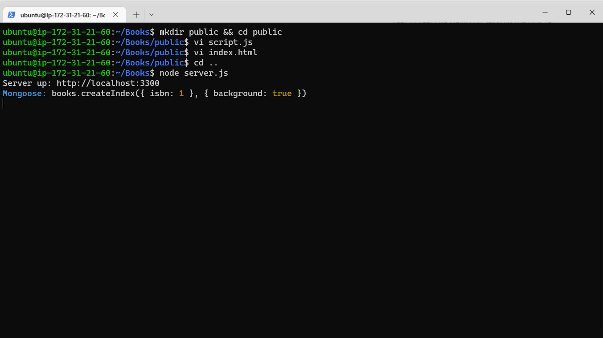


* The server is now up and running, I connected it via port 3300. I launched a separate GitBash console to test what curl command returns locally: `curl -s http://localhost:3300`

Although it returned an HTML page, it was hardly readable in the CLI.
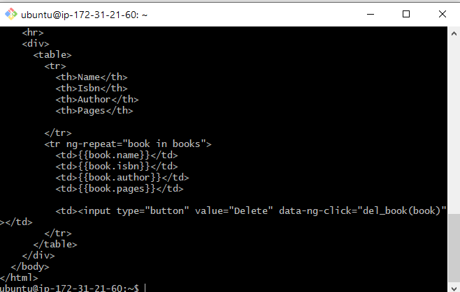

## STEP 6: Updating the EC2 instance Security Group
Configuring the security group of the EC2 instance to be able to listen to port 3300

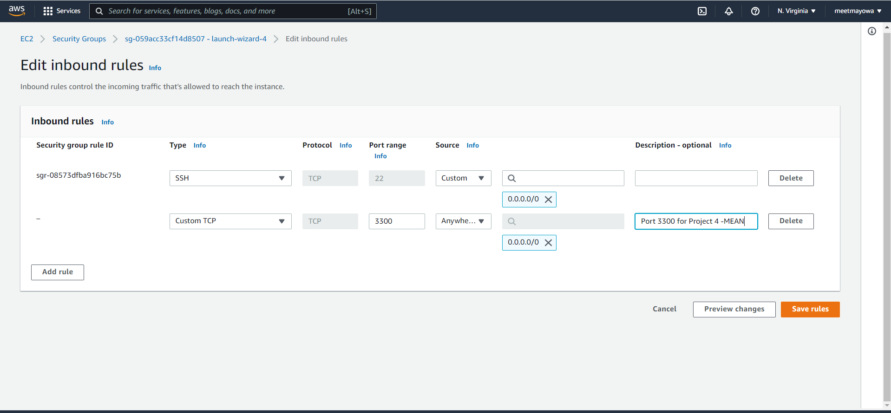

## LAST STEP
Opening up my browser and entering my public address with the port number 3300 to access the Book register application: 

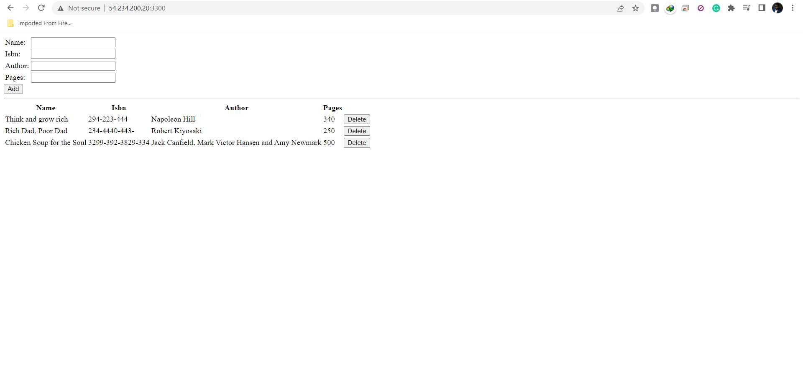

Hola, Done!!!