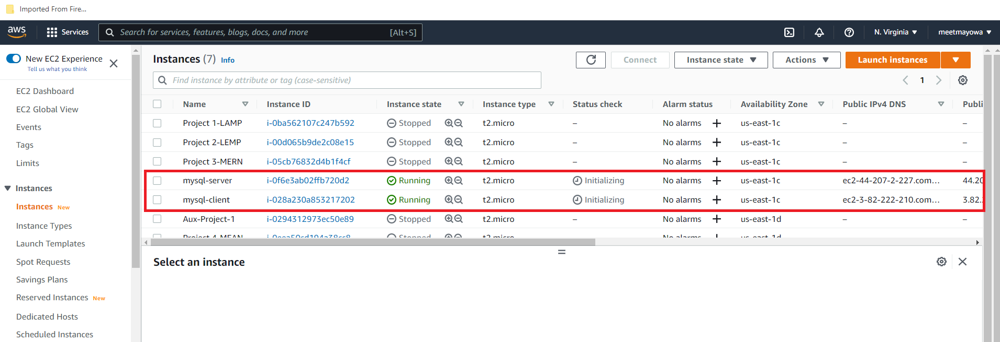
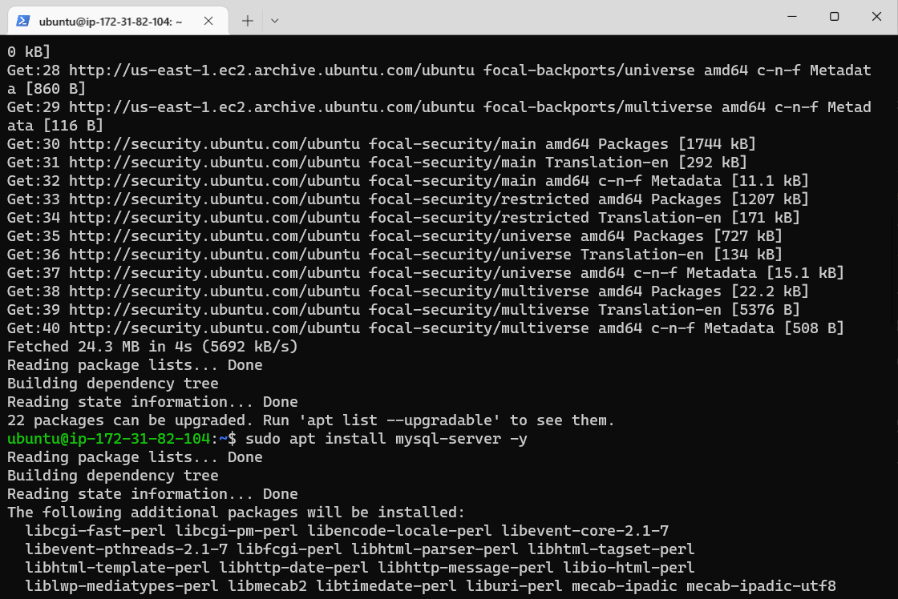
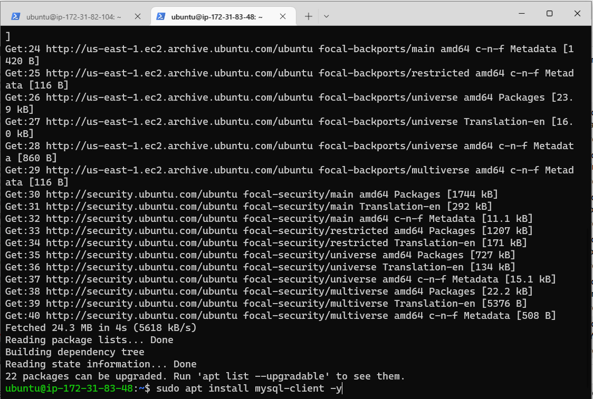
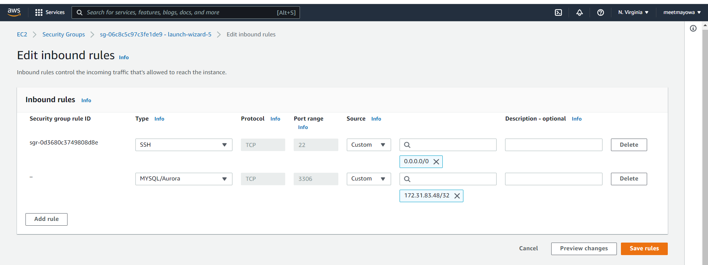
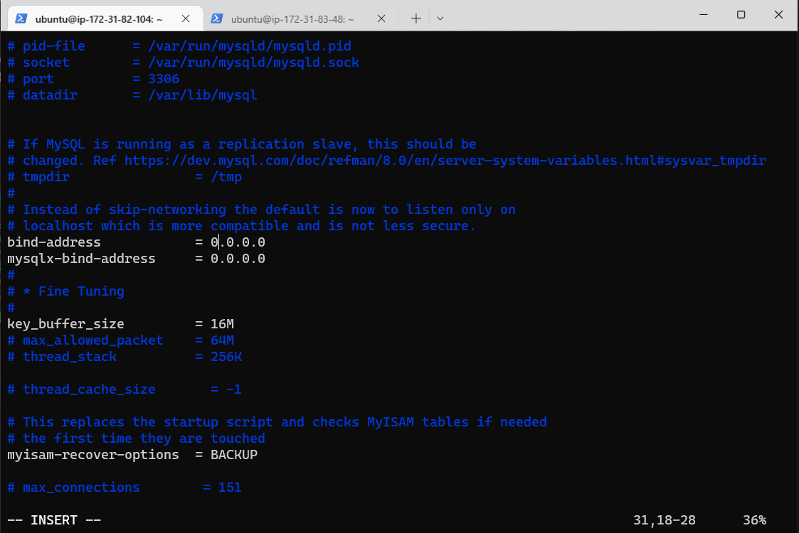

# IMPLEMENTATION OF A CLIENT SERVER ARCHITECTURE USING MYSQL DATABASE MANAGEMENT SYSTEM (DBMS).

## My Understanding

As I proceed in my journey into the world of IT, I began to realise that certain concepts apply to many other areas. One of such concepts is – **Client-Server architecture.**

**Client-Server** refers to an architecture in which two or more computers are connected together over a network to send and receive requests between one another.

In their communication, each machine has its own role: the machine sending requests is usually referred as "Client" and the machine responding (serving) is called "Server".

## STEP 1: SETTING THE TWO SERVERS IN AWS RESPECTIVELY 
Create and configure two Linux-based virtual servers (EC2 instances in AWS).

* Server A name - `mysql server`
* Server B name - `mysql client`    

    
## STEP 2: CONFIGURATION OF THE TWO SERVERS IN AWS RESPECTIVELY 

**(SERVER A) - On mysql-server (SERVER A) Linux Server install MySQL Server software.**

* Update the server:  `sudo apt update -y`
* I then installed mysql software  on the sysql-server (SERVER A):
  `sudo apt install mysql-server -y`
* I also made sure the service was enabled on the server: `sudo systemctl enable mysql`

    

## STEP 3: CONFIGURATION OF THE TWO SERVERS IN AWS RESPECTIVELY 
**(SERVER B) - On mysql-client (SERVER B) Linux Server install MySQL Client software.**

* Update the server:  `sudo apt update -y`
* I then installed mysql software  on the mysql-client (SERVER B):
  `sudo apt install mysql-client -y`

    

## STEP 4:  CONFIGURING THE SECURITY GROUP OF SERVER A

* Adding a rule to the security group of server A to be able to listen to port 3306 because MySQL uses TCP port 3306 by default, and for extra security customizing it to allow access only to the ip address of server B:

   

## STEP 5: CONFIGURING MYSQL-SERVER IN SERVER A TO ALLOW CONNECTIONS FROM REMOTE HOSTS.

* Editing the mysqld.cnf file: `sudo vi /etc/mysql/mysql.conf.d/mysqld.cnf`

* Replace ‘127.0.0.1’ to ‘0.0.0.0’ like this:

* Restarting the mysql service  `sudo mysql restart mysql`

## STEP 6: CREATING AND GRANTING FULL ACCESS TO A MYSQL USER IN SERVER A
To be able to connect to server A from server B a remote user is created and granted privileges and :

* Activating mysql security script : `$ sudo mysql_secure_installation`
* Activating mysql shell: `$ sudo mysql`
* Creating a database: mysql> `CREATE DATABASE mysql_db;`
* Creating a remote user with server B’s ip_address: mysql> `CREATE USER 'meetmayowa'@'%' IDENTIFIED  WITH mysql_native_password BY 'PassWord.1';`
* Granting the remote user full access to the database:mysql> `GRANT ALL ON mysql_db.* TO 'meetmayowa'@'&' WITH GRANT OPTION;`
* Lastly, flushing the privileges so that MySQL will begin to use them: mysql> `FLUSH PRIVILEGES;`
* Exit: mysql> `exit`

